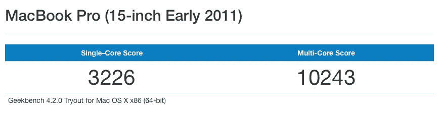

# 我戒不掉的 MacBook

> 原文：<https://medium.com/hackernoon/the-macbook-i-cant-quit-4426d85097f>

Many years, many names and many stickers later, she’s still going strong

## 六年了，仍然很强大

五磅半的东西太重了。看起来不像，但是一旦你习惯于携带更轻的东西一段时间，回去似乎是戏剧性的。

据官方消息，我的 2011 年初的 15 英寸 MacBook Pro 重 5.6 磅，以今天的标准来看，这对于笔记本来说是一个巨大的重量。我室友的[专用游戏笔记本电脑](https://www.newegg.com/Product/Product.aspx?Item=N82E16834233162)更轻。它比现代的 [MacBook](https://hackernoon.com/tagged/macbook) Pro 厚近 1 厘米，重 2.5 磅。电池寿命已经到了地狱。屏幕被洗去并像素化。启动时听起来像飞机起飞。

也是他妈的坦克。我不忍心和它分开。

九月，我的电脑庆祝了它的六岁生日。这是我拥有的最耐用的电脑。通常，到了第四年，在电脑上，我会一边咒骂一边敲打它，因为它很难运行。我每天都在渴望地在苹果网站上构建新的配置。但我还是对这个笨重的大石板很满意。这是一个痛苦的负担，但在家里，这是一块石头。

我这个痴迷于技术规范的书呆子想知道我是如何满足于一台正式的老式电脑。毕竟，是我恳求朋友和家人升级他们的旧硬件；但我不能接受自己的建议。

随着时代的进步，我拥有的每一代电脑都很快过时了。我的第一台电脑是一台葡萄色的 iMac G3，在数字中枢出现之前，它从未被设计用来处理流媒体视频、大量的照片收藏或丰富的互联网应用。第二台电脑，iMac G5 允许这些新的体验；但是很快在同一年被淘汰，因为苹果从 PowerPC 转移到 Intel 芯片。

我的第三部也是目前的 MacBook Pro 逆势而上。它仍然很强劲。

什么变了？例如，[摩尔定律](https://simple.wikipedia.org/wiki/Moore%27s_law)(以及英特尔)已经开始显示出它的进步。芯片不再受益于每两年左右翻倍的性能。我 2011 年的电脑仍然承受着更新的笔记本电脑的冲击。

With a Geekbench score of over 10000, my computer still beats any new shipping MacBook Pro under $2400

更重要的是，2011 年的 MacBook Pro 是苹果最好的产品之一。机箱设计允许您只需一把螺丝刀就可以更换内存、存储甚至电池。2011 款车型是非常强大的硬件和重大内部更新的完美结合，提供了更广泛的售后市场变化。

久而久之，电脑就变了。添加了更多内存，硬盘被闪存取代。甚至连 DVD 驱动器也被移除，以便为第二个存储卷腾出空间。我今天拥有的计算机已经随着我的发展而改变了

我不是在这里哀叹当前一代 MacBook Pros 缺乏升级能力。[别人](https://motherboard.vice.com/en_us/article/xygmyq/new-macbook-pros-mark-the-end-of-upgradeable-apple-computers)都把那点打死了。然而，我面临着一个困境:我没有面临性能或功能的代际飞跃。今天的新 Macbook Pro 会更快一点(有时)，有更好的显示屏，重量更轻；但表面上，它们都以同样的方式运行同样的软件。

我的需求也发生了变化。我已经放弃了 Mac 游戏，从大学开始就没有渲染过视频。我作为一名 web 开发人员的日常工作比其他程序员需要更少的计算能力。我比以前更看重便携性和电池寿命。在许多方面，13 英寸的笔记本电脑适合我的需求(事实上，这正是工作所提供的)。

因此，虽然我今天可以买一台现代的 13 英寸 MacBook Pro 并感到快乐，但我不会感觉到 6 岁多的 T4 应该有的代沟。在我买车或买房之前，电脑将是我购买的最昂贵的东西，我希望它能持续越久越好。

更加聪明和多产的作家已经讨论了当前一代 MacBook Pros 的问题。从不可靠的键盘到糟糕的电池寿命，新机器上有许多挑剔的地方。比起这些问题，我更关心的是缺少必备的功能。这当然不是一个无聊的 touchbar。

[推广展示](https://www.imore.com/promotion)在哪里？HDR 或者薄边框怎么样？[苹果神经引擎](https://www.wired.com/story/apples-neural-engine-infuses-the-iphone-with-ai-smarts/)在哪里？ [FaceID](https://www.apple.com/iphone-x/#face-id) ？难道 iOS 得到的那些了不起的新增功能就不能全部传到 Mac 上吗？

而且我连 USB-C 口都不进。或者 16GB 内存限制。

我希望 MacBook Pro 上真正的创新和飞跃可能已经开始到位。Kaby Lake-R 和英特尔最近与 AMD[的交易标志着该公司开始再次认真对待性能。有传言称，即将推出的 iMac Pro 将采用苹果 A10 Fusion 来执行 Siri 计算，FaceID 可能会在稍后推出。我祈祷这些创新渗透到笔记本电脑中。](https://www.theverge.com/2017/11/6/16612048/intel-amd-partnership-nvidia-laptop-chip)

在那之前，只要这台机器启动，我看不到自己升级。