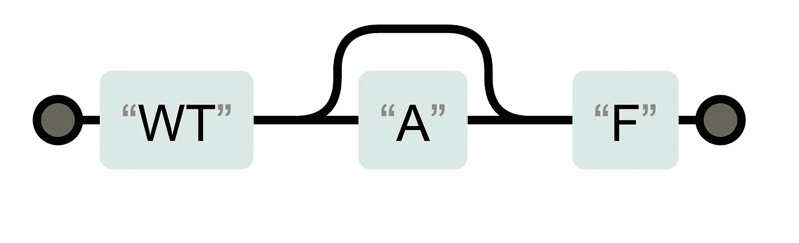
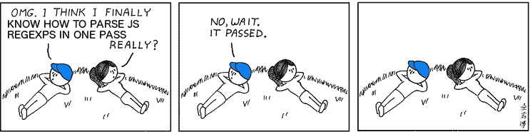

# 解析真实世界 JavaScript 正则表达式的疯狂

> 原文：<https://medium.com/hackernoon/the-madness-of-parsing-real-world-javascript-regexps-d9ee336df983>

JavaScript 的故事是一个偶然的实现细节的故事，对于所有新开发人员来说，这些细节成了不可修复的 WTF 时刻。所有的流行语言都是这样。参见[解释](https://www.lysator.liu.se/c/dmr-on-or.html)为什么 C 和[几乎](https://www.dartlang.org/guides/language/language-tour#operators)所有 C-syntax 语言在“&”操作符上都有错误的优先级。但我认为 JS 已经超出了它的公平份额。

[https://regexper.com/#%2FWTA%3FF%2F](https://regexper.com/#%2FWTA%3FF%2F)

一个著名的例子是，当微软的 JScript 工程师查看了`typeof`操作符并确定

`(typeof 1) == "number"`、
、`(typeof new Object()) == "object"`和
、

到目前为止，一切顺利，但是
`(typeof null) == "object"`怎么样

是的，没错，没有对象就是对象。所以他们尽职尽责地确保在 Internet Explorer 的 JScript 解释器中也是如此。你不能责怪他们——他们别无选择，只能兼容，即使在早期阶段，web 开发人员也不会感谢他们偏离“标准”。当我们制造 V8 时，我们也是这样做的。

如果你想花点时间研究一下*为什么*null 的类型是“对象”，看看[附录 B](https://medium.com/u/7fab51e62203#sec-additional-ecmascript-features-for-web-browsers) 说明你必须做些什么才能兼容。还有附件 B 中没有的东西，你也必须做到兼容。

比如根据主 spec，未知的 alpha 转义是不允许的，所以`/bac\k/`应该是错误，但是在[附件 B](http://www.ecma-international.org/ecma-262/6.0/#sec-regular-expressions-patterns) 你发现，它正好和`/back/`匹配一样。当我们想改进 JS 正则表达式时，这就带来了麻烦，比如用[命名捕获和命名反向引用](https://twitter.com/littledan/status/818637415304658944)。如果使用`/\k<name>/`语法添加对反向引用的支持，那么可能会破坏已经使用该语法表示与`/k<name>/`相同含义的网页。

类似地，不能在断言上加量词，所以前视后跟星号将是错误的:`/(?=foo)*/`。但是在附录 B 中我们发现，一些断言*是*允许的量词。附录 B 不适用于 regexp Unicode 模式，这是一种选择，所以`/(?=(foo))?/u`是一个语法错误，而如果没有 Unicode 模式的`/u`，它将是一个可选的 lookahead，通过捕获的文本告诉您它是否匹配。这可能真的有用！你应该能够通过像这样在非捕获组中包装前瞻来重写，但是在 Chromium 中这是失败的。我提交了一个 [bug](https://bugs.chromium.org/p/v8/issues/detail?id=5845) 来修复这个‘有价值的用例’。

如果你在反斜杠后面加上数字，事情就变得很奇怪了。不看附件 B，你能猜出这背后的规则吗？

`/\1/ // Matches Unicode code point 1 aka Ctrl-A
/()\1/ // Empty capture followed by a backreference to that capture
/()\01/ // Empty capture followed by code point 1
/\11/ // Match a tab character, which is code point 9!
/\18/ // Match code point 1, followed by "8"
/\176/ // Match a tilde, "~"
/\400/ // Match a space followed by a zero`

你成功地从这些例子中逆向工程出规则了吗？

规则是将整个数字作为十进制反向引用数字，但是如果它有前导零或者超出范围(没有足够的捕获括号)，我们就放弃这种解释，转换数字基数，并将其重新解释为最多 3 位八进制转义 255 (\377)，后面可能跟有文字数字。(在写这篇博文的时候，我提出了一个 Safari bug ，因为这不是 Safari 的功能。)

每次我为此实现一个解析器时，我都确信我可以一次就解析它，但是每次，我都错了，不得不用两次通过的算法(第一次只是计算捕获数)。

Apologies to [http://abstrusegoose.com/93](http://abstrusegoose.com/93)

但是我们陷入严重的 WTF-land 的地方是`\cx`语法。这代表 control-X，意味着 Unicode 码位 24，因为 X 是字母表中的第 24 个字母。到目前为止还很深奥，但是有人可能会发现它很有用。奇怪的是如果你不把 a-to-z 放在“c”后面会发生什么，比如`/\c:/`。根据主要的 JS 规范，这应该抛出一个语法错误，但它并没有这样做。

它也可以只与`"c:"`匹配，遵循附件 B 的规则和`/\k/`树立的榜样。这也不是它的功能。

它可以匹配一些由冒号决定的随机控制字符，这在 Safari 上经常发生。这也不是它的功能。

`/\c:/`实际上匹配一个字面反斜杠，后跟`"c:"`这使得它成为 regexp 解析器中唯一一个按字面解释单个反斜杠的地方。你会在所有现代浏览器中发现这种行为，并且有测试来确保它保持这种方式。

我最新的(爱好)项目是 [Grut](https://github.com/ErikCorryGoogle/grut) ，这是一个超前的正则表达式到机器代码的编译器，用 Dart 编写，使用 LLVM 完成所有繁重的工作。为了保持测试简单，我确保与其他 regexp 引擎兼容，主要是与 Irregexp 兼容，所以我重新实现了这些特性，完全兼容。奇怪的反斜杠 c 行为是其中的一部分。向后兼容性万岁！

> [黑客中午](http://bit.ly/Hackernoon)是黑客如何开始他们的下午。我们是 [@AMI](http://bit.ly/atAMIatAMI) 家庭的一员。我们现在[接受投稿](http://bit.ly/hackernoonsubmission)，并乐意[讨论广告&赞助](mailto:partners@amipublications.com)机会。
> 
> 如果你喜欢这个故事，我们推荐你阅读我们的[最新科技故事](http://bit.ly/hackernoonlatestt)和[趋势科技故事](https://hackernoon.com/trending)。直到下一次，不要把世界的现实想当然！

