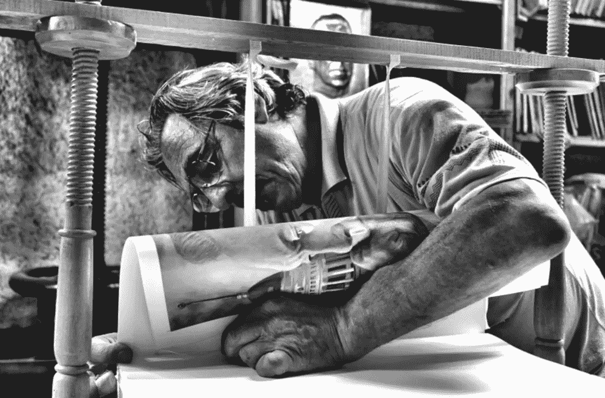

# 制造者的时间表:做你最好的工作

> 原文：<https://medium.com/hackernoon/the-makers-schedule-doing-your-best-work-f4f6b07f99fa>

[Doro Collection](http://dorocollection.com/doro-collection-behind-the-scenes-2/)

实际上有两种类型的时间表，因为它关系到今天的创造者。 [***制造者的时间表***](http://www.paulgraham.com/makersschedule.html) 是由不确定性定义的——它需要持续的不间断的工作时间和强烈的专注。*经理的时间表*的特点是可靠。它通常满足短期需求，重点是监测和控制。然而，当你试图在两者之间跳舞时，就会有一场优先权之争。

在我们这个注意力集中的世界里，很少有人能保持一个纯粹的制造者的时间表。像许多艺术家一样，他们受到经理日程安排的困扰——表现为没完没了的会议、行政要求和其他长期干扰，妨碍他们继续创作。请放心，有几个窍门可以帮助你找到并坚持一个激发你创造力的时间表。

# 风险和确定性的工艺

皇家艺术学院的前家具教授大卫·派伊提出了一种被称为确定性工艺的工作风格。它暗示了大规模生产过程——产品被开发出来并且不能被改变(没有太多的痛苦和花费)。与此形成鲜明对比的是*工艺的不确定性*迎合了含糊不清的创作过程，在这一过程中，实现最终和精确的结果一直处于风险之中。这种做工模式普遍被艺术家、设计师、科学家、作家、制造者等等采用。

创作者订阅创造者的时间表，因为它将不可预测性置于前台和中心舞台。这有助于开发他们的全部艺术天赋，并提高他们在不断变化中灵活移动的能力。培养和掌握这种流畅的工作方式已经成为区别多产制造者和其他群体的关键特征。

# 闭锁时间

**肤浅的工作太熟悉了，经常需要谈论或思考要做的工作，而实际上却做得很少。这种工作方式可以灵活运用你的后勤技能，对于确定工作范围、分工以及团队间的协调非常重要。以正确的方式衡量，决策者(单独工作或在团队中工作)从这些投入中受益。然而，这种工作模式比 [**深度工作**](https://www.nytimes.com/2016/01/31/books/review/dont-distract-me.html) 对认知的要求要低得多——深度工作需要持续的专注并依赖独特的技能。**

> **在很多方面，你如何在两种风格之间转换取决于你的自律。如果你未能设计和采用最佳工作条件，很可能是因为你缺乏意识，没有刻意选择何时、何地以及如何去做。**

****你的日子就是被黑的。简单地把你的工作分成几个时间段，比如说一个半小时，记住什么时候是执行某项特定活动的最佳时间。然后你可以在下午晚些时候把所有肤浅的工作铲进 90 分钟的时间里。这使得整个上午以及一天中的其他时间可以自由地进行长时间的专注工作。通过尝试不同的时间表和衡量你的表现，你会发现什么最适合你。最终结果是保护你最有创造力的时间，确保你不会中断你的心流。****

# ****故意休息****

****刻意的练习对于做好任何事情都是必要的。同样，学习如何最好地管理你的时间本身就是一项需要掌握的技能。设定一个目标——你希望发生的事情——并不是瑜伽课的专利。它与你的普通工作日息息相关，就像与你的整个人生**一样。******

************

******如果你认为安排休闲时间不是最重要的，那你就错了。研究表明，当你变得忙碌时(比如真正的忙碌)，你的注意力会被劫持。你根本无法判断如何最好地利用时间。当然，最终的结果是，你经常会因为焦虑增加而变得更加忙碌。计划一次休息不仅能提高你的创造力，因为你的大脑在后台处理问题，讽刺的是，它还能完全减轻你的时间压力感。******

******机遇的确青睐有准备的人。事实证明，稍微放松一下****可以帮助你将注意力集中到重要的事情上，并在风暴中保持冷静。**********

# ******新的创意税******

******我遇到过一个代笔人，他有一份很棒的工作，为一家大公司的 CEO 写文章。面对每天早上去办公室的漫长通勤，她应该在早上 9 点到达。她必须在一个耗尽精神的环境中发挥创造力，这个环境只重视以可预见的传统方式完成的工作。然而，众所周知，我们的生理节奏是微妙的，灵感并不总是在固定的时间或地点出现。研究表明，“早起的人”实际上在晚上更擅长解决创造性问题**。确切地说，如何以及何时做好自己的工作是完全独特的——没有放之四海而皆准的解决方案。********

******为了让创意时间神圣不可侵犯，我提议对首席承包商征收一种形式的创意税。一旦建立了适当的信任度和它所隐含的责任，各方就同意你如何做好工作的环境。重点放在你的产出质量上，不管你何时何地工作。******

************

******事实上，像 Gap 和明尼苏达州运输部这样的一些公司已经采用了这种 [**只看结果的工作环境**](/grey-matters/the-office-of-the-future-dfa6d1c11dc2) (ROWE)。但对于大多数仍在坚持过时模式的公司来说，如果它们违反了这一新的双方同意的协议(通过让你加入或打断你计划外的肤浅工作)，它们必须以员工福利或慈善捐款的形式支付象征性的罚款。很漂亮不是吗？—但是实际的税收没有它所表明的那么重要。******

> ****那些经常把自己的时间看得比你更重要的人——实际上消耗了你有限的注意力资源——可能会在打断你和解释应付税款之前三思。****

# ****优化您的性能****

****接下来要问的问题是:*我如何优化创造力？对你自己的节奏以及别人不断对你提出的要求保持敏感，可以帮助你决定在什么时候利用什么样的时间表。很有可能是一个混合的经理和制造商的时间表，可能发生在交替的几个月或几周，甚至可能在同一天。*****

****寻找最有利于你做最好的创造性工作的空间(无论是字面上还是象征性的)需要实验。但是它一定会帮助你表现得更好。真正的挑战是随着你、你的同事、你的工作和你周围的世界不断变化，修改你的时间表和时间段。****

*****要了解更多关于工作、设计和创新的信息，请点击这里* 注册我的简讯****

********如果你喜欢这篇文章，请分享你的爱，给它一个*👏*还是两个:)********