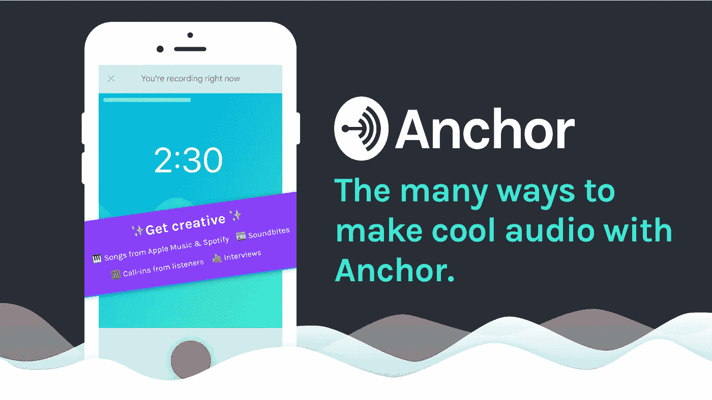
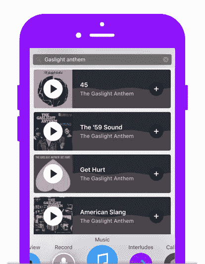
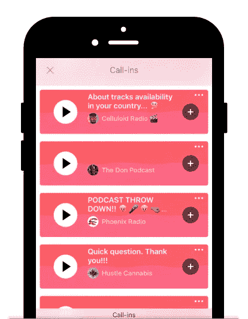
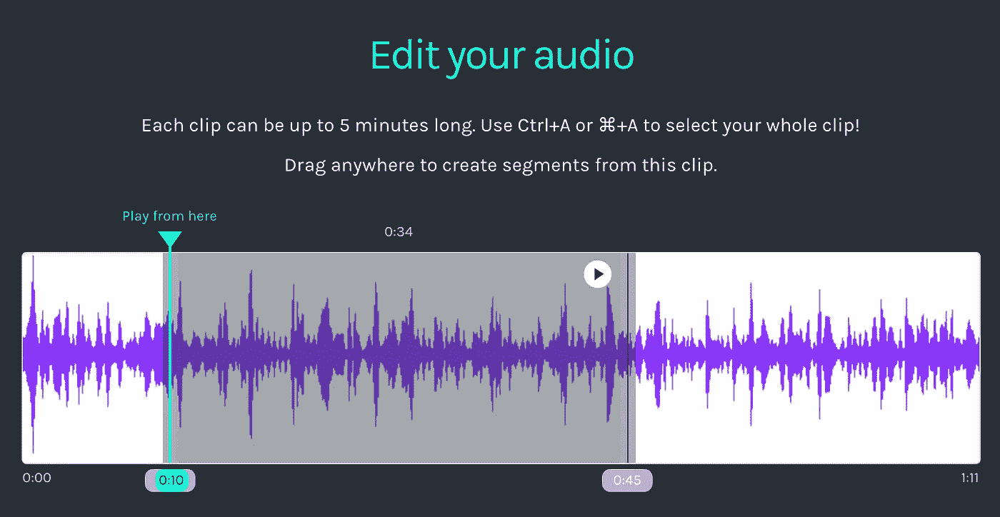
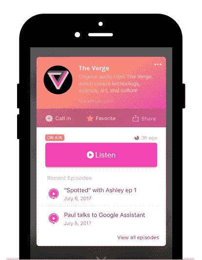
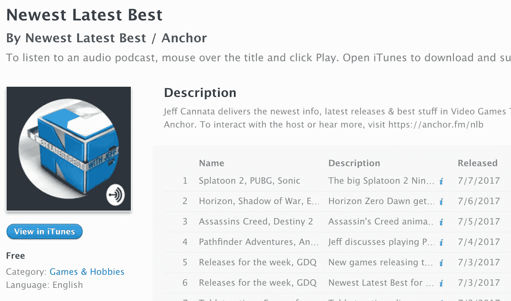
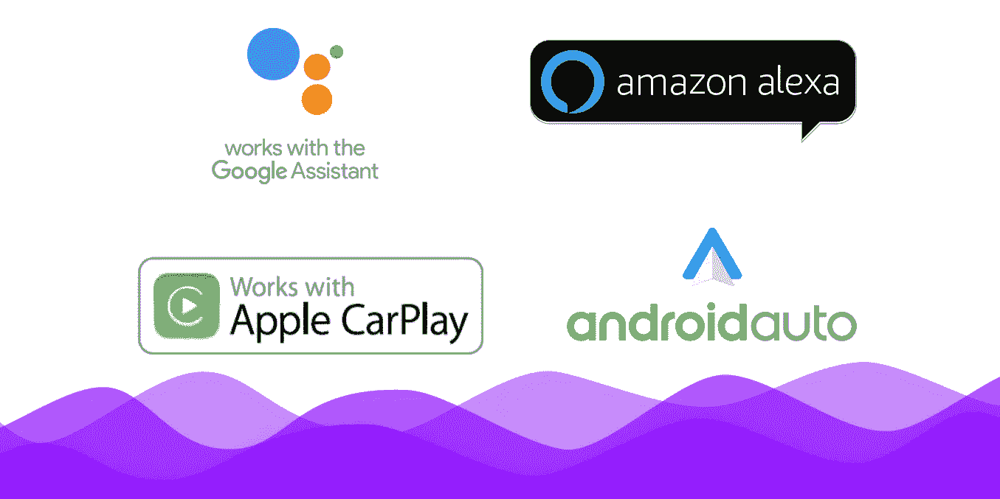

# 用 Anchor 制作音频的多种方法

> 原文：<https://medium.com/hackernoon/the-many-ways-to-make-audio-with-anchor-68e74ad8b300>

随着我们向 [Anchor](http://anchor.fm) 添加越来越多的功能(我们目前正以几乎每周一个巨大的新更新的惊人速度进行)，我们已经收到了大量的请求，要求对 Anchor 的许多创新功能进行单独的教程或演练。

所以这是…所有你以前不能做的，现在可以用 Anchor 做的又酷又疯狂的事情的最终清单。就在你的手机上！

# 1.在几秒钟内录制并播放您的声音。

主播的*捕捉你声音的*最简单的方法，句号。试着记录下你自己，和朋友的对话，或者你周围的世界。这里有几个让这变得轻而易举的方法:

Just hold the phone up to your ear to record!

*   **电话模式:**只要把电话举到耳边，就像在打电话一样。它会自动开始记录，并在你放下它时结束。
*   **免提录音:**向上滑动录音按钮将其锁定，这样您就可以免提录音了。
*   **分段录音:**如果你在录音时需要暂停(或者是整理思绪，或者是一辆大卡车碰巧经过)，就停止录音。你将能够从你离开的地方重新开始。

# 2.分享 Apple Music 或 Spotify 上的任何完整曲目。

由于我们与 Apple Music 和 Spotify 的集成，您可以将他们库中的任何歌曲添加到您的主播台。默认情况下，听众将听到 30 秒的预览；任何拥有这些服务之一的高级帐户的人都可以听到完整长度的歌曲。

我们看到人们使用歌曲作为过渡，创建完整的广播节目，在其中播放 DJ 播放列表，并在音乐评论之间添加歌曲。几个突出的例子:

Add any song you can think of to your Anchor station.

*   [Medicine Remixed 的“Audiotopsy”系列](https://anchor.fm/medicineremixed/episodes/9b23a0)，医生阿朵检查说唱和嘻哈歌曲中的医学歌词，并揭示它们的准确性。
*   “该死的儿子，你在哪里找到这个的？”重复出现的功能，其中湾区说唱歌手 Frak 打破了著名的采样节拍的起源。
*   资深音乐记者乔纳·拜尔分享了他最喜欢的歌曲，以及内部评论和制作这些歌曲的乐队的故事。

# 3.采访任何人，无论他们在哪里——即使他们没有主播。

共同主持一个节目或进行一次采访从来没有这么简单过。你可以从主播 app 给任何人打电话(你只需要他们的电话号码；他们所需要的只是回答)，记录对话，并将其添加到您的锚站中。

一些关于面试的有趣事实:

Interview anyone you want, even if they don’t have Anchor!

*   接收者确实需要选择加入(当他们准备好录制时，他们会听到按 1 的指令)，所以不要担心——它不能用来让不知道他们正在被录制的人感到惊讶。
*   与主播的普通片段不同，采访没有时间限制，所以你不需要担心被切断。
*   如果您想在发布之前编辑您的采访(或者如果您只想保留原始音频文件)，我们将通过电子邮件将文件发送给您，这样您就可以随心所欲了！

我们已经在主播节目中看到了大量非常有创意的采访；最近几周，我们最喜欢的一件事是，白手起家的[给诺姆·乔姆斯基](http://www.madellc.us/blog/interview-professor-noam-chomsky-cults-and-business)打电话，询问他关于现代企业的狂热文化。

# 4.接听朋友或听众的来电。

主播在很多方面让音频社交化；一个是任何听到你节目的人都可以打电话来表达他们的想法、问题和建议。这非常简单。他们点击一个按钮，录制长达 1 分钟的音频，然后发送给你。如果你喜欢他们说的话，你只需轻轻一点就可以把他们的来电添加到你的电台，这样你的听众也能听到！

因为你也可以导出你的来电，我们已经看到很多播客利用 Anchor 作为与现有听众互动的方式——这在以前是不可能的。

这里有几个电台用来电做创意的例子:

Take call-ins from listeners of your Anchor station!

*   [Shan Boody](https://anchor.fm/shanboody) 回答问题并给她的听众关于性和爱的建议。
*   [10 分钟的魔术](https://anchor.fm/10minutesofmagic)每周一使用电话直播的纯音频魔术游戏:聚会(“精神魔术”)。
*   Sara Dietschy 通过电话与她在 YouTube 上的观众交流，这些观众以前没有办法与她直接对话。
*   [团队主播](http://anchor.fm/maya)的 Maya 定期回答支持问题，并回应功能请求。

# 5.随时随地共享或嵌入音频。

你的站可以想多长就多长(它是由单个的片段组成的)，但是 Anchor 中的每个片段都限制在 5 分钟内。最棒的是，它迫使每个片段都有自己的主题，当它在社交媒体上分享时，更有可能转化为听众，因为他们可以直接进入相关的部分。

有了 Anchor，你可以选择在应用程序之外分享你的音频:

*   分享一个片段链接到 Twitter 它将在应用程序中作为声卡播放。
*   将你的站链接分享到 Twitter 或脸书；它会显示一个漂亮的定制卡，上面有你的电台信息和你的电台链接。现有的主播用户将能够在主播应用程序中深度链接到你的站；其他人将被带到你的网络个人资料，这样他们就可以收听，而无需安装该应用程序。

也可以[随时嵌入你的站](https://www.imore.com/onanchor)或者某个特定段；只需从该音频的网络播放器中获取嵌入代码。

# 6.转录您的音频，并将其作为动画视频共享。

为您的任何片段生成自动转录，并将其导出为视频，这将在社交媒体上自动播放，这是一种非常引人注目的方式来让您的内容被听到。这里有更多关于[如何从你的手机上制作你自己的视频](/anchor/introducing-anchor-videos-the-best-way-to-share-audio-on-social-media-8701d85e4819)的信息。

# 7.从您的桌面上传预先存在的音频。

如果你有现成的音频(如播客、捕获的对话、你录制的歌曲等)，你可以通过访问桌面上的【anchor.fm/clip】的将它上传到你的电台。如果你想绕过 5 分钟的限制，一个窍门是你可以在这里上传一段较长的音频。我们仍然会将它分割成 5 分钟的片段，这样它就可以在 Anchor 应用程序中正常工作，但它会无缝地播放给任何人听。

The Anchor Clipper at anchor.fm/clip

# 8.创建 24 小时内消失的音频、永久持续的音频或传统播客。

有了 Anchor，您在音频格式方面拥有前所未有的灵活性:

Turn your segments into permanent episodes at any time.

*   默认情况下，你添加到你的**电台**的任何音频都会在 24 小时内过期。这意味着你的听众总是听到你最近的、最相关的内容；一个副作用是，当你只是想分享随意的音频时，它也可以减轻压力。
*   在任何时候，你都可以将电台中的任何音频转换成永久的**集**。人们可以随时收听它，如果你分享或嵌入该集的链接，它将永远存在。
*   你还可以把你的主播剧集变成一个**播客**，只需在手机上轻轻一点([真的是](/anchor/anchor-is-now-the-easiest-way-to-make-a-podcast-ever-9c0505e2ff7a))。我们将为您处理发布的所有细节，一旦设置完成，您在 Anchor 中创建的任何剧集都将自动同步到您在 Apple Podcasts 和 Google Play Music 等地方的播客，因此人们有更多的方式来发现和听到您的音频！

关于完全由主播制作的播客的例子，请查看[最新的苹果播客](https://itunes.apple.com/us/podcast/id1253150928)。(你可能还记得几年前 NLB 在 T2 成功发起的 Kickstarter 活动；我们——以及它的所有粉丝——非常高兴我们能够帮助它起死回生！)

# 9.通过 Apple CarPlay 和 Android Auto 让人们在汽车中听到您的声音。

Your voice, in cars everywhere.

如果你有一个主播台，人们就可以在他们的车里通过我们对苹果 CarPlay 和 Android Auto 的集成自动收听你要说的任何内容。你的电台 DJ 梦想终于要实现了。

在这里阅读更多，或者现在就在你的车里抛锚试试吧！

# 10.获取音频的实时数据。

一旦您将音频添加到您的电台，我们就开始跟踪(并报告)有多少人在听，他们是谁，甚至他们喜欢您音频的哪些部分。如果你有一个播客，我们也从那里导入你的听众——这样你就可以随时了解到底有多少人在听你说话并做出反应。

这只是有锚的冰山一角；如果您还没有尝试过，我们希望您能尝试一下，并在我们的平台上发现您可以用音频做的所有不可思议的事情。如果你还想要一个我们认为一贯利用*所有*这些特性的电视台的闪亮例子，请查看[伟大的一切](https://anchor.fm/tge)。

如果您有任何问题、功能需求或建议，请告诉我们！您可以随时通过电子邮件联系我们，地址是 [support@anchor.fm](mailto:support@anchor.fm) 或 Twitter 上的 [@anchor](http://twitter.com/anchor) 。