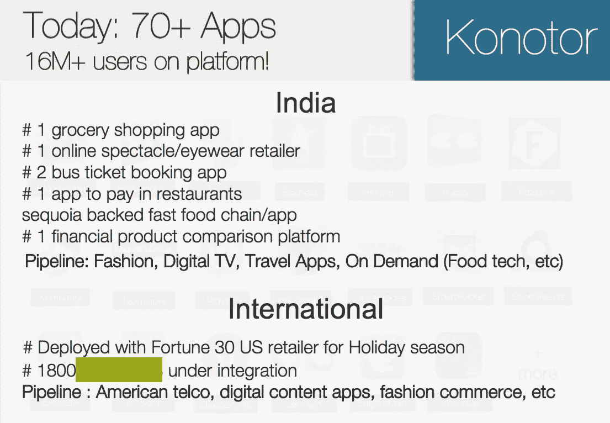
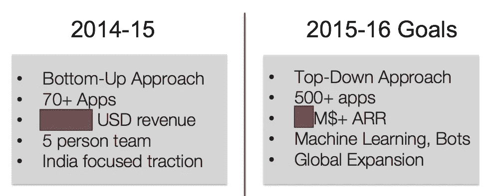

# 市场胜过一切

> 原文：<https://medium.com/hackernoon/the-market-trumps-all-else-5e016972dc0f>

## 在 Freshdesk 收购我们一年后，我最大的创业经验是

“才过了一个星期，然而这一切对我来说是如此清晰。 ***市场*** 胜过一切！”Freshdesk 工程副总裁塔克说。我们*刚刚*在 Freshdesk 推出了我们的 CRM 产品 Freshsales，它已经像*火箭船*一样起飞了。和我一样，塔克也曾是一名企业家。在团队和技术被 Freshdesk 收购之前，他花了四年多的时间经营自己的初创公司 Chatimity，经历了相当多的起起落落。

当我点头同意他的观点时，我的思绪回到了我自己的初创企业和我们参与的市场。我的初创公司 Konotor 是一个移动优先的客户参与平台，于 2013 年底推出。在经营 Konotor 的时候，我总是对自己说，“有了一个伟大的团队和产品，我就能教育和创造市场，让这一切成为现实。只是*时间*和*毅力*的问题。我的*真言* 要赢就要**要有耐心，而且，要有紧迫感**。我会一直自豪地说我在玩***长游戏*** 。**

**你有理由认为会有许多像我一样的企业家——试图创新和创造全新的产品，追逐可能存在也可能不存在的新兴市场，有时甚至等待市场的出现。我自己也遇到过很多！**

## **玩长线游戏适合你的初创企业吗？**

****

**We’re hungry and foolish. So for how long should we keep it up?**

**企业家是一群乐观的人。我们需要！如果你不能让自己相信你身处一个潜力巨大的大市场，你如何说服员工或投资者呢？！**

**如果你相信你有一个很大的市场，并且你要让它发生，或者只是等待一段时间，后退一步，重新评估你的市场到底有多好。**

**并不是说没有人玩过长线游戏并赢过。请记住，这些都是例外，真正需要正确的条件才能成功。作为一个经历过艰难市场，并在整整四年里保持乐观心态的人，我可以肯定地说，这很难，但当业务增长没有你希望的那么快时，即使没有获得大赢的真正证据，也仍然有可能继续下去。我们总是设法让我们的团队对我们正在建设的东西保持热情，庆祝一路上的每一次胜利，并有很多机会讲述我们的故事，讲述我们如何*领先群雄并为未来而建设*。**

****

**A “traction” slide from our pitch deck for Konotor in 2014**

> **“我们今天可能只有几个大客户，但我们看到了市场正在发生变化的所有迹象。客户开始意识到需要转变他们的移动客户体验——为他们使用移动应用的忠实客户。当然，在应用内客户支持方面，我们是市场上最好的移动优先产品”。**

**那是我的演讲。我相信这一点，我的员工意见一致，我们的投资者相信同样的信息，我们的首席执行官(收购 Freshdesk 后)也明白这一切。**

**但最近，我对我遇到和接触的其他 B2B 企业创始人，甚至是希望加入早期初创企业的员工，唱反调。从 Freshdesk 的成功中，我开始相信一些事情，并且我一直非常关注它。这就是**市场势头**。**

**在继续之前，有几个注意事项:**

**注 1:我承认我们都更热衷于解决某些问题，或者有时“创造一个新市场”。但是如果那是你的路，要*非常非常*意识到你的机会很小，你正在让自己经历一段艰难的旅程。确保你真的做了一些分析，如果你成功了，市场将会增长或变得巨大，并且你拥有成功所需的正确条件——地理、资本、时机等。如果你把宝贵的职业生涯花在创业上，赌它会大获成功，为什么你会选择一个成功几率较低或者成功几率较小的事情呢？**

**注 2:我写这篇文章并不是为了阻止人们去追求一个难题或者创造他们相信的东西。我写这篇文章是为了让他们思考他们看到的势头，并确保他们不会仅仅因为过去几年投入精力的“沉没成本”而坚持当前的产品和市场！**

## **市场和势头**

**我敢肯定，我们都读过[本帖](https://medium.com/u/fa65e64cf273#.vh1ixx3uq) [Ameet Ranadive](https://medium.com/u/c411b3c34968?source=post_page-----5e016972dc0f--------------------------------) 的。所有这些帖子都强调了这一点——虽然产品、团队和市场很重要，但市场往往是真正决定你命运的*。但我们仍然发现，这并不总是伴随着每一个初创企业家——我们被自己和团队能力的信念蒙蔽了双眼。***

***或者 ***也许，*** *当我们身处一个***的艰难市场时，我们中的一些人根本无法识别！*****

**从 2012 年至 2013 年与我一起创业的一批公司中，我看到许多公司倒闭，很少有成功的。几乎所有的公司都有非常聪明的创始人——有些人曾经是初创企业的一部分，有些人有很好的资历或开发优秀产品的经验，他们都非常努力。**

**当他们在一个快速增长的市场(一个“上升的浪潮”)中玩的时候，团队成长了，客户成长了，团队赢了，正确的产品被*自动拉出*，团队一起快乐。势头很重要，并创造了一个良性循环。“成功孕育成功”听起来确实是真的。**

**当你赢了，你就有了资本、品牌和资金去追逐更艰难的市场。Freshdesk 在基于云的客户支持软件领域取得了胜利，并且已经发展到足够大的规模，可以追求新兴市场和未来的创新理念。**

> **在一个好的市场中获胜能让你追求更难的市场，也能在新的市场中进行尝试。**

## **现在让我们考虑一下艰难的市场。**

**非常新的福音派市场、增长缓慢的市场、小市场或萎缩的市场——在这些市场中，公司可以看到一些误导性的初步成功。早期的成功通常来自创始人的努力和已知的客户，来自快速增长以饱和一个小市场(例如:只有移动应用的 SaaS)，或者来自在一个本身正在经历快速戏剧性变化的市场中的成功(例如:2012-13 年的功能手机市场)。**

> **你不能确定你是否真的为客户提供了有价值的东西，或者你只是一个永远不会被优先考虑的人。你无法确定自己是否能以目前的速度继续增长(以及能持续多久？).**

**对于每一个成功的初创企业，事后来看，我能想到的大概有 50 家是在艰难的市场中成功的。**

**当你处于艰难的市场时，这是一个恶性循环。发布一些初步的成功，你不知道是销售不工作还是销售人员，更难保持人们的积极性，还有一些关于人们做好自己的工作和所做决策的问题悬而未决。整体缺乏持续的动力会导致团队分裂，进一步使初创公司的情况变得更糟。**

## ****我犯了同样的错误****

**到目前为止，我已经从事产品开发工作将近 10 年了，其中 60%的时间都是和初创企业在一起。我读了很多关于产品市场匹配、产品管理的帖子，参与了 Quibb 上的讨论，关注了 Hackernews 上的帖子。我应该更清楚，但我对我的初创公司 Konotor 的市场问题视而不见。**

**我已经做了三年多——宣扬应用内支持的好处，听到一系列借口，即使在高层管理人员和产品负责人表示他们真的想实现它之后。我所接触的公司的内部冠军总是有许多战斗要打:
——“服务团队还没有准备好处理额外的新渠道”
——“产品团队已经确定了下一季度的路线图”
——“即将有一个新的应用程序改造，这可能是引入该功能的合适时机”
——“客户服务希望在 web 和移动设备上使用一个工具，即使这不是最佳体验”
——“开发主管目前还没有准备好添加另一个 SDK”**

**我听过各种借口，告诉自己，人们迟早会发现，如果没有一个好的方法来留住和吸引这些用户，他们在获取新用户上所花的一切都是浪费。毕竟，我们确实有一些优秀的客户和品牌可以展示，收入也在增长。人们有时可能会觉得它不够快，但它是显而易见的。**

****

**Ambitious plans for 2015, from our investor pitch deck**

**“2015 年将是这一切改变的一年”，我对自己说。“我们的时代已经到来”。后来我甚至明白了，由于“多方利益相关者”的问题，这一领域的产品采用率并没有真正提高。人们真的很喜欢他们所看到的，但并不迫切需要实施这一点——这可以将他们的客户支持成本减少一半，可以帮助他们将快乐和保留的用户群增加两倍，但仍然有惰性转向对我来说明显是“必须做”的事情。**

**我最后经常问自己的问题是——我们有耐心等待它发生吗？我们的投资者有耐心吗？我们的团队是否觉得他们仅仅是通过创造出最好的产品就赢得了胜利？他们有动力为增长不够快的客户群开发越来越多的功能吗？**

**多年以后，我终于明白了。移动是一个浪潮，但移动支持不是一个浪潮。**

**你不可能永远是一个等待时机的乐观主义者。严酷的事实是，我们在生存，而不是繁荣。**

> **结果很重要。势头很重要。这两者大多是市场的功能。**市场很重要。句号。****

**你要么需要想办法让整个市场对你有所警觉——这通常需要大量的**资本、耐心和强大的品牌**。或者你需要改变你的市场，让人们在那里寻找解决方案，为自己造势，然后用你的创新来补充。没有创造一个新的市场并不意味着你需要建立一个模仿产品。**

*****我自己的故事有一个美好的结局——我们经历了这一切，转向，随后与 Freshdesk 携手(我们被收购了),并在强大的品牌和资本的支持下，通过 Hotline.io 战略性地寻求建立正确的市场。*****

## ****那么，你如何知道你是在一个伟大的市场还是一个艰难的市场？****

****

**How do you know you have a wave backing you?**

**让我们不去管那些“明显”处于一个非常好或非常坏的市场中的人。作为一名企业家，你如何经营一家发展不错的初创公司——增长缓慢——没有曲棍球棒——拥有真正喜欢你的产品的客户——确定你的市场是一个巨大的市场还是一个普通或艰难的市场？**

**我的一位企业家朋友维克拉姆·巴斯卡兰根据他自己的经历说了这句话，我完全同意**

> **作为创新者，我们都想做出新的东西——做出能产生 10 倍、100 倍惊叹的东西。我认为这就是我们开始陷入兔子洞的地方——当我们追求“新”的时候——一些竞争不激烈的东西。我们希望建立一些东西，给用户增加疯狂的价值，并且在游戏的那个层次上没有相对的竞争。**
> 
> **在竞争方面，我们足够聪明，能够开辟出一片未知的领域，并宣称拥有它。这是否增加了“疯狂的价值”？这是最难的部分，因为(1)当我们深陷困境时，很难找到正确的观点，以及(2)作为永远的乐观主义者，我们善于找到更可信的理由。**

**虽然我没有一本可以给你所有答案的剧本，但我自己已经在这个领域花了相当长的时间，并与 B2B 领域的投资者、其他创始人和销售人员进行了富有洞察力的对话。也许你需要一个非常不同的思路来理解 B2C 公司。**

**这里有一些关于 B2B 产品艰难市场的一些症状的想法**

**迹象表明你是*太早*或者*还不是真正的强烈需求*(维生素 vs 止痛药)**

*   **当市场处于平均水平时，不清楚你是因为产品特性还是市场本身而失去一些交易。你可能会发现许多客户表现出极大的热情，但要求你回来时提供另一个可以“达成交易”的功能。然后另一个特征。
    *在一个* ***的大市场*** *，你的顾客“购买”并帮助“拉动产品”出来
    在一个* ***的硬市场*** *，你得到的只是功能要求。不要误认为这是“市场拉动产品”，除非有采购订单:)***
*   **在一个普通的市场中，你经常需要解释为什么客户需要你的产品。在一个巨大的市场中，你的销售团队花时间将你的产品或解决问题的方法与竞争对手的产品或方法区分开来**
*   **检查你的领域是否已经有巨头的最简单的方法——如果顾客已经表现出愿意购买你卖的任何东西，这是一件好事。缺乏这一点并不会使你的市场变得困难。但是，嘿，我无法想象为什么在你利润丰厚的领域没有其他快速增长的竞争对手；)
    *在一个* ***的大市场*** *，有多个巨大的公司建立在你的空间里，它们也还在继续成长。可能也有一些 UX 很糟糕的公司仍然在赚很多钱！
    在一个* ***艰难的市场*** *中，你会发现要么很少有大规模的公司(客户、融资等)，要么即使是较大的公司也在缓慢增长/挣扎着被采用。通常情况下，你还会看到增长缓慢的产品的“搜索量”较低——这是评估增长率的一种显而易见的方式。***
*   **预算、利益相关者、购买您的产品或为您的服务付费的决策者在一般市场中可能不明确
    *在* ***大市场*** *中，特定部门有明确的预算，并且有适当的流程来购买像您的
    这样的产品在* ***困难市场*** *中，可能有多个利益相关者参与其中，但没有明确的决策者，或者缺乏针对您产品的预算。ROI 难以计算/展示是另一个迹象。***
*   **销售周期缓慢是糟糕市场的典型特征。你需要将问题和你的解决方案传播给多个利益相关者
    ****巨大的市场*** *，你解决的问题是优先考虑的，在* ***艰难的市场*** *中，在一个月内进行试点或试用
    并不罕见，采用你的解决方案没有紧迫性。有时候，你很难帮助他们优先采用你的产品(即使是免费的试播版)，而且有借口——路线图被设定到下个季度，出现了重要的事情，需要一个新功能，等等——即使你感觉他们真的* ***喜欢你的产品。******
*   **可能会有一场关于短期内需要构建什么特性的争论，因为客户正把你拉向不同的方向。
    *在* ***的大市场*** *中，你的产品团队将处理同类产品的核心功能请求
    在* ***的硬市场*** *中，这些请求会将你拉向不同的方向，让你不断质疑哪一个才是合适的客户***

**这里有几个方法可以鉴别你的市场是否很小。
如果你能找到一种方法，获得你可能拥有的严肃潜在客户的名单(成千上万)，那么看看以下因素，了解你的立场:**

*   **如果您只为这些企业客户解决了一个更大难题的一部分，那么您可能会耗尽 TAM 作为*独立* *产品***
*   **如果这份名单中的客户没有以一种非常可衡量的方式看到真正的“企业价值”(SaaS 的交易超过 7.5 万美元)，你就永远无法获得你的产品的全部价值**

## **另一方面……对于那些身处艰难市场的人来说，这里有些东西**

**我们不断听说下一件大事将从今天看起来像玩具开始。也有公司*创造了整个市场*的例子(例如:pmarca 帖子中的 VMWare)。**

**但是要记住的一点是——这不是常态。创造一个市场需要大量的教育(因此需要大量的耐心，相信背后的金钱)，或者需要一个可笑的创新产品，这个产品有很强的价值主张来解决每个人都有但以前没有认识到的问题。如果市场是一个更大的现有市场的延伸，并且由现有市场中的一个已建立的参与者提供，这可能会更好地工作。*你需要足够多的回头率*并被认真对待，才能成功传福音。**

> **如果你真的需要“创造一个市场”，那就干到底。制造足够的噪音，让潮水上涨！**

****

**我有一家公司在这方面做得很好。*branch . io***

**如果你对移动应用的产品管理或市场营销感兴趣，你很有可能参加过 Branch Metrics 举办的名为“移动增长”的活动。**

**他们的方法是通过他们的活动创造一个更广泛的漏斗顶端，这些活动实际上只关注增长，而不是 branch.io。增长吸引了产品经理、增长黑客、营销人员、开发人员和企业所有者。增长对创业公司和大型企业都很重要。因此，召集一群聪明人来分享他们发展移动应用业务的经验是一个很好的主意。**

**Branch 每个月都会在全球多个城市举办这项活动。这就是我所说的“大规模教育顾客”。Branch 的产品——深度链接的软件/工具——并没有真正进入一个有意义的市场。很少有人理解在他们的应用程序中启用深度链接的必要性，或者为什么他们需要第三方服务来做正确的深度链接。但是经过多年在市场上的辛勤工作，举办午餐和晚餐会议，举办一个又一个活动，每个人都知道 branch，他们提供什么，并且许多许多全球大型应用程序已经在使用它们。**

**我还询问了 Branch 的首席执行官亚历克斯·奥斯汀(Alex Austin)，他对产品与市场的契合度有什么看法，以及在他们的旅程中还有哪些帮助。Alex 分享:**

> **“我认为产品营销就是回答一个问题或意图。你的产品必须是有权使用它的人所提问题的答案。例如，我们的一个目的是关注通过应用/游戏商店传递推荐数据的问题。我们知道 Branch 有一个强大的解决方案，问问题的人有能力实现我们的工具。随着时间的推移，我们会试图找到越来越多的这些痛点，并确保我们是这些意图的答案。没有比这更好的定义了。**
> 
> **为了利用这一点实现增长，我们必须确保无论潜在客户到哪里询问上述问题，Branch 都能找到答案。例如，在早期，我们有一些内部规则，所有工程师必须每周回答 5 个关于通过应用程序或 play store 传递数据或不太相关的主题的堆栈溢出问题。我们会如实回答如何构建解决方案本身，并警告说这非常复杂，我们在 Branch.io 工作，很好地解决了这个问题。这是一次帮助推广解决方案的真诚尝试，但也让我们在互联网的每个角落都能被发现，成为我们用户所面临的一个关键问题的解决方案。"**

**所以，走出去，问问你自己，你是否进入了正确的市场。你会受益于涨潮而快速成长吗？你有必要的资金和生态系统来支持制造噪音和传播新事物，并提升整个市场吗？清醒地认识到你所在市场的现实。**

**我们都是为了赢得胜利，正确把握市场可能是影响您获胜几率的最重要因素。所以，去抓住你身后的顺风，开始赢吧！**

**— — — — — — — — — — — — — — — — — — — — — — — — — — — — — -**

***关于我:产品经理变身企业家。2015 年把我的第一个创业卖给了*[*Freshworks*](https://www.freshworks.com)*。现在建筑* ***丁仪*** *。在 sri@rocketlane.com 联系我或者在推特上联系我关于创业的对话:*[*@ srikrishnang*](https://twitter.com/srikrishnang)*)***

************

> **黑客中午是黑客如何开始他们的下午。我们是这个家庭的一员。我们现在[接受投稿](http://bit.ly/hackernoonsubmission)并乐意[讨论广告&赞助](mailto:partners@amipublications.com)机会。**
> 
> **如果你喜欢这个故事，我们推荐你阅读我们的[最新科技故事](http://bit.ly/hackernoonlatestt)和[趋势科技故事](https://hackernoon.com/trending)。直到下一次，不要把世界的现实想当然！**

****