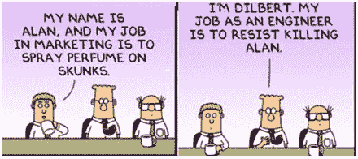
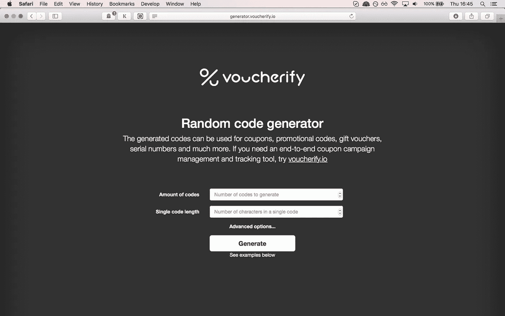
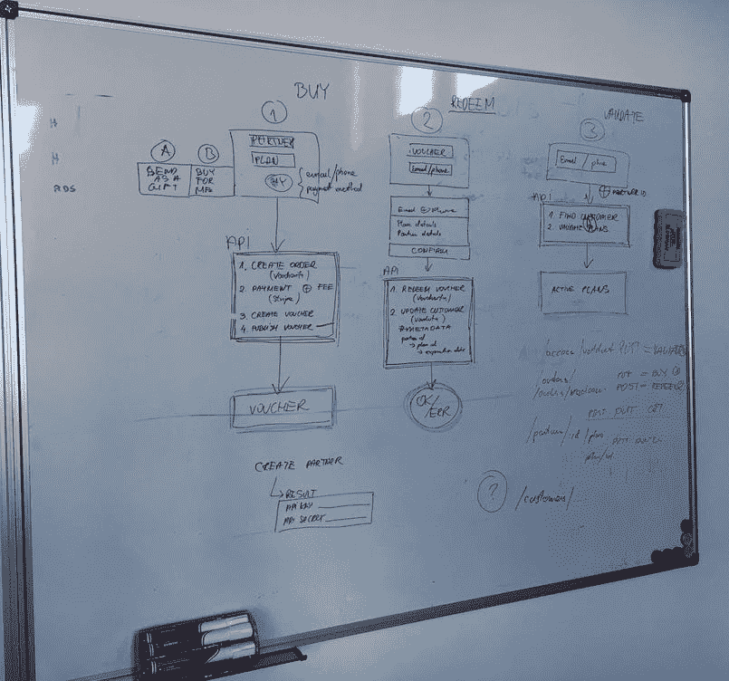
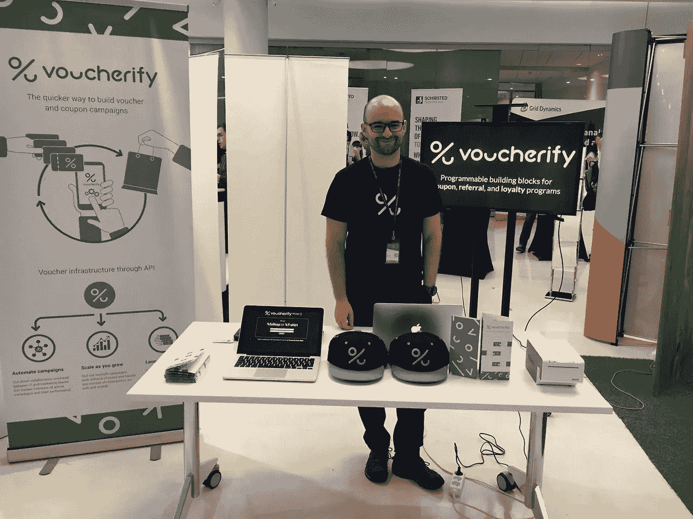
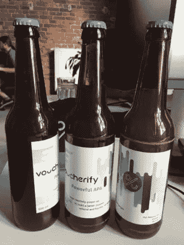

# 让我们拥有 100 名客户的营销组合

> 原文：<https://medium.com/hackernoon/the-marketing-stack-that-got-us-to-100-customers-f31332421f31>

一年前，我写了一篇关于[营销](https://hackernoon.com/tagged/marketing)工具的小文章，帮助我们赢得了前 5 个客户。这个堆栈和策略算是成功的，因为 12 个月后我们突破了 100。但是我们也应用了一些基本的改变，所以，我想分享一个更全面的总结，包括这篇文章中的工具和策略。

给你一些关于我们业务的观点:Voucherify 是一个开发者友好的 API 优先推广平台。它为优惠券、推荐和忠诚度活动提供可编程的构建模块。

从一开始，我们就开始专注于开发者，因此，专注于无 BS 营销。我们的角色模型包括我们以前使用过的流行的 API 优先平台，我们喜欢在[以前的项目](https://www.rspective.com/blog/delivering-it-for-an-immensely-successful-startup)中与之合作。通过分析 Stripe、Contentful 或 Shippo 开放文档，我们了解了他们如何设计 API、搭载用户或处理支持案例。所有这些都有助于我们形成第一个产品愿景。但不太清楚的是我们应该采取什么营销步骤。

榜样通常这样命名，因为他们是成功的。当你第一次听说一家科技领域的成功公司时，他们原有的营销策略通常早已不复存在。更糟糕的是，跟踪他们早期营销策略的历史并不容易。最后，我们不生产同样的东西，所以我们的上市策略在某些方面有所不同。总而言之，由于没有明确的营销技巧，我们别无选择，只能开始尝试。首先——什么有效。

# 搜索引擎优化

这个原来是我们 Voucherify 的电源引线发生器。搜索引擎结果页面的攀升让我们每天都有越来越多的注册用户。我们设法把自己放在我们最有价值的关键词如优惠券软件、优惠券软件、优惠券 API 等的神话般的第一页上。从那以后，没有一天我们的平台上没有超过 10 个新用户。我怎么强调 SEO 在现阶段对我们的重要性都不为过。

‍ **SEO 等于内容** 众所周知，你的内容分享得越频繁，你的排名就越靠前。我们的结果证实了这一点。虽然很难找到特定类型的内容和反向链接数量之间的精确关系，但我们可以看到一个持续的创建/推广周期会产生越来越好的结果。这让我们想起了雪崩效应。

“但是我们应该生产什么内容呢？”—我们在问自己。一开始不清楚，现在也还是不完全清楚。我能说的是，我们将内容分为两类:

**面向营销人员** —展示我们平台、促销活动最佳实践、白皮书、产品更新的博客文章，以及[客座文章](http://chiefmartec.com/2017/02/introduction-ecommerce-apis-non-developers/)。

***优点:***

*   帮助我们在 SERP 中获得更好的排名
*   可重复用于入职和支持

***缺点:***

*   随着我们对产品的迭代，其中一些已经过时了
*   一些技术性更强的帖子，例如关于通过电子邮件服务提供商自动发送优惠券的帖子，对于营销人员来说太技术性了，无法立即发现其价值，因此它们没有被分享。说到这里，我想知道人工智能、虚拟现实、物联网(比我们简单的推广 API 复杂得多的东西)是如何如此频繁地被分享的。

‍ **面向开发者**——我们在与电子商务初创公司合作时获得了技术经验。没有特定的领域，一般的中高级文章有希望引起架构师/CTO 的注意。

***优点:***

*   我们自己也是开发者，所以我们更容易写和推广技术文章
*   20 个高级开发人员有丰富的经验，因此有很多新职位的材料
*   股份比率看起来不错

***缺点:***

*   很难“说服”一个资深开发者写博客
*   对 SEO(关键词优化)帮助不大
*   高水平的文章不像全新的 React 特性那样被愉快地分享

总的来说，我们长期要发布的是面向不惧怕技术的营销人员和懂商业/经济的开发者的受欢迎的内容。做到这一点有点困难，因为拥有这些技能的人比普通营销人员或开发人员要少得多。而且，这些人也不那么经常“分享”。无论如何，我们相信通过足够长时间的迭代，并在此过程中积累越来越多有趣的见解，我们最终会到达那里。

不仅仅是博客
我们还进行了一个开源贡献的小实验；我们发布了一个生成随机代码的平台子集，名为[自由库](http://rspective.github.io/voucher-code-generator-js/)，带有到我们主平台的推广链接。一些想要发布随机优惠券代码的开发者可能对兑换、跟踪以及整个促销管理过程感兴趣，对吗？

在第二次迭代中，我们决定让营销人员也可以使用这个库。而免费的[优惠券生成器](http://generator.voucherify.io/)就是这样诞生的。事实证明，这是一个很好的线索来源，因为它很快就出现在谷歌的第一页。

我们使用的工具:

*   [Unamo(以前为 Positionly)](https://unamo.com/) —关键字和反向链接监控
*   免费试用 [Moz](https://moz.com/) 或 [DeepCrawl](https://www.deepcrawl.com/) 来查找 SEO bugs
*   [用于图表和信息图的 Omnigraffle](https://www.omnigroup.com/omnigraffle/) 和 [Piktocharts](https://piktochart.com/)
*   流量分析: [Google Analytics](https://analytics.google.com/) ， [Heapanalytics](https://heapanalytics.com/) ， [hotjar](https://www.hotjar.com/)

# 产品营销

SEO 实际上只是在下一个更重要的营销过程——产品营销——开始之前吸引早期注意力的一种方式。这包括帮助我们的客户理解我们产品背后的价值的所有工件。产品营销活动的范围很广，但为了方便起见，我们将其分为两类:

***报名前:***

*   网站和登陆页面——还没有准备好投资一个成熟的、漂亮的、定制的网站，比如 Stripe 和 T30，但是有了 Webflow，你仍然可以建立一个非常好的、交互式的网站。
*   指导性博客帖子— [示例](https://www.voucherify.io/blog/creating-advanced-coupon-campaigns-part-1)，我们也在 Webflow 上托管我们的博客，但是请注意，我们混合了视觉和文本消息，以满足用户和谷歌机器人。
*   [帮助中心](http://support.voucherify.io/) —一个面向营销人员的知识库，大量自助教程，同时推广其他功能。除了票务系统，HelpScout 还提供了一个非常实用和敏捷的知识库平台。主要功能:价格、使用/搜索分析、富文本编辑器、API、“嵌入应用”选项
*   打开[文档](https://docs.voucherify.io/) &示例——作为 API 优先的提供商，我们最初需要说服开发者。因此，我们逐渐在规范中添加了越来越多的教程、操作方法和示例。这些例子越来越具有说明性和互动性。例如，我们使用[邮递员](https://www.voucherify.io/blog/postman-really-supercharges-your-api)来演示我们的 API 能够快速完成什么。类似地，我们接入了 [Glitch](https://glitch.com/) 平台，该平台允许您仅使用基于网络的编辑器创建前端和后端应用程序。最有趣的部分是，您可以快速复制(重新混合)这个示例，并自己进行调整。因此，开发者可以在几分钟内试用我们的 API，不需要注册或样板文件。
*   内容简讯——我们有两个简讯:一个是关于一般营销文章的，另一个是关于“[如何建立在线市场](https://hackernoon.com/building-an-online-marketplace-from-scratch-introduction-738839e4e76)”系列的。

***报名后:***

*   时事通讯——我想这是一个相当标准的通讯。我们在博客上分享产品更新和有趣的阅读。和博客内容一样，我们有两个对不同主题感兴趣的目标群体(开发者和营销人员),因此，我们可能会在未来尝试发布两个独立的时事通讯。
*   互动入职培训——这也是一个标准的点滴活动。然而，我们觉得我们应该以一种更加数据驱动的方式来处理这个话题。

对于这两个任务，我们使用对讲机。这是一个超级灵活的工具，有一个 API 和一个可用的移动应用程序，但质量下降往往是显而易见的。看他们的事件历史；几乎每隔几天就有一期。最重要的是，它们价格昂贵，而且早期不友好。诚然，他们最近推出了一个折扣计划，但你必须是一个新顾客。(我们可能会替换它——如果你知道一个替代方案，请在评论中告诉我。)

我们来总结一下堆栈:

*   [Webflow](http://webflow.com/) 替换了 [Squarespace](https://www.squarespace.com/)
*   我们将非开发文档从 [Readme](http://readme.io/) 转移到 [HelpScout](https://www.helpscout.net/)
*   [Glitch](https://glitch.com/) 和 [Postman](https://www.getpostman.com/) 用交互式、易于使用和易于破解的例子增强了开发者文档
*   [对讲机](https://www.intercom.com/)和 [MailChimp](https://mailchimp.com/) 处理简讯

# 产品是王道

最后，搜索引擎优化和产品营销构成了第三个也是最重要的营销任务——产品开发的跑道。这是我们投入最大精力的地方，我相信它会永远这样。也许，当我们发现一个新的、有保证的销售渠道时，我们的营销努力漏斗部分会改变其直径，但形状会保持不变:

早期产品开发的奇妙之处在于，你真正需要的是一套基本的廉价工具，如用于开发新功能的**白板**和用于向客户验证这些想法的**电子邮件/Skype** 。这正是 Tom(我们的 CPO)所做的，他与开发团队交替构思功能，并在电话/skype 上花费无数时间。

‍Of:当然，用定量数据来包装你的脑袋也是值得的。这就是为什么我们最近建立了[元数据库](http://www.metabase.com/)(一个开源数据分析工具)，但是你也可以通过简单地查询数据库得到相同的结果(假设你知道 SQL)。无论如何，塑造我们产品愿景的绝大多数见解直接来自与客户的通话。

我们处理产品实际软件开发的‍The 方式超出了本文的范围，但是如果你对发现我们的技术堆栈和我们如何迭代感兴趣，请在评论中告诉我。

我们用于产品开发的工具:

*   白色书写板
*   Skype/电话/电子邮件
*   [元数据库](https://metabase.com/) / SQL

# 什么失败了

我们的一些策略没有带来客户或线索。或者他们没有在我们预期的时间内完成。我将试着描述这些失败背后的原因，但请记住，这很可能是由于缺乏经验。

**没有故事的公关** 我们没有住在[汽车](/startup-grind/how-to-get-press-for-your-startup-the-complete-guide-b79c57318113#a0a4)里，也没有离开过庞大咨询团队中舒适的椅子。我们甚至没有从任何风投那里拿到一分钱。我们没有加入创业孵化器(也没有申请)。我们是一家正规的自举公司，最初是一家软件公司，作为技术团队的支持与成功的初创公司合作，在一个项目中注意到优惠券软件的利基，并决定通过分配团队的一部分来弥合差距。我要说的是，我们没有一个令人信服的故事，媒体现在似乎没有兴趣报道它。我认为这就是为什么敲每个出版物的门已经没有什么意义了。让我们等待由我们连续的里程碑引发的有机兴趣。

**Dev 大会展位** 我们参加了波兰最大的 Dev 大会之一， [Devoxx](http://devoxx.com/) 。我们获得了一个免费的赞助商展位，用于帮助组织者打印二维码。我们认为应该抓住这个机会在 2500 名开发人员中推广 Voucherify。我们准备了免费赠品和微型竞赛来激发参与。但是它没有来。开发人员很少对理解 Voucherify 的好处感兴趣。然而，他们对我们的工作机会或小玩意很好奇。有一些例外，但不是我们所希望的。也许做一次演讲是吸引注意力的更有效的方式。

‍ **每周简讯** 我们创建了 30 期交付周刊——这是一份为在快节奏环境中交付软件的开发人员准备的简讯。每期都有一系列关于云提供商、开发者工具、产品设计、软件架构等的精选链接。尽管管理链接的努力不是很大(我们的团队定期在 Slack 上分享这样的链接)，但订阅者的数量并不令人印象深刻。我们可以在推广上投入更多的时间，或者转向更专注于某项特定技术的东西(就像库柏所做的那样)，但我们同意专注于搜索引擎优化和产品营销。

大约一年前，我们发起了一个小型的冷邮实验。我们向营销人员(主管、副总裁)发出了数百条信息，但效果不佳。也许，当时的问题是网站，或者是我们只在一份简短的备忘录中销售好处的问题。我们不想针对开发人员，因为他们很快就会对冷冰冰的电子邮件感到恼火。但是，小样本和时间让我们认为它值得在未来回顾。

**付费广告** 与冷冰冰的电子邮件类似，这个渠道可能引入得太早了。最重要的是，我们没有足够的投资来看到结果。因此，我们最后花了几个星期的时间来理解平台和广告机制。如果你补充说我们的网站当时排名很低，那么很明显我们只是在烧钱。Adwords 的默认设置应该更智能，这样早期公司就不会浪费预算。

但最基本的事情是，大多数人[忽略](https://moz.com/blog/eye-tracking-2016-how-searchers-interact-mobile-serps-desktop)谷歌的 Adwords，并直接进入有机结果，我敢打赌，当涉及到技术人员时，这个比例甚至更高。因此，作为一般建议，我会放弃付费广告，直到你有机地获得 100 个客户，并且知道什么关键词会吸引你的目标——但我仍然不会把它作为你的主要营销渠道。

黑客马拉松
嗯，我不会称之为失败，问题是我们不相信它会转化为线索。尽管有丰厚的报酬，但活动的反响和出席率还是不错的。出席率低导致需要认证的集成/插件/连接器比我们想出这个主意时希望的要少。无论如何，我们玩得很开心，并从我在这里描述的[黑客之夜中吸取了一些有价值的教训。](https://dev.to/msedzielewski/takeaways-from-our-first-hackathon-361)

# 概述

综上所述，我们对 API 优先的 SaaS 营销策略的建议是:

*   倾听客户意见，让反馈回路始终保持温暖。不要逃避面对面的交流(电话、f2f 会议)
*   确保你的产品文档是透明的，有丰富的例子，并且是交互式的
*   尽早投资搜索引擎优化
*   内容不仅仅与博客相关，想想你可以分享的开源/社区工件
*   保留付费广告，直到你开始有机地获得客户
*   实验——你的产品是独一无二的，因此应该成为你的上市策略
*   耐心——这不是短跑，而是马拉松。耐心点。非常有耐心。我们了解到，大团队中最小的时间单位是一个季度，例如，如果有人不能参加 5 人会议，下一个可能的日期是 3 个月后:)

‍Lastly，非常感谢 [Snipcart](https://snipcart.com) 的[Fran ois lanthier n .](https://medium.com/u/d6c1e76d5cac?source=post_page-----f31332421f31--------------------------------)所做的伟大工作[记录了](https://medium.com/snipcart-stories)他们的旅程，感谢 [Heavy Build](https://www.devmarketingguide.com/) 的人们免费提供大量建议。

*最初发布于*[*www . voucherify . io*](https://www.voucherify.io/blog/the-marketing-stack-that-got-us-to-100-customers)*。*