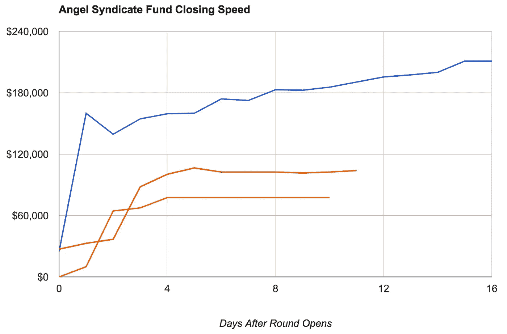

# AngelList 辛迪加的机制

> 原文：<https://medium.com/hackernoon/the-mechanics-of-angellist-syndicates-267be1f17dea>

*为投资人&创业公司，由* [*大卫 e .周刊*](https://www.linkedin.com/in/dweekly) *，2016 年年中撰写*

嗨！我在 AngelList 上帮忙经营两个独立的辛迪加。 [drone.vc](http://drone.vc) (专注无人机技术) [neuron.vc](http://neuron.vc) (专注应用深度学习)。许多人不熟悉 AngelList 辛迪加的工作方式——它们与单个天使、一个“天使团体”或传统风险投资机构的工作有何相似和不同之处。本指南希望为你澄清这一点。如果你想了解创业公司股票之类的基础知识，我推荐我的免费股票期权指南。

> 大量免责声明:我不是律师。以下任何一条都不应构成法律或税务建议，您应该寻求有执照的专业人士的服务。以下内容是针对投资美国科技初创公司的美国投资者而写的:规则、限制和考虑因素可能与以下针对其他地区的建议有很大不同。我不为 AngelList 工作，也不代表 AngelList，可能在实质上歪曲了他们的计划。投资创业公司是危险的。还有，不要拿着剪刀跑。

# **天使**

“天使”就是我们所说的投资自己的钱的人。美国证券交易委员会对那些还不富裕的人可以进行何种投资进行了限制——以防止，比如说，祖父母被小贩骗走他们的退休储蓄——所以大多数天使需要在美国证券交易委员会的限制下变得富有。如果你符合这个标准，美国证券交易委员会将认为你是一个合格的投资者。这些定义已经有一段时间没有改变了，但是当我们谈论天使时，我们不是在谈论机构，我们是在谈论个人——人类。有动机的。成为天使的动机有好有坏。

投资者首先应该问自己的是，他们希望从投资中获得什么。如果一个天使希望通过天使投资“快速致富”，“帮助指导一家早期公司”，甚至“获得一个公司运营的前排座位”，他们很可能会对这个过程感到失望。天使很少得到特殊的权利，比如董事会席位或者甚至是观察员的权利。试图过分干涉公司运营的天使们会得到一个坏名声，这是有原因的——你可能会受到伤害而不是帮助。

好天使通常拥有广泛的公司投资组合，并充当被动的“服务提供商”，在初创公司要求时提供帮助。硅谷的“教父”罗恩·康韦开创了这种方法，他会见了大量的公司，迅速做出投资决定，投资了大量的公司，并且通常不要求控制/观察——他根本不可能有时间坐那么多的董事会！虽然有些人嘲笑这是“喷雾&祈祷”,更愿意将投资视为“聪明钱”,公司既可以获得资本，也可以得到积极的建议，但罗恩的回报说明了一切。罗恩几乎可以接触到任何交易，因为罗恩已经消除了你可能对接受他的钱有任何合理的反对意见。你将意识到的回报将映射到你是否能够参与到*最好的*交易中，很可能有许多其他投资者也在争夺进入交易的机会。如果你建立了乐于助人、容易共事的声誉，你就更容易达成任何你想要的交易。

现在，为了避免我把被动投资者框定得过于被动，罗恩会为一家对他有特殊要求的投资组合公司移山倒海——即使你需要花前三十秒打电话提醒他，你是他投资的一家公司的首席执行官。；)我要声明，罗恩投资了我的第一家公司 PBwiki，并且是一个很好的支持者。

从回报的角度来看，投资组合方法很重要。很难预测哪些公司会做得很好，哪些会陷入困境。谦逊的“[黑天鹅](http://paulgraham.com/swan.html)”风格的方法是让投资者承认他们可能会犯很多错误，因此进行广泛的押注，希望其中一个会取得突破。投资者的回报通常处于一个极端的幂律曲线上——如果一家公司表现非常好，它会表现得非常好，以至于你投资组合中的任何其他公司发生了什么都不会有影响。因此，一个好的天使投资者会寻求建立一个投资组合，比如 30 多家初创公司。你投资 30 个 1 万美元的概率收益比投资一个 30 万美元的概率收益高得多。换句话说，如果你参与天使投资只是开一张支票，你可能会对结果感到失望，并得出结论说天使投资不适合你。调整自己的速度！分配一定的年度投资预算，并寻求定期小赌注。

成为天使投资人的另一个好理由是，你喜欢与创始人会面，他们可以教你新的行业、新兴的最佳实践，以及解决问题和团队建设的聪明方法。方正能量很好玩，很有感染力，能激励你。

最后，回馈真好。硅谷很多人(可能大部分！)在别人对他们“下了赌注”时大赚了一笔，因此他们希望通过用资本、建议和关系网祝福新来者来“向前支付”。这是硅谷最强大也最不为人知的秘密之一；我将其归因于该地区的嬉皮士历史。:-)

# **辛迪加**

[旧金山的一家私人公司 AngelList](https://angel.co/) ，为公司、个人和天使们提供广泛的服务。创业公司可以发布职位空缺，天使可以寻求公司投资，公司可以寻求资金。AngelList 在过去几年中增加的一个功能是，一个人脉广泛的天使投资者可以创建一个辛迪加，让其他天使投资者以同样的条件参与该投资者正在参与的交易。天使投资者可以“软承诺”认真考虑与这些有影响力的天使一起投资公司。这产生了有趣的后续效应:创业公司现在有更多的动机与这些“超级天使”辛迪加领导会面，因为他们代表了投资者的集体，这意味着这些辛迪加比他们作为一个无组织的个人投资者团体获得了更多更好的交易流。随着时间的推移，这种辛迪加的规模可能会赋予单个天使投资者相当于传统小型风险投资公司的决策权，几乎没有基金的典型投资管理费用。让我们来看一下数学。

如果我想成为辛迪加的领导者，我会宣布“我计划每年投资 1 万美元到 3-4 家公司”。我可能会找到 30 个朋友，他们每个人都愿意尝试性地投入 1 万美元自己的钱，以和我一样的条件进行这样的交易。现在我有 1 万美元自己的钱和 30 万美元别人的钱，我可以用来投资一家公司。与我只能给他们开一张 1 万美元的支票相比，这显然让一家公司更有兴趣与我见面。对于那些关注的人来说，你会注意到 30 万美元只是暂时的承诺。事实上，只有大约 60%的财团支持者会真正完成交易。因此，有了 30 万美元的财团支持，我有理由期待向一家公司提供 18 万美元的资金。

当银团牵头人发现一笔令他们兴奋的具体交易时，他们会与初创公司就投资条款达成一致(“牵头”该交易)，或者他们会加入同时投资该公司的其他投资者，条件相同(“跟随”)。他们向 AngelList 表明交易，这引发了一些 al 人员联系辛迪加领导和初创公司，以确认条款，并帮助初创公司将他们的 AngelList 页面调整到适当的形状，以“启动”交易。一旦交易被 AngelList 批准启动，就要由财团负责人来宣传了。

然后，负责人写下他们为什么对这家公司感兴趣，并秘密地与辛迪加参与者分享这些想法和数据。财团中的参与天使可以审查交易，并决定他们是否愿意加入交易。单个银团交易最多只能有 99 名合格投资者参与；如果有 100 名或更多的投资者想要加入，将由银团牵头人决定他们想让谁参与交易。通常情况下，选择“预先投资”参与银团的投资者排在第一位；这些投资者不得不主动退出交易。紧随其后的是愿意投入更大金额的投资者，例如 1 万美元对 5 万美元，然后是其他所有人。

随着交易的启动，AngelList 建立了一个托管服务，辛迪加参与者可以将他们的资金转移或电汇到该服务中，并从初创公司、辛迪加牵头人和辛迪加参与者那里收集电子签名。AngelList 对管理所有后勤服务的交易收取 8000 美元的固定费用。因此，如果在上面的例子中，有 18 万美元的辛迪加融资，其中 8 万美元将支付给 AngelList，17.2 万美元将电汇给初创公司。AngelList 创建了一个新的特拉华州有限责任公司，作为一个单一目的的公司工具来进行和管理投资。这家有限责任公司的名字通常是财团名称和被投资的初创公司名称的混杂组合；例如，在 [drone.vc](http://drone.vc) 投资 [PRENAV](http://www.prenav.com/#intro2) 的案例中，创建的实体被称为“AngelList-Prav-Fund，一系列 AngelList-DrVc-Funds，LLC”。是啊，有点拗口。为了让事情变得更有趣，AngelList 实际上将这些有限责任公司的管理外包给一家名为 [Assure Fund Management](http://assure.co/) 的公司。

从创业公司的角度来看，这很好，因为他们的资本表上只有两个新股东；辛迪加牵头人(直接以个人身份进行投资)和有限责任公司。因此，PRENAV 得到了“大卫周刊”作为股东，以及上述满嘴的有限责任公司。因为公司的每个股东都需要做有意义的日常后勤工作，所以最小化资本表条目对初创公司来说是一个很好的时间和金钱节省。

我看到的大多数交易都使用非常普通的条款:一个[系列种子](http://www.seriesseed.com/)(股权)、一个[安全票据](https://www.ycombinator.com/documents/)，或者其他有明确上限和折扣的模板化可转换票据(债务)。我听说过一些早期投资者被严重滥用安全票据的故事，所以我温和地鼓励人们使用系列种子，因为这对初创公司来说非常容易，并为投资者提供了实际股权的安全性。

该交易仅在一段固定的时间内有效，通常为 20-30 天。这让领导有足够的时间与参与者讨论交易，给投资者一个提问的机会(或者度假回来！)并把他们的钱汇进来。我会注意到，对于大多数交易来说，你会在交易开始后的四天内知道交易会有多好。以下是我与 drone.vc 达成的三笔真实交易。请注意，如果预先投资的投资者选择退出，承诺资本可能会每周下降。

需要注意的是:AngelList 拥有像 Maiden Lane 和 CSC Upshot 这样的辛迪加放大基金，可以进一步从财务上放大具有显著牵引力的辛迪加交易。通常情况下，这些基金会在几天内做出决定。他们正在寻找具有强烈“信号”的交易，这意味着几个著名的投资者或公司已经在财团之外参与了交易。因此，由财团牵头、只有财团成员参与的交易不太可能获得这些资金。如果该基金决定参与一项交易，它们将以同样的条件通过银团工具参与进来。

如果你是银团贷款的牵头人，你不仅需要宣传一家公司，还需要坦率地披露潜在的风险。彻底做到这一点真的很重要；如果能证明你知道初创公司成功的某些重大风险，但没有向其他投资者透露，你可能会陷入困境。最后，你需要披露任何变化——如果创业公司实际上是由你的兄弟经营的，如果你获得了顾问股份，如果你已经是股东，如果你得到的交易与财团参与者不同，等等。不用说，如果你的交易没有变化是最好的。

# 携带

到目前为止，一切都很好，但你可能会问，除了获得更好的交易曝光率和帮助他们的朋友，辛迪加牵头还有什么好处？辛迪加的领头人一分钱都没拿到，那 8000 美元归 AngelList 所有。事实上，他们的银行账户唯一的变化就是投资到创业公司的资金流出。

当辛迪加投资的公司发生*流动性事件*(例如，有人收购该公司或该公司上市)时，就会向辛迪加牵头人支付款项。此时，有限责任公司持有的股份被兑换成现金。投资者投入的现金会返还给他们，返还给有限责任公司的超出投资资金的资金被称为*利差*，这基本上是投资的利润。在利差中，AngelList 占 5%,通常银团贷款占 15%左右。当投资者签署银团或银团交易时，总金额(例如 20%)会清楚地列在银团页面上。

> 感谢阅读这份指南，以 AngelList 辛迪加！让我知道它是否对你有用和/或我在 david@weekly.org[做错了什么。最后，如果你是对无人机感兴趣的合格投资者，我欢迎你加入我的](mailto:david@weekly.org) [drone.vc](http://drone.vc) 辛迪加；如果进入深度学习， [neuron.vc](http://neuron.vc) 。

HN 讨论

> [黑客中午](http://bit.ly/Hackernoon)是黑客如何开始他们的下午。我们是 [@AMI](http://bit.ly/atAMIatAMI) 家庭的一员。我们现在[接受投稿](http://bit.ly/hackernoonsubmission)，并乐意[讨论广告&赞助](mailto:partners@amipublications.com)机会。
> 
> 要了解更多信息，请[阅读我们的“关于”页面](https://goo.gl/4ofytp)、[在脸书上点赞/给我们发消息](http://bit.ly/HackernoonFB)，或者简单地说， [tweet/DM @HackerNoon。](https://goo.gl/k7XYbx)
> 
> 如果你喜欢这个故事，我们推荐你阅读我们的[最新科技故事](http://bit.ly/hackernoonlatestt)和[趋势科技故事](https://hackernoon.com/trending)。直到下一次，不要把世界的现实想当然！