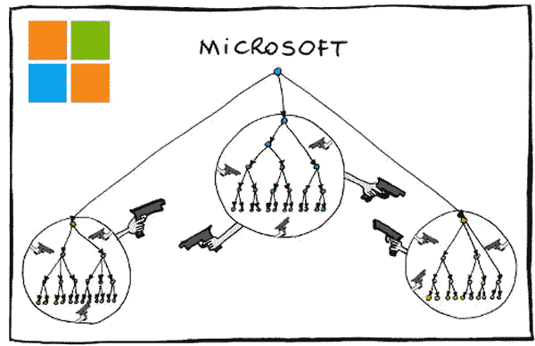

# 微软洗牌

> 原文：<https://medium.com/hackernoon/the-microsoft-hustle-2-0-9de19a277e52>

在我之前的帖子中，我谈到了微软和他们的合作伙伴在保持他们的产品人为缺陷和复杂方面有既得利益。但是我没有机会深入探究微软是如何故意人为地保持他们的解决方案有缺陷的，或者这些方法在他们公司的其他地方可能会产生的负面影响。不过，在没有员工参与的情况下，公司只有几种方式可以故意制造有缺陷的产品，而不会让它看起来像是故意的。显然，这并不像他们的员工随意放弃那么简单💩晚上把表情符号转换成他们的代码。

当然，微软也可能对高质量的软件工程最佳实践一无所知，无能为力，只是意外地每年赚 890 亿美元。他们也可能只是过时了，因为这种商业模式在 80 年代和 90 年代更合理，那时他们没有真正的竞争，他们的产品当时提供的生产力提升是无与伦比的。然而，如果没有对质量工程的复杂理解，微软作为全球首屈一指的软件开发公司，不可能达到目前的水平，也不可能利用这种动态，从人为缺陷产品中获利，达到现在的程度。

不言而喻，微软实际上并没有指示他们的员工制造有缺陷的软件。事实上，作为一名前微软员工，我可以确认，在这个世界上，没有人比微软员工更讨厌缺陷和不必要的复杂性，而且微软正在努力解决这些问题。但是，虽然信息技术解决方案的质量可以绝对反映出制造该解决方案的工程师的质量和奉献精神，但是生产这些解决方案的环境的质量同样重要，同样也反映在产品中。除了雇用顶尖人才，科技公司和其他公司一样，可以通过相应地调整环境来培养他们想要的最终结果。这恰好就是为什么现代科技公司倾向于花费大量的收入来调整他们的工作环境，用奢侈的办公室津贴和先进的管理方法。

不管他们有多么热情和敬业，微软的员工，不像高级领导，对环境变量，如员工总数、工作量、时间表、资源、士气、管理、标准或被利用的意识形态，几乎没有影响；所有这些都会影响他们产品的整体质量。因此，正如公司可以利用这种理解来简化他们的环境，以最大限度地提高质量一样，微软可以很容易地反过来应用相同的逻辑，并对上述环境变量进行微妙的改变，以扼杀质量。在这样做的过程中，就好像他们可以转动转盘一样，微软的领导层可以大规模地调整员工的士气，增加他们的积极性，更冷漠，效率更低，更容易出错的趋势，而不必告诉他们做任何事情都要尽力而为；只需对他们的环境进行细微的改变。

例如，由于他们严重依赖供应商，而供应商的数量几乎与他们的全职员工一样多，领导层可以通过不加选择地增加或减少供应商人数来轻松调节他们团队的压力。不管他们是多么优秀的员工，随着人们工作越来越努力，越来越瘦，他们往往会为了赶上最后期限而偷工减料，除此之外，他们通常更容易出错。通过减少供应商人数，他们可以大规模增加员工的工作量，同时降低士气，这反过来会增加产品中出现缺陷的可能性。

除了利用可变的供应商资源来调节员工的压力之外，微软还可以通过限制其他地方的环境质量来在不同程度上限制他们的产品质量。除了简单地放弃大量的 QA 和 SDETs，他们还可以利用过时的领导，这通常伴随着过时的组织和管理实践。这种领导方式通常会导致频繁的重组、任期制、臃肿的管理结构、变革阻力、复杂的角色，以及对审核系统的激烈竞争。当与调整他们的供应商人数和降低领导层的标准相结合时，这种做法会对生产力和士气产生重大的负面影响，这又会对他们的产品的整体质量产生限制作用，否则他们就不会有这种影响。

与让他们的员工参与破坏他们的产品相比，这样的操作有几个好处。首先，如果员工参与其中，就不可能掩盖这样的违规行为。不过，很方便的是，为了让你的产品人为地有缺陷而改变环境，这种做法很难联系起来，从法律的角度来看，这也让他们远离了同谋。因为很少有人精通缺陷密度这个主题，所以找到一个对它有足够深刻理解的人来建立这样的关联可能是相当具有挑战性的，同时让对这个主题的无知的辩解变得非常容易、可信和方便；即使对于软件工程师来说。此外，虽然裁员似乎总是新闻，但微软的供应商流失很少引起任何轰动，他们可以不受惩罚地调节剩余员工和供应商的压力。然而，这样操作有其固有的缺点。

微软优化他们的组织以制造更容易出现缺陷的产品的一个不幸的后果是，这样做也使他们的产品在创新和质量优先于他们的合作伙伴的影响的市场上缺乏竞争力，例如零售市场。毫不奇怪，大概也是因为这个原因，微软在接触零售消费者方面遇到了困难。Playstation 4 的销量是 Xbox One 的 2:1，Windows Phone 随着他们在诺基亚的收购彻底失败，他们很难免费赠送 Windows 10，他们的健康乐队持续了三分钟，消费者报告最近撤回了他们对 Surface 系列产品的推荐，Groove 正在离开 T4，似乎没有人关心他们即将发布的 Invoke 扬声器。

为了在零售市场上补充他们的缺陷产品，微软不得不在营销上花费更多，并收取比苹果等公司高得多的支持费用。例如，微软还必须给 NFL 4 亿美元来使用他们的 Surfaces 年。相对于他们 2016 年的收入，微软将 1/6 的收入用于营销，而苹果仅花费 1/107 的收入。此外，三年期 AppleCare 硬件保修和无限制的软件支持比致电微软寻求单个 Windows 支持案例的费用更低。

此外，当有更好的解决方案可用时，通过拥抱他们自己的解决方案，微软也以同样的方式限制他们自己，其他企业也受到他们产品的限制。不仅微软产品在生产率损失、管理和支持方面的成本更高，而且他们的竞争对手也在使用更高效的工具来完成这些工作。相比之下，配备苹果解决方案的苹果员工的人均收入是配备微软解决方案的微软员工的 3 倍。当然，其他环境变量也造成了这种差异，但工具的质量和效率对最终产品的整体质量有重大影响，正如武器的质量和效率影响战争的结果一样。这也是 IBM 转向 MAC 的另一个原因，也是许多创业公司至今仍在使用苹果产品的原因。

虽然大多数人会认为微软的产品是行业内的标准，但他们没有看到他们的垄断地位，因为他们是在合作伙伴的帮助下实现的。从生产力软件的角度来看，它们非常符合这个轮廓，没有一个科学领域可以证明微软依赖的组织行动和方法是垄断或无能公司的行动之外的。幸运的是，随着 IT 行业提高其设计更高质量、更高效、更便宜和更简单的解决方案的能力，微软最终将被迫适应或崩溃。值得称赞的是，他们正在非常努力地尝试在合作伙伴网络之外实现收入多元化，但微软在这些努力中的许多失误迫使他们回到垄断倾向，依赖人为的有缺陷的解决方案，以保持合作伙伴网络和投资者的满意，现在比以往任何时候都更是如此。

总之，这只是垄断运作的许多方式之一，毫不奇怪，微软似乎在他们的合作伙伴蓬勃发展的相同行业中拥有垄断地位。在他们建立的行业中工作，微软不能声称不知道环境质量和产品质量之间的关系，也不知道他们有缺陷的软件对他们的合作伙伴和他们自己的业务的刺激作用，这是以整个行业为代价的。如果没有对工程最佳实践、软件缺陷密度以及偏离它们的后果的高度理解，微软就不可能达到他们现在的水平，更不用说认识到并利用他们的合作伙伴动态，目前他们的收入有 95%来自合作伙伴动态。做出这样的声明基本上相当于说他们每年偶然赚了 890 亿美元。