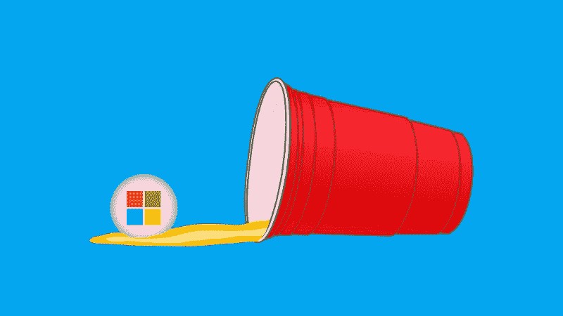
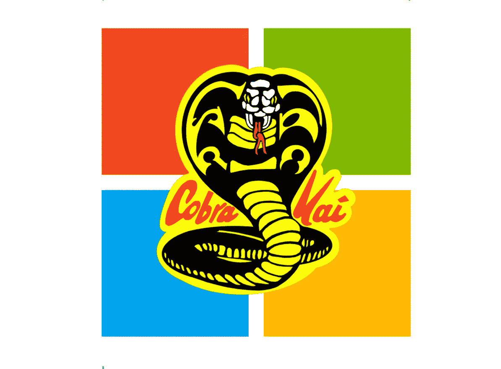

# 微软骗局

> 原文：<https://medium.com/hackernoon/the-microsoft-hustle-355f818161a6>

尽管他们的硬件、软件、云服务和收购令人生厌，微软在这个时代仍然是一家出色的公司，在这方面低估他们是愚蠢的。当然，他们最近的三个操作系统都是彻头彻尾的垃圾，他们已经从能够收取数百元的许可证费用下降到免费赠送 Windows 10，同时不得不在其上放置广告，实施无法禁用的侵入式遥测技术，并诉诸恶意软件式的分发策略，Windows 7 仍然拥有几乎两倍于 Windows 10 的市场份额，而且它已经有近十年的历史了。他们的 Surface 系列笔记本电脑甚至遭到内部员工的厌恶，其质量如此之差，以至于《消费者报告》不得不撤回他们的推荐。更糟糕的是，他们在营销上的支出超过了 R&D，2016 年为 147 亿美元，而 2016 年为 120 亿美元，这基本上意味着他们是一家有软件问题的营销公司。那么是什么让他们如此出色呢？他们的合作伙伴网络。

对于那些不知道的人来说，微软的合作伙伴网络包括咨询公司、软件经销商等，并负责微软 95%的商业收入；使他们成为 ol' Softy 的主要客户。大多数合作伙伴围绕 Microsoft 堆栈提供广泛的服务，包括但不限于实施、管理和支持(IMSs)。但是，他们并不支持微软的产品，因为他们碰巧提供了缺陷最少或最有效的解决方案。相反，除了比最接近的竞争对手高出 19%的利润率之外，合作伙伴公司每向微软上缴 1 美元的收入，该公司就可以通过他们的 IMSs 获得额外的 9.01 美元，而这是以他们的客户为代价的。例如，如果微软产品是一家公司依赖的价值 50，000 美元的汽车，它将附带 450，500 美元的后续维护成本。

然而，信任微软合作伙伴的企业支付的费用远远高于他们的 IMSs 费用，后者通常不到 IT 财务费用的一半。即使在管理良好的环境中，生产力损失几乎总是企业最大的 IT 支出，无论其规模如何。在生产力损失之后，IMSs 成为第二大成本，硬件/软件成本排在第三位。简而言之，虽然价值 50，000 美元的汽车可能会直接花费 450，500 美元进行维护，但由于固有的停机时间，生产率损失≥其维护成本，从而将公司的总体财务负担增加到至少 960，000 美元。

不幸的是，对于一个典型的咨询公司来说，盈利是以牺牲客户利益为代价的，很少有情况下微软能提供比竞争对手更经济或更高效的解决方案。在给合作伙伴的一篇博客文章中，微软甚至建议他们用他们的解决方案“创造粘性”，这是“创造利润”的俚语，我几乎不得不接受他们自己的产品也是用这种心态创造的。由于这种使事情变得更有利可图的策略，甚至像 IBM 这样的公司，个人电脑的发明者，在意识到他们的总拥有成本(TCO)比 Windows 个人电脑降低了 1/3 后，已经转移到苹果产品，这是很重要的。

> **“创造粘性**就是寻找机会巩固你的(我们的？)解决方案并增加转换成本。”- [***Jen Sieger，资深商业策略分析师@微软***](https://blogs.partner.microsoft.com/mpn/create-stickiness-with-ip/)

不难看出，相对于实施、管理和支持的成本，It 解决方案的缺陷或“粘性”有多大。随着时间的推移，IT 解决方案的缺陷越来越少，其 IMSs 的成本和频率也会降低。相反，随着时间的推移，IT 解决方案变得越来越有缺陷，其 IMSs 的成本和频率也会增加，这对合作伙伴公司来说更有利可图。对于软件公司来说，随着时间的推移，软件会变得越来越有缺陷，同样地，营销也会变得越来越昂贵；回复:营销公司遇到软件问题。我离题了，但很容易看出合作伙伴公司如何从有缺陷的软件解决方案中获得巨大利润，同时最小化利润较低和缺陷较少的解决方案，这些解决方案对他们的服务产生较少的必要性，更不用说由于他们之间的这种动态，微软及其合作伙伴之间会出现利益冲突。

微软的合作伙伴并没有把他们的客户放在第一位，也没有把他们的商业模式与他们的最大利益结合起来，而是因为显而易见的原因而与微软完全一致；因此被称为“合作伙伴”。看起来，作为对微软“创造粘性”或运送粪便(如果你喜欢简洁)的交换，他们的合作伙伴公司通过他们的 IMSs 产生了大部分收入，而微软的产品产生了最大的收入。再加上 19%的转售利润率，微软合作伙伴有很大的动力支持微软产品，同时也避开或忽视竞争解决方案，而不管对其客户的潜在影响。

正因为如此，微软实际上似乎更有动力以牺牲客户的利益为代价，为他们的合作伙伴保持理想的“粘性”或“盈利能力”,并可以通过简单地控制他们软件的缺陷程度来实现这一点。更多的缺陷导致更多的停机时间，更多的停机时间导致更多的 IMSs 和生产力损失，同时对他们的合作伙伴变得更有利可图。尽管微软不能直接进入他们的代码并故意制造错误，但他们绝对可以影响他们代码的缺陷程度。除了裁减大量的质量保证和 SDET 资源(这将对软件的缺陷程度产生明显的影响)之外，微软还可以通过限制其他地方的员工人数来调整缺陷密度，这将增加与员工相关的工作量以及出错的可能性。这种做法对微软来说更合理，因为他们也有强大的供应商劳动力，可以填补他们的全职员工的流失。

在某种程度上，微软找到了一种从有缺陷的软件中获利的方法，这本身就很棒，你必须给予他们应有的信任。即使微软和他们的合作伙伴之间的这种关系实际上可能违反了[谢尔曼反垄断法](https://en.wikipedia.org/wiki/Sherman_Antitrust_Act)，如果他们是故意这样做的，这仍然是一个辉煌的罪行。他们可能是软件公司的别克，他们的标志可能看起来像涂了颜色的博格立方体，尽他们最大的努力模仿 Voltron，但他们一点也不愚蠢，你应该明智地记住，他们不会偶然每年产生近 1000 亿美元。

> “高质量的软件并不贵。从最初的开发一直到总拥有成本，高质量的软件比低质量的软件构建和维护起来更快更便宜。*-*[*雀跃奇兵*](https://en.wikipedia.org/wiki/Capers_Jones)

[**点击此处观看本系列的第二部分**](https://hackernoon.com/the-microsoft-hustle-2-0-9de19a277e52)