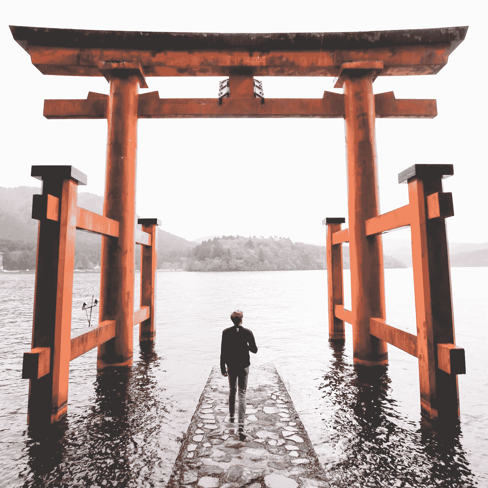

# 今天越不舒服，明天就越舒服

> 原文：<https://medium.com/hackernoon/the-more-uncomfortable-today-the-more-comfortable-tomorrow-3e271d7674e4>

## 在国外 7 年后，世界教给我的教训

[Photo credit to Mitchell Jordan](https://www.instagram.com/mitchelada/)

> “我们的父母看不到真实的我们——他们看到的是他们记忆中的那个孩子。我们的朋友看不到真实的我们——他们看到的是他们记忆中的朋友。只有在旅途中遇到的陌生人才会看到真实的你。”

最近， [Conor Neill](https://conorneill.com) 与我分享了这些话，他是 IESE 商学院([《金融时报》](https://www.iese.edu/en/about-iese/news-media/news/2017/may/iese-ranked-1st-in-world-for-executive-education-by-ft-for-3rd-straight-year)排名第一的高管教育中心)的领导力和沟通教授，也是 [Youtube 频道](https://www.youtube.com/user/rhetoricaljourney)的所有者，该频道讨论这些话题，讨论旅行对提高自我意识有多重要。

这个故事由康纳的一个日本 MBA 学生传给了他，让我思考海外旅行和生活如何塑造了我的生活，以及在我迫切需要答案的时候，这个世界教给我的重要教训。

7 年前，当人们问我为什么决定放弃一份舒适的管理工作，换取一张去西班牙的单程票时，我告诉他们，我想去看看这个世界，在西班牙，我没有朋友，工作机会也是一样多。

但那是谎言。

我离开是因为我把自己创造的世界搞得一团糟。

介于优先考虑我认为别人想从我这里得到的东西和太在意试图融入之间，我迷失了自己想要什么，我不再寻找我真正属于的地方。

旅行的美妙之处在于我们每个人都带着不同的东西离开。

对我来说，与众不同的是，在国外的旅行和生活打开了我的眼界，让我看到了我成为的那个人，让我看到了我能够成为的那个人。

简而言之，旅行教会了我再次对自己下注。

下面这些在国外旅行和生活给我的教训是我为什么会继续这样做的原因。

## **学会如何向前失败的重要性:**

旅行或搬到一个新国家的美妙之处在于，你学会了如何向前失败。事实上，没有失败——只是方向的改变。

在你交了一个等待下一班火车的新朋友后，错过的火车很快就会被遗忘。那次地狱般的巴士之旅。这将是未来几年的一大奇闻。

旅行没有什么是完美的，这就是它的美丽所在。我们跌跌撞撞地前进，经常失败。作为一种奖励，旅行带我们去我们一直想去的地方，在这个过程中教会我们，我们一直想成为什么样的人。

## 你没有事业——你有自己的生活

任何旅行者，甚至任何去度假的人都有一个最大的收获，那就是生活中有比工作更多的东西。对某件事充满激情是很棒的，世界因“想法加行动”而运转，但我去过的许多地方与美国之间的一个显著差异是，人们对生活中其他支柱的重视程度不亚于工作。

我周围的人都是为了生活而工作，而不是为了工作而生活，这是我从长达十年的企业昏迷中走出来的最佳时机。当我在让我快乐的相反方向上走得太远时，这种心态提醒我回到正轨。

## **获得支持的最佳方式是首先给予支持:**

我喜欢认为自己是个好人。然而，在国外的旅行和生活教会了我主动示好的重要性和力量。到达巴塞罗那后，我首先意识到，周围绝对没有人真正关心我，只有我能给他们一个关心我的理由。

在这一路上的某个地方，我忘记了注意那些让我周围的人微笑的细节。我太专注于自己的想法，以至于很少抬起头来看看如何让我关心的人生活得更轻松。

也许根本不是巴塞罗那。也许只是因为我后退了一步。但是旅行教会了我，没有比对某人表现出兴趣并真正倾听他们所说的话更高的赞美了。毕竟，最美好的记忆和最伟大的教训往往不是看到的，而是听到的。

## **你不仅开始接受变化，而且开始拥抱变化:**

我 23 岁时，为了克服口吃，我找了一份销售工作。一开始，我制作了一些抵押贷款销售史上最差(也是最长)的广告。但是我好起来了，我一天感觉越不舒服，第二天就越舒服。

回顾我为什么用轻松的薪水换取与工作无关的未知。然而，这与我开始优先考虑“熟悉”和“安全”等词，而不是“成长”和“推动自己”等词有很大关系——这正是我最初取得某种程度成功的原因。

当我们需要的时候，我们都可以变得非常足智多谋，旅行和移居到一个新的国家迫使我们这样做并成为那样的人。旅行每天都在挑战我们，随着时间的推移，它教会我们，未知并不可怕，只是通往我们一直知道自己有能力成为的那个版本的自己的一条路。

媒体大亨和社交媒体专家[加里·维纳查克](https://en.wikipedia.org/wiki/Gary_Vaynerchuk)很少制作不包含自我意识重要性的视频。然而，在与拉里·金的一次谈话中，当被问及如何实现这一目标时，加里回答说:“我不知道。”

如果是我和拉里说话，我的答案会很简单:旅行。

在国外旅行和生活会很快教会你什么样的个人特质让你在这个世界上生存下来，以及你需要努力什么才能茁壮成长。

在国外旅行和生活会让你直面这样一个现实:无论你多么世俗，你都无法独自完成，而这种类型的人最适合和你一起踏上旅程。

在国外旅行和生活教会你将心态从说“我相信”转变为先问别人他们相信什么。

最重要的是，在国外旅行和生活让你知道你是谁，让你知道你想成为什么样的人。

开头提到的那个日本学生还说，在他的旅行中，他遇到了他生命中最重要的三个人，“他的妻子，一位明智的导师……..还有他自己。”

很难说如果我留在美国，最终是否会学到这些经验。我想是的，但我确信，走出我的舒适区并生活在国外大大加快了学习曲线，并帮助我遇到了我也注定要成为的那个人。

*如果你喜欢这篇文章，请给它一个*👏*所以其他人会在媒体上看到它。作为一个刚刚在过去一年重新发现自己热爱写作的人，你的掌声、评论和关注意味着全世界。*

如果你喜欢这篇文章——前往[**www.mikethompsonblog.com**](https://mikethompsonblog.com)并注册接收所有新文章和 2 份免费的欢迎礼物:“ **31 个激发你写作创造力的想法”** — *我作为一个新作家的备忘单，我想出了关于*和 **225 个激发你写作灵感的引语**—*—*。