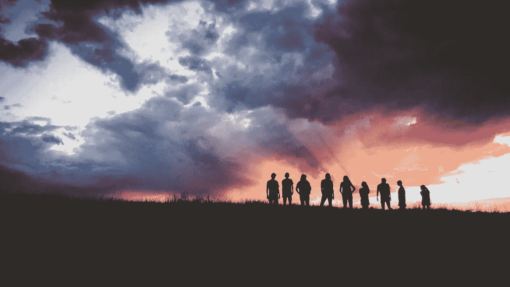

# 早上的起立仪式

> 原文：<https://medium.com/hackernoon/the-morning-standup-ceremony-671ccdbc7d7e>

我们中的一些人有自己的仪式来启动我们的生活。对于很多团队来说，他们的晨会已经变成了这样。因为你如何开始你的一天决定了这一天是否会是美好的一天，所以和你的团队开一个好的会议会有积极的效果。

# 这是什么？

这个[会议](https://hackernoon.com/tagged/meeting)的目的是为了每个人的利益，为那天的团队努力制定框架。这些会议通常在每天的同一时间召开，最好是在工作日开始时，所有团队成员都应该参加。这个会议可以在同一地点举行，也可以通过视频远程举行。

你不需要真的站起来*。*

晨会也被称为每日 Scrum 会议，或者简称为 Scrum。我更喜欢用“站起来”这个短语，但是为了方便起见，我会在这篇文章中交替使用所有这些术语。

# 你是怎么做到的？

会议期间，每个人依次发言并回答以下问题

*   他们昨天在做什么？
*   他们今天会做什么？
*   **是否存在任何阻塞问题？**

随着时间的推移，文明、快速和有效的起立鼓掌可以在团队成员之间建立紧密而具体的关系。它是每个团队成员对另一个团队成员，或者对每天的进展所做的承诺。

通过让每个团队成员讲述他们在前一天和当天都做了些什么，可以为每个人描绘出一幅清晰的画面，说明已经完成了哪些工作，还有哪些工作有待完成。

每位团队成员轮流阐述上述要点。一个 5-7 人的团队可能需要大约 15 分钟，因此每人需要 3 分钟。

这些会议是自发的，不是由一个人领导的。创造性地决定谁先开始，谁接着发言。他们应该什么时候开始？让我把上午 10 点的时间扔出去。

# **一些单口相声的礼仪**

下面是一个任意的、非详尽的列表，列举了一些在社交场合下可以接受的行为。也许你可以把它们应用到你自己的团队中。

*   文明一点，表现好一点，玩得开心点。
*   要准时。理想的情况是早一两分钟。会议需要 15 分钟。如果你迟到 3 分钟，你就会错过你的一个队友所说的话。
*   做好准备。你应该能够不假思索地回答这三个问题。人们可能会本能地说。
*   注意，不要做笔记。
*   将你的手机、平板电脑、设备、智能手表和笔记本电脑放在触手可及的地方。
*   坚持你的*分配的* 3 分钟，但不要削减其他人的时间，如果他们超过这个限制。会后私下鼓励节约时间。你或许也可以私下对那些迟到的人做同样的事情。

换句话说，做一个好的沟通者，表现出良好的礼貌，尊重他人。

# 什么单口相声不是

**某种状态报告**

这是一个团队之间的交流。这不是向老板或主管单独汇报，也不是经理从团队中收集信息；通常是为了查看什么晚了。

**问题解决会议或问题解决会议**

也许你在当前的工作中遇到了一两个问题。也许您在某个实现中遇到了问题。或者也许你正在处理一个棘手的问题，需要向对这个问题非常了解的人请教或寻求一些建议。所有这些以及更多的事情都可以在会议结束后，在你自己的时间内，按照你自己的节奏进行。将会议作为提出问题的工具，这些问题你将在以后解决。

**社交聚会**

站起来之后是整整一天。午餐也是。

# 有效站立的典型障碍

有些细枝末节决定了你自己的站立会议是否有用、有效并推动你的团队前进，或者是一次没有发挥全部潜力的拙劣尝试。其中包括:

**不听或不关注队友。**

积极倾听将提高会议的质量，并使会议达到其目标，即传达已经完成的工作和有待完成的工作。不听很可能会产生相反的效果，让说话的人感到沮丧。

***进化*超越 3 题格式**

如果你已经离开了三个问题的形式，也许是时候重新考虑回到它了。scrum 会议是这样制定的，因为它在最短的时间内提供了最大的交流利益。不要放弃单口相声的真实能力。

**重复与前一天相同的日常任务**

随时询问他们是否有什么事情耽搁了。也许有一个阻塞的问题。帮助询问他们是否需要帮助，并在站立后与他们一起工作。这个也是我们每天召开站立会议的原因。

尽管如此，我还是应该指出，站立会议绝不是浪费时间。

# 晨间站立的好处

随着时间的推移，这些会议将导致团队之间的后续对话，从而改善沟通和分享个人成员领域以外的领域的知识。这有助于更好地理解你正在开发的产品、服务或流程。

# 简明恰当

晨间起立仪式是团队交流任务、分享知识、全面提高协作和超越目标的最佳方式之一。只需每天回答这三个简单的问题，并使用上面的简单建议，就可以获得它们的全部好处。你会惊喜的。总是试着开心。

哈德逊·辛慈在 [Unsplash](https://unsplash.com/?utm_source=unsplash&utm_medium=referral&utm_content=creditCopyText) 上拍摄的封面照片