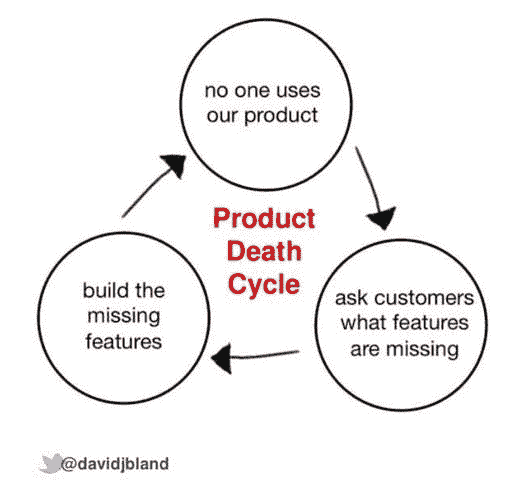

# 每个个人和组织都会犯的最基本的错误

> 原文：<https://medium.com/hackernoon/the-most-basic-critical-mistake-that-every-individual-and-organization-makes-e06e9ad322d8>

## 在我分享这个最关键和最基本的错误是什么之前，我需要在这里建立一些可信度。我有什么权利指出这一点？作为一名十多年的管理专业人士，现在又是一名企业家，我在大型企业巨头、初创公司中见过这个问题，作为团队的导师和经理，我认识到人们身上也有这个问题。见鬼，我自己也认识到了这一点。

Source: renegade tribune

个人和公司忽视的对他们不利的关键事情——*****事情*** 是“**反馈**”**

**无论你生活的指导哲学是什么，无论你的信仰体系是什么，人们普遍认为你在这个人类化身中的最终目标是“改善”。无论是对世俗财富的提升还是对你灵魂的“升级”,为了任何形式的改善，你都需要比较你向最终目标前进的方向——以防你出轨。反馈机制在你的生活中实现了这个目的。**

**虽然反馈机制对你的个人成长至关重要——当然，除非你走上了享乐主义道路——但这里探讨的是组织框架内的反馈机制。**

# ****组织内部的反馈文化****

**“反馈”在两个方面发挥着重要作用:**

1.  ****关于产品/服务的反馈****
2.  ****对员工的反馈****

**你通常不会将**客户反馈**和**员工管理反馈系统**相提并论。但我逐渐意识到，原则上，它们是一样的。如果公司有正确的 DNA，它将在两个方面都做得很好。这两者对公司的成长都至关重要——你不能因为忽视其中任何一个而渴望公司的成长。**

## ****1。客户反馈的重要性****

**获客成本比留住一个客户高 5 倍。认真倾听反馈是确保你的客户满意的一种方式——如果不满意，在你失去他们的业务之前找出补救的方法。**

**这些是一些流行的征求反馈的方法。**

*   ****调查**——创建一个调查只需要一个谷歌表单。但挑战往往是让人们对这些形式做出反应。B2C 公司甚至为你的时间提供“奖励”,以获得消费者的回应。**
*   **电子邮件——与匿名调查相比，个性化邮件几乎总能得到回复。当然，这在 B2B 环境中更加现实**
*   ****忽略你的俘虏观众**——让我们举个例子。你的产品是一款提供送餐服务的应用。你有 50 名员工。如果你的每一个员工都没有经常使用你的应用，如果他们没有积极地向他们的朋友和家人推荐他们，你可以放心，你的产品/服务有问题。将团队置于枪口下并让他们使用产品不是解决方案。相反，要有一种文化和流程来识别和捕捉这种“反馈”。**
*   ****可用性测试**——你可能只有一个“**最小可行产品**”或者你即将推出的功能的等价物。设计可能只完成了 70%。打开功能进行可用性测试。这将给你关于你的产品使用的难易程度的巨大反馈。它为你节省了宝贵的时间。**
*   **客户访谈——这是一个棘手的问题。因为顾客可能并不总是知道他们想要什么。大卫·J·布兰德称之为“**产品死亡周期**”，并用下面这条推文解释了它。解决方法是尝试找出根本原因。这最好由一组高级成员来完成，包括来自产品、技术和销售团队的代表。准备好诚实的自我反省。**

****

****既然有如此精细的机制来征求反馈意见(**甚至有公司开发产品只是为了帮助你获得更好的反馈意见)**，为什么大多数公司仍然会弄错呢？****

*   ****不要只是坐在反馈上**——当从首席执行官到下面的[组织的较低层没有明确的命令时，反馈只是坐在周围收集隐喻的灰尘。有时行动的意图可能就在那里。但是公司忙于应付多种事情，以至于反馈和所需的纠正措施被放到了图腾柱的最低端。这通常发生在处于成长阶段的初创企业身上](https://hackernoon.com/tagged/organization)**
*   ****结束对话** —是的，当一份服务水平协议以书面形式出现，并带有用**粗体**书写的惩罚条款时，公司通常倾向于结束对话。但是，当它是口头或通过电子邮件提供给你的团队的反馈时，会发生什么呢？如果是队友提供的创新想法呢？他们通常会遇到正确的陈词滥调，然后迷失在系统中。应该有一种机制来捕捉这一点，并向反馈提供者更新正在做的事情。如果你当时不能采取行动，也应该进行沟通。**
*   ****跨团队的责任** —“客户反馈”一词会立即将您的注意力吸引到“客户服务主管”(CSE)身上。对于一个将客户反馈作为优先事项的组织来说，这一责任不应该仅仅委托给 CS 团队。你的销售团队、运营团队、关系经理——甚至是讨厌人际交往的极客开发人员，都应该将这一点植入他们的 DNA 中，以意识到反馈。**
*   ****衡量有效性**——根据反馈的严重性(比如，客户有多生气)，公司倾向于提供“创可贴”式的解决方案。虽然创可贴有其优点(我们都不得不在某个时候这样做，以安抚愤怒的顾客)，但这不应该是故事的结尾。应该有一个流程来衡量该解决方案的有效性和客户满意度。**
*   ****透明度** —如果一个特定的流程改进是由组织中的一个初级成员提出的，他们可能在系统中没有可见性，不知道该建议发生了什么。或许，该公司已经搁置了这个想法，因为它不符合更大的组织目标。如果是这样，这必须传达给团队成员。这对于创造一种文化非常重要，在这种文化中，人们觉得自己有能力提供反馈。**
*   ****确认偏差** —这是所有反馈流程的丧钟。你将开始解释反馈，以适应你的信仰体系。这一点在初创企业的创始人身上尤为明显，因为他们对自己的想法投入了太多感情。因此，在较早的送餐应用程序的例子中，即使 49%的员工不经常使用该应用程序，也不要解释他们的行为，说因为他们和父母在一起，所以他们在家吃午饭，因此不需要该应用程序。如果完全符合目标受众的内部团队不使用该产品，那么这就是一个危险信号，而且是一个很大的危险信号。**

## ****解决这些麻烦的灵丹妙药****

**和任何关系一样，这里也一样，沟通是关键。获得客户反馈并不是续约(对于 B2B cos)或新产品发布(对于 B2C cos)时的例行公事。**

> **积极寻求反馈应该是任何公司的口头禅，它们不想在一个保质期和用户注意力持续时间都低得吓人的环境中被淘汰。**

**或许另一个乌托邦式的想法是设立一个“**首席反馈官**”的职位，其职责可能是:**

*   **确保收集“反馈”不是一次性活动，而是产品或服务生命周期的持续过程。在这里，你需要首先定义一个产品的生命周期——通常[初创公司](https://hackernoon.com/tagged/startup)在第一阶段做得很好，重点是创造第一个 1 亿美元的收入。狩猎可能不错，但在农业方面就没那么好了。**
*   **确保所有反馈都被记录下来并与相关人员分享——以建立问责制。**
*   **确保重要的问题得到应有的关注(首席执行官需要足够的知识和成熟来测试反馈本身的相关性)**
*   **确保实施纠正措施——这包括将所有权分配给各个团队，并跟踪任务的完成情况**
*   **确保进一步测量以测试上述措施的有效性**
*   **如果没有达到期望的结果，进行进一步的修正**

**在商界，很少有人没有听说过理查德·布兰森爵士。除了他作为企业家的古怪和非凡的成功，他领导的企业也是顾客满意度的缩影。用他自己的话说，**

*****你的教育真正开始于你向顾客敞开大门的那一天。*****

**这应该是所有企业主的座右铭。**

****第二部分——个人和公司忽视的关键问题——对他们不利(随后发布)****

**— — — — — — — — — — — — — —**

**如果你喜欢这篇文章，请点击❤，这样它会帮助其他人发现这篇文章。非常感谢！**