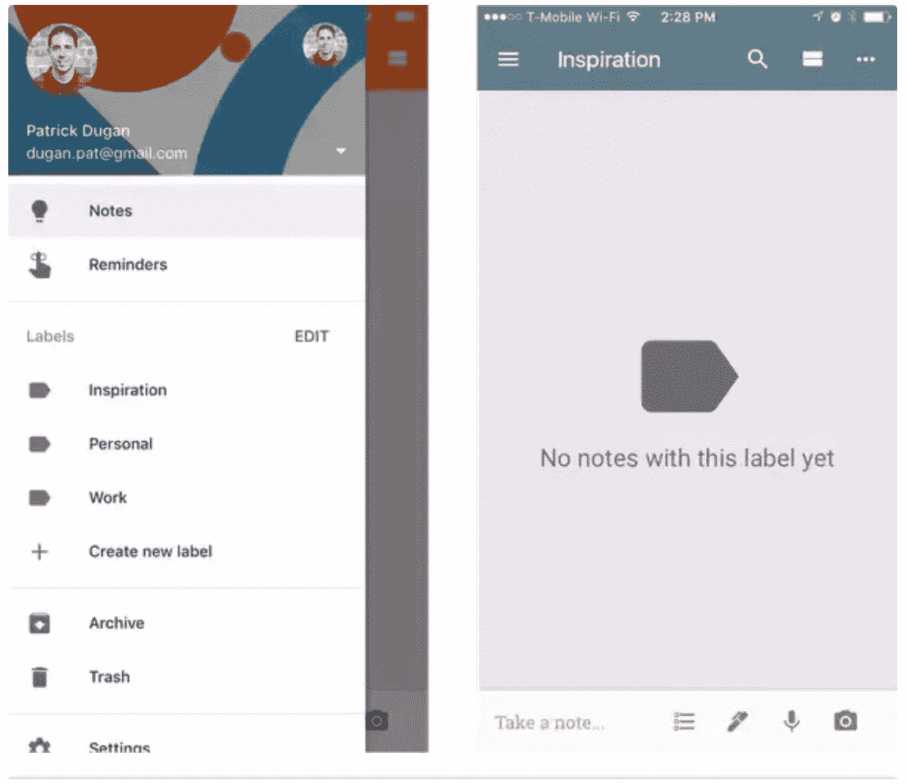
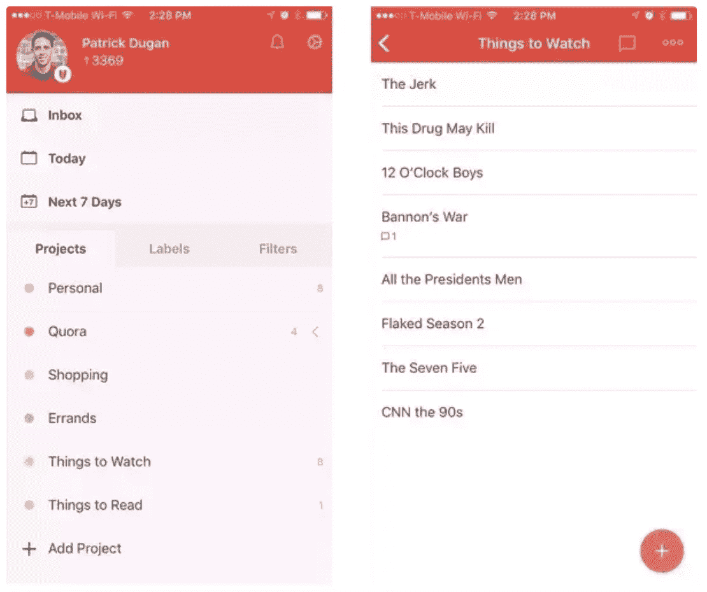

# 移动应用程序设计中最常见的 UX 陷阱

> 原文：<https://medium.com/hackernoon/the-most-common-ux-pitfalls-in-mobile-app-design-5f42d27e4717>

> 帕特里克·杜根是一名产品设计师。[原载](https://www.quora.com/What-are-the-most-common-UX-pitfalls-in-mobile-app-design/answer/Patrick-Dugan-3)于 [Quora](http://quora.com?ref=hackernoon) 。

移动应用程序设计中的一个常见缺陷是依赖于[“汉堡菜单”](https://en.wikipedia.org/wiki/Hamburger_button)作为通用操作和通用导航的总称。

看看两个笔记应用程序的比较， [Google Keep](https://itunes.apple.com/us/app/google-keep-notes-and-lists/id1029207872?mt=8) 和 [Todoist](https://itunes.apple.com/us/app/todoist-todo-list-for-organizing-work-and-errands/id572688855?mt=8) ，汉堡菜单的使用及其负面影响是非常明显的。

首先关注 Google Keep，应用程序的导航条上挤满了未标记的图标，用户不清楚这些图标的动作。其中一个图标，汉堡包菜单，是谷歌 Keep 存储导航点的地方，比如笔记、提醒、存档、垃圾桶和设置。

此外，在汉堡菜单中，用户可以访问应用程序的标签功能(与文件夹同义)。

相反，Todoist 应用程序根本没有汉堡菜单。

文件夹、标签和过滤器等屏幕中的导航点采用选项卡式导航控制器的形式，从应用程序的主屏幕上可以看到。

当在主屏幕上时，应用程序导航栏具有进入通知和设置屏幕的入口点，并且一旦用户向下进入应用程序的层次结构，它就被文件夹和标签标题所取代。

Todoist 决定完全取消汉堡菜单的好处有很多，包括:

*   **更容易发现特征**
*   有大量的研究表明许多用户从来不看汉堡菜单。Todoist 以高度可见的方式展示其应用程序的主要功能，而 Google Keep 将应用程序的大部分表面区域的入口点放在一个不可发现的菜单中。
*   **更加一致的信息层级**
*   Todoist 的用户能够理解项目、过滤器和标签都是排序和组织内容的同等手段。然而，在 Google Keep 内部，标签、注释和提醒之间的信息架构和关系在视觉上和每个功能各自的位置上都是混乱的。
*   **能够更轻松地浏览整个应用程序并完成常见任务**
*   Todoist 的特点是在列表底部添加内嵌动作，并在适当的时候使用上下文相关的[浮动动作按钮](https://material.io/guidelines/components/buttons-floating-action-button.html)。然而，Google Keep 在应用程序的导航栏、标签栏和汉堡菜单中插入了常见的操作。在这样做的时候，用户可能很难理解如何完成一个动作，或者他们应该在哪里完成。

汉堡菜单在谷歌的大多数第一方 iOS 和 Android 应用程序中占据显著位置，这可能是因为它是谷歌材料设计框架的基石(在该框架中，它被称为[导航抽屉](https://material.io/guidelines/patterns/navigation-drawer.html))。

我发现，将汉堡菜单整合到应用程序的信息架构中，最终会导致设计师行动迟缓。

汉堡菜单允许设计师和产品经理在应用程序中添加新的功能或屏幕，最终会使所述应用程序更难学习、使用和理解，而不是关注应用程序的主要用例或试图真正理解有效地允许用户在应用程序中导航的方法。

> 帕特里克·杜根，他是一名产品设计师。[原载](https://www.quora.com/What-are-the-most-common-UX-pitfalls-in-mobile-app-design/answer/Patrick-Dugan-3)于 [Quora](http://quora.com?ref=hackernoon) 上。
> 
> 更多来自 Quora[的趋势科技答案，请访问](https://medium.com/u/3853f85f7d5e?source=post_page-----5f42d27e4717--------------------------------)[HackerNoon.com/quora](https://hackernoon.com/quora/home)。