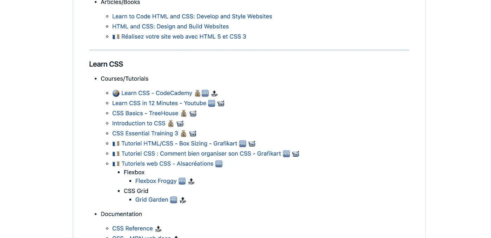
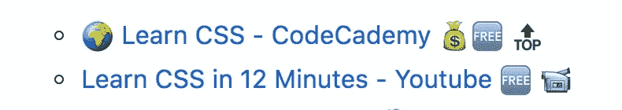

# 前端初学者最基本的资源列表

> 原文：<https://medium.com/hackernoon/the-most-complete-list-of-resources-for-front-end-beginners-efff3c3744db>

如果你是一个前端初学者或者想学习 Web T2 开发，你可能不知道如何开始。这就是为什么我决定在 Github 上创建“ [**前端初学者最基本的资源列表**](https://github.com/thedaviddias/Resources-Front-End-Beginner) ”。基于我的一些列表，我选择创建一个新的列表…但是不同于你可能在 Github 上找到的其他列表(优秀列表)。

# 使用表情图标添加更多信息

今天，每个人都使用表情符号，所以我发现用它们来添加更多关于我添加的资源的信息很有趣:

*   这🌍意味着资源是多语言的。
*   💰是付费教程和🆓意味着它们是免费教程。
*   🔝表示该链接是一个*引用*，这有点主观，但我总是想指出一些非常好的资源。
*   这📹当视频内容可用时出现

Example of the use of emoticons in the list

# 英语🇺🇸和法语🇫🇷资源

我的 Youtube 频道和我的居住地(毛里求斯)上的一些人要求我定期向他们提供法语内容。我添加了法国国旗，以帮助识别哪些资源使用该语言。

我做了一些研究，发现很少有内容是法语的，质量很好。这意味着一些“空间”仍然在这里提供关于网络开发的法语内容。

# 下一步是什么？

我已经在用关于 Sass、CSS 框架、JS 框架和更高级的东西的资源做一个中间列表。所以请继续关注我在 Github 上的简介。

感谢您的阅读，如果您有任何问题或评论，请随时留下您的评论。

如果你认为其他人应该阅读这篇文章，按下❤️按钮，发推特并分享这篇文章。记住[在媒体上关注我](/@thedaviddias),这样你就可以得到关于我未来帖子的通知。