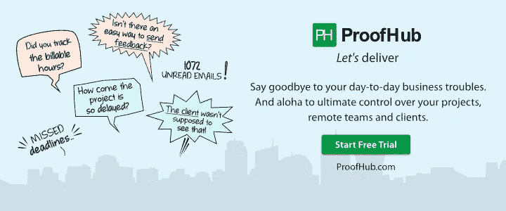

# 在工作中大喊大叫是最危险的事情

> 原文：<https://medium.com/hackernoon/the-most-dangerous-things-that-you-can-go-about-yelling-at-work-48898ad31adf>

有无数种方法可以敲响谣言的警钟，让它到达你在办公室的坏名声。所有这些都源于一个对话陷阱──当你不小心说了一些听起来可疑的话，却仍然不知道自己做错了什么。例如，当你想听听同事对某件事的看法时。对话可能是这样的-

**你**:嘿！！怎么了(*短暂的停顿让你下定决心*)。没关系。

你的同事:什么事？？

**你:** ( *)没什么！只是想听听我最近一直在思考的一些事情的看法。(*现在你有了第二个想法，如果你真的应该问它。)**

**你的同事:**那就要吧。

你:我在想……(*你最后说了一些你应该在工作之外告诉你朋友的话。*

这场对话有很多陷阱，从最后一句话中完全错误的用词开始。最终将你的精神安宁、友谊，甚至在某些情况下，你的工作置于危险之中。你可能认为你走对了路，但是人们并不像你想象的那样看待你。

你需要避免许多这样的对话陷阱。你不可能照顾到所有的问题，但是有几个非常常见的问题在工作中经常出现，如果恰好陷入其中就太愚蠢了。列表如下:

**#1 你的职业规划**

每个人都有一个 A 计划和许多备用计划。就像和某人谈论一家竞争对手的公司，你愿意转投你现在的公司。像这样的计划，直接瞄准了你公司的利益，最好和同事们保持一定的距离。如果你的老板知道了怎么办？想过吗？

因为你不知道你的老板想要什么，所以冒这个险是不公平的。但现在他完全知道你想要什么。像这样的情况永远不会在零和游戏中结束。

**#2** **你对公司目标和愿景的批评**

你永远不知道你老板忠诚的花栗鼠是谁。意外地开始一段你和他一起批评公司政策的谈话可能是一件非常糟糕的事情。

这可能都是偶然的，但这才是真正的危险。如果它是有意识的，你可以做些什么。所以最好永远不要提起这件事。

**#3 你的创业抱负**

如果你不想让你的老板认为你现在的工作只是未来事情的垫脚石，那么最好避免谈论更大更好的计划，比如开始自己的事业。然而，你应该掩饰你对在当前组织中取得成功的渴望。

如果你在工作之外做一些事情，那么最好不要在工作附近讨论它，即使它是一种爱好。你的行为所表达的含蓄的语言可能会传达一个错误的意思，你只要稍微小心一点就可以避免。

**#4**

如果你的老板是一个强有力的领导者，他会支持你的事业。如果没有，你对他来说就是一个威胁，需要立即处理。你的意图是职业的，可能不会引起他的共鸣，他的意图可能会变成个人的。

你可能永远不知道这样的讨论会如何开始对你的推广计划产生负面影响。对抗的意图或任何暗示对抗的东西，即使是微妙的，最好都要远离。

**#5 你在工作中或工作之外犯过的任何大错误**

永远不要走在哲学智慧的道路上，说你需要从错误中学习。这是不对的。永远不要在谈话中强迫你说这样的话:我当时错了，我纠正了自己，我正在康复，我现在好多了，因为这些肯定会被你的同事以最负面的方式使用。

有时公开说出你的想法是好的，但是你的时机要恰当。如果你是一家公司的新员工，或者打算留在你现在的雇主那里，那么最好采取预防措施，而不是一直小心翼翼！！

***让我送你我最好的东西，*** [***点击这里现在就订阅***](https://www.proofhub.com/articles) ***！***

## **********

Vartika Kashyap 目前在 [**ProofHub**](https://www.proofhub.com/#utm_source=Medium.com&utm_medium=referral&utm_campaign=Leadership&utm_term=AB&utm_content=The%20Most%20Dangerous%20Things%20That%20You%20Can%20Go%20About%20Yelling%20at%C2%A0Work) 运营营销团队，这是一款面向各种规模团队的项目管理软件。她是一位经验丰富的营销专业人士，是数字营销和创业方面的专家。她入选了[LinkedIn 2016 年度](http://www.linkedin.com/pulse/linkedin-top-voices-2016-15-must-know-writers-india-ramya-venugopal?published=t)最佳声音。在 [LinkedIn](http://www.linkedin.com/in/vartika-kashyap-30653245) 、 [Medium](/@kashyapvartika) 和 [Twitter](http://twitter.com/kashyapvartika) 上与瓦尔蒂卡联系。

也请关注我们的公司页面 [@ProofHub](https://plus.google.com/b/108914464885286332891/+proofhub) 以获取关于我们工具的最新更新、发表的文章、激励性引言&演示文稿。

## **********

如果你喜欢读这篇文章，你肯定也会喜欢它-

*   [这些可行的步骤将帮助你避免加班](/@kashyapvartika/these-actionable-steps-will-help-you-to-avoid-working-overtime-5b650a2c9ba2)
*   [500 天的拒绝让我这样补偿自己的恐惧](https://theascent.biz/500-days-of-rejection-made-me-compensate-my-fears-like-this-198efcdc01f4)
*   [与窃取你创意的同事打交道](https://theascent.biz/dealing-with-a-co-worker-who-steals-credit-for-your-ideas-a10309640fa3)

*原载于* [*赫芬顿邮报*](http://www.huffingtonpost.com/entry/58bfe195e4b0a797c1d3972b)

> [黑客中午](http://bit.ly/Hackernoon)是黑客如何开始他们的下午。我们是这个家庭的一员。我们现在[接受投稿](http://bit.ly/hackernoonsubmission)并乐意[讨论广告&赞助](mailto:partners@amipublications.com)机会。
> 
> 如果你喜欢这个故事，我们推荐你阅读我们的[最新科技故事](http://bit.ly/hackernoonlatestt)和[趋势科技故事](https://hackernoon.com/trending)。直到下一次，不要把世界的现实想当然！

