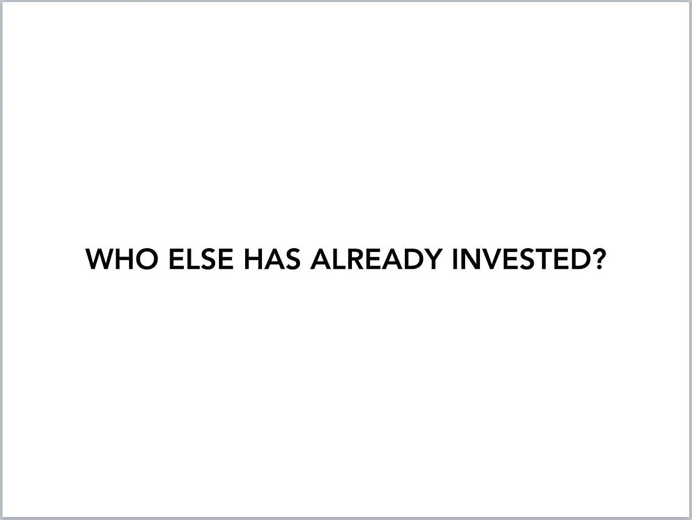

# 创始人最害怕的筹资问题

> 原文：<https://medium.com/hackernoon/the-most-dreaded-question-while-fundraising-9826df72a910>

我创办了一家名为 [Stilt Inc.](https://www.stilt.co) 的金融科技公司，我们正在为移民提供简单的金融服务。我们在 2016 年冬天通过 Y Combinator，因为 YC，我们在过去的一年里有机会会见了数百名投资者。这些投资者从个人/天使到大型风投基金不等。我参加过很多会议，在筹资过程的各个阶段，我肯定至少推销过 100 次我们的公司。

几乎所有的会议都会有一些关于公司、团队、市场、增长、防御能力等问题。其中一些会议可能会持续两个小时，我只是回答问题，试图说服投资者投资这个为移民建立银行的绝佳机会。

我发现了一个与投资者下一步行动密切相关的问题(或其某些版本):

## 世卫组织已经投资了？

他们试图确定两件事情中的一件:

*   如果一个知名投资者已经投资了——这对他们来说是一次强有力的信任投票，并降低了他们投资的风险。如果你有知名风险投资公司的投资，很有可能你会得到比你需要的更多的钱，而且估值也比你预期的要高。
*   如果你接近填满这一轮——这就是 FOMO(害怕错过)开始发挥作用的地方。如果有多个投资者在投资，他们一定看到了什么，这些投资者不想被遗漏。如果投资失败，他们也很容易回答自己的有限合伙人——每个人都认为公司会成功。

每次会议，当我被问到这个问题，还没有说出一个大投资者的名字，或者告诉他们我们的一轮几乎已经满员了，我都能几乎 100%准确地预测他们的答案。他们只是想在此之前找其他人投资。我没有见过任何问这个问题的投资者继续投资(如果我们没有达到这两个标准中的一个)。

这是筹款中最令人沮丧的部分之一，没有足够的人谈论它。毫无疑问，硅谷是科技创新的中心，也是一个伟大的创业生态系统，拥有最高密度的创始人和投资者。未来建立在这里，每天都有许多高风险的创业公司获得资金。但没有人谈论投资者的从众心理在硅谷有多严重。没有足够多有独立信念的投资者投资于他们认为未来可能成为大公司的公司。

*作为一家 YC 公司，我们有很多投资者会议的原因之一

感谢 Renuka Kumar 阅读本文的草稿。

> [黑客中午](http://bit.ly/Hackernoon)是黑客如何开始他们的下午。我们是 [@AMI](http://bit.ly/atAMIatAMI) 家庭的一员。我们现在[接受投稿](http://bit.ly/hackernoonsubmission)，并乐意[讨论广告&赞助](mailto:partners@amipublications.com)机会。
> 
> 如果你喜欢这个故事，我们推荐你阅读我们的[最新科技故事](http://bit.ly/hackernoonlatestt)和[趋势科技故事](https://hackernoon.com/trending)。直到下一次，不要把世界的现实想当然！

