# 有史以来最著名的自拍

> 原文：<https://medium.com/hackernoon/the-most-famous-selfies-of-all-time-2480023beb5c>

## 艾伦·德杰尼勒斯、巴拉克·奥巴马、乔·拜登、赛琳娜·戈麦斯让自拍成为社交媒体时代最强有力的代表之一。

在 2014 年 3 月洛杉矶奥斯卡颁奖典礼上，主持人兼喜剧演员艾伦·德杰尼勒斯发布了推特史上分享次数最多的自拍照，有超过 340 万次转发和 2.4 次赞。直到最近，该自拍也是该平台上被转发最多的帖子。[现在是第二个](https://blog.twitter.com/official/en_us/topics/events/2017/-nuggsforcarter-is-now-the-most-retweeted-tweet-of-all-time.html)！

这张名人照片包括(从左起):杰瑞德·莱托、詹妮弗·劳伦斯、查宁·塔图姆、梅丽尔·斯特里普、艾伦·德杰尼勒斯、茱莉亚·罗伯茨、凯文·史派西、布莱德利·库珀(亲自拍摄照片)、布拉德·皮特、露皮塔·尼永奥、安吉丽娜·朱莉等。

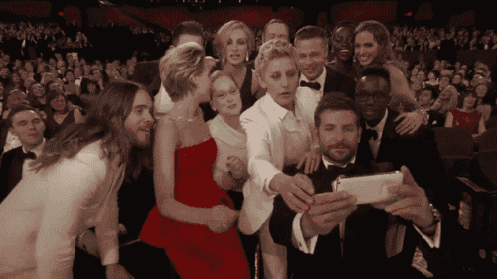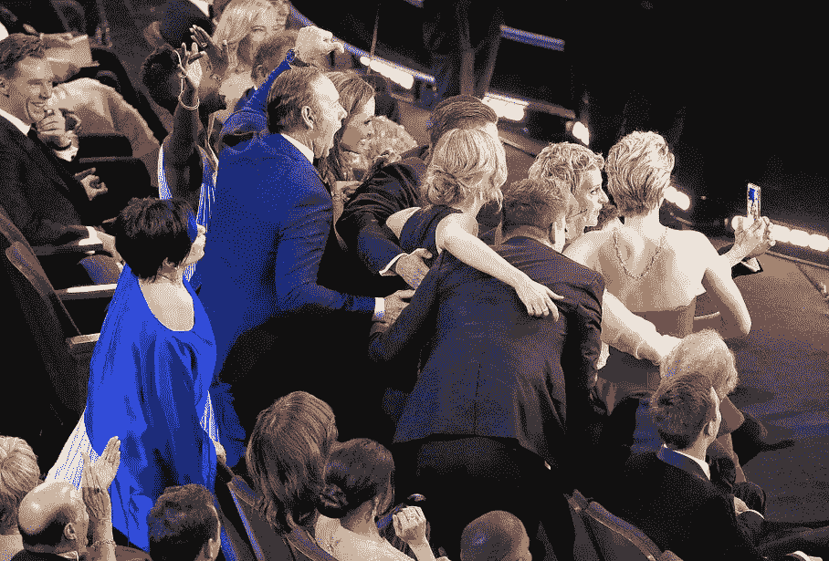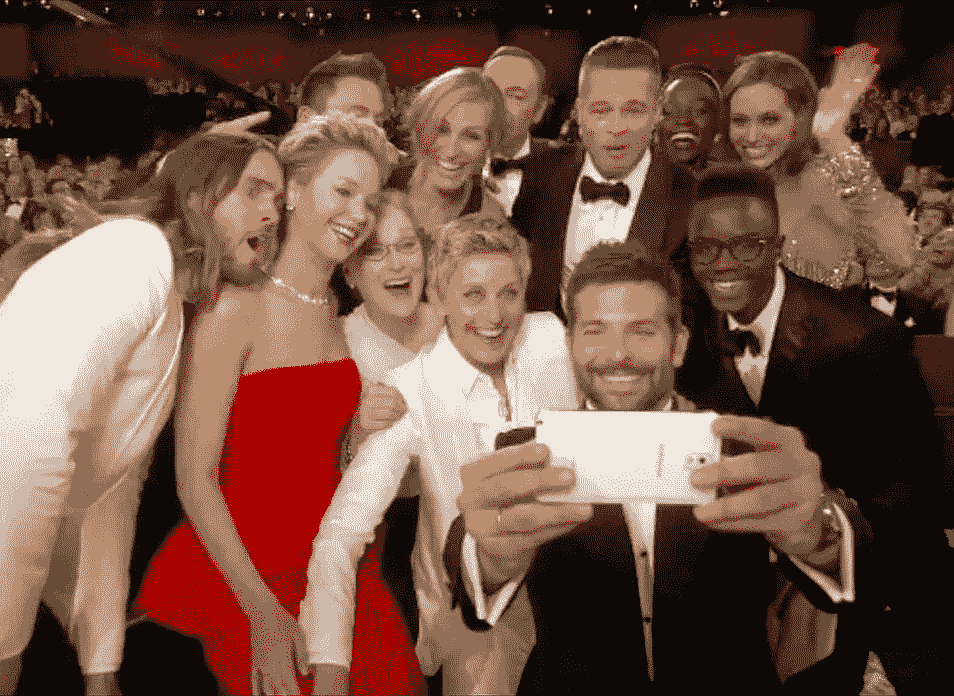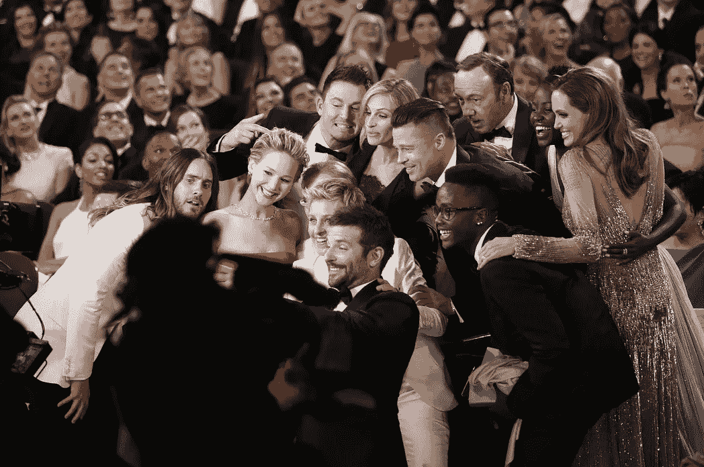

“这是为名人饱和的互联网时代创造的时刻，”《时代》杂志写道，当时它将这张自拍列入了 [100 张最有影响力的照片名单](/@fredgraver/the-true-story-of-the-ellen-selfie-eb8035c9b34d)。

“不时有人问我那张自拍是怎么来的，” [Fred Graver](https://medium.com/u/fa9449c02682?source=post_page-----2480023beb5c--------------------------------) ，他当时是 Twitter 的全球电视主管[今年 2 月在](/@fredgraver/the-true-story-of-the-ellen-selfie-eb8035c9b34d)[媒体](https://medium.com/u/504c7870fdb6?source=post_page-----2480023beb5c--------------------------------)上写道。

“在奥斯卡颁奖前的几个月里，我们提出了几十个想法让艾伦去尝试，”他回忆道。“她喜欢的一张照片是她在舞台上发了一张自拍，观众在她身后。周六下午彩排时，她一时冲动，认出了梅丽尔·斯特里普的座位卡，她将坐在第三排的过道上。

结局是尽人皆知的...那是社交媒体的历史！

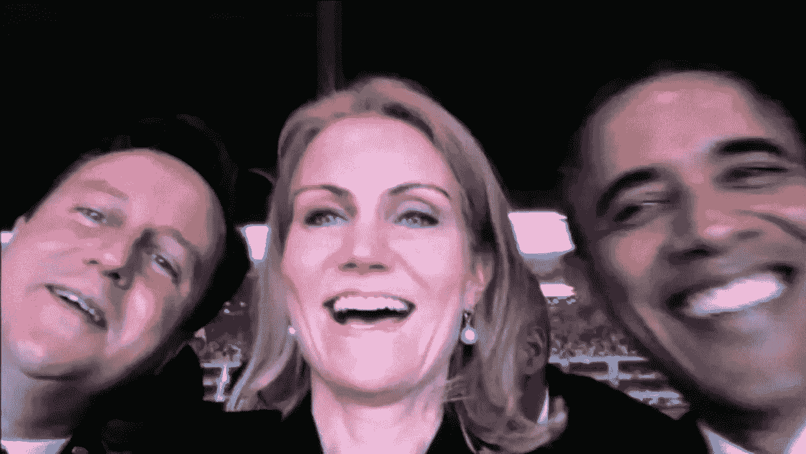

艾伦·德杰尼勒斯在 2014 年奥斯卡上的自拍照是有史以来被分享最多的自拍照，而世界政治中最臭名昭著的自拍照是由丹麦前首相赫勒·托宁于 2013 年 12 月在南非约翰内斯堡举行的纳尔逊·曼德拉追悼会上拍摄的。自拍中还有美国前总统巴拉克·奥巴马和英国前首相大卫·卡梅伦。

我们都看过他们三个尝试自拍的照片。由于许多批评，这些照片在社交媒体上疯传，几乎世界上所有的报纸——在线或离线——都在谈论它们。

但是贴在哪里呢？

显然，哪里都没有…尽管有照片显示索宁·施密特在社交媒体上发短信或发帖。

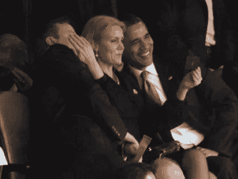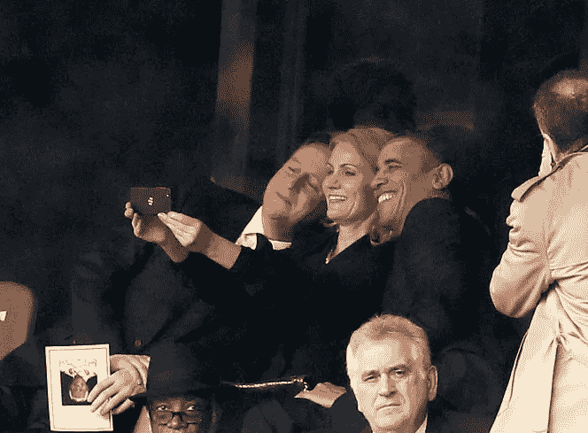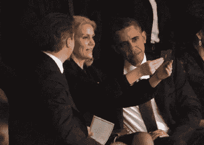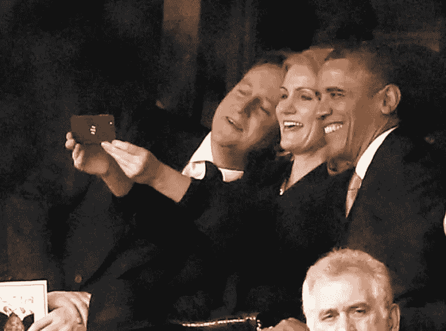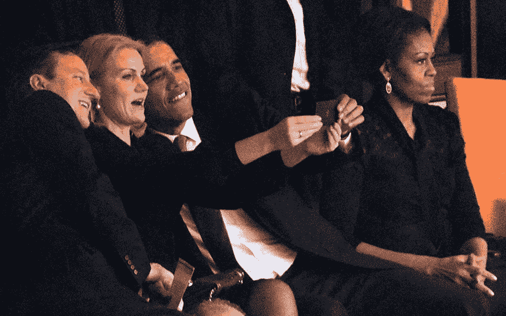

在 2016 年《财富》杂志举办的*最具影响力女性*活动上，这位前丹麦首相在描述曼德拉追悼会的气氛时对观众说:“这真是令人惊叹的一天。”。"这是我的第一张自拍照，我是从我十几岁的女儿那里学来的。"

“我一直在问自己这是好事还是坏事，”她开玩笑地说。“但因为它让我如此出名，我不得不说这是一件好事。”

Thorning Schmidt 拍摄的原始自拍于 2017 年 10 月在一本名为*的泄密书*中出版并向公众发布(丹麦原文标题:*Hvad Man Ikke dr Af*)。

巴拉克·奥巴马出现在另一张非常著名的自拍照中，这是美国前副总统乔·拜登在 2014 年 4 月发布的第一批照片之一，当时他用他的官方账号[at]vp 加入 Instagram，现在存档为[at]vp44。

这张自拍照被赞超过 75000 次，评论约 8000 条。

这些年来，奥巴马和拜登的现代“兄弟关系”在许多照片中得以不朽。

2017 年 1 月，当奥巴马向拜登授予总统自由勋章时， [NPR 写道](http://www.npr.org/2017/01/12/509545778/in-surprise-send-off-president-obama-awards-biden-presidential-medal-of-freedom)“两人在过去的八年里享有异常密切的工作关系”。

奥巴马本人甚至在仪式开始时开玩笑说:“这也给了互联网最后一次机会来谈论我们的兄弟关系。”

在 Instagram 上，有史以来最受欢迎的自拍是演员兼歌手赛琳娜·戈麦斯今年 4 月与男友威肯在科切拉音乐节上拍摄的一张。

到目前为止，这张照片已经被赞了 820 万次，评论超过 20.6 万条。

然而，自拍并不是平台上最受欢迎的图片。碧昂斯因 2017 年 2 月发布的怀孕公告照片[获得了这一头衔](https://www.instagram.com/p/BP-rXUGBPJa/?hl=en)，这是 Instagram 历史上最受欢迎的照片。

*注意:赛琳娜·戈麦斯是平台上第二大关注者(1.28 亿关注者)，仅次于 insta gram(2.27 亿)。*

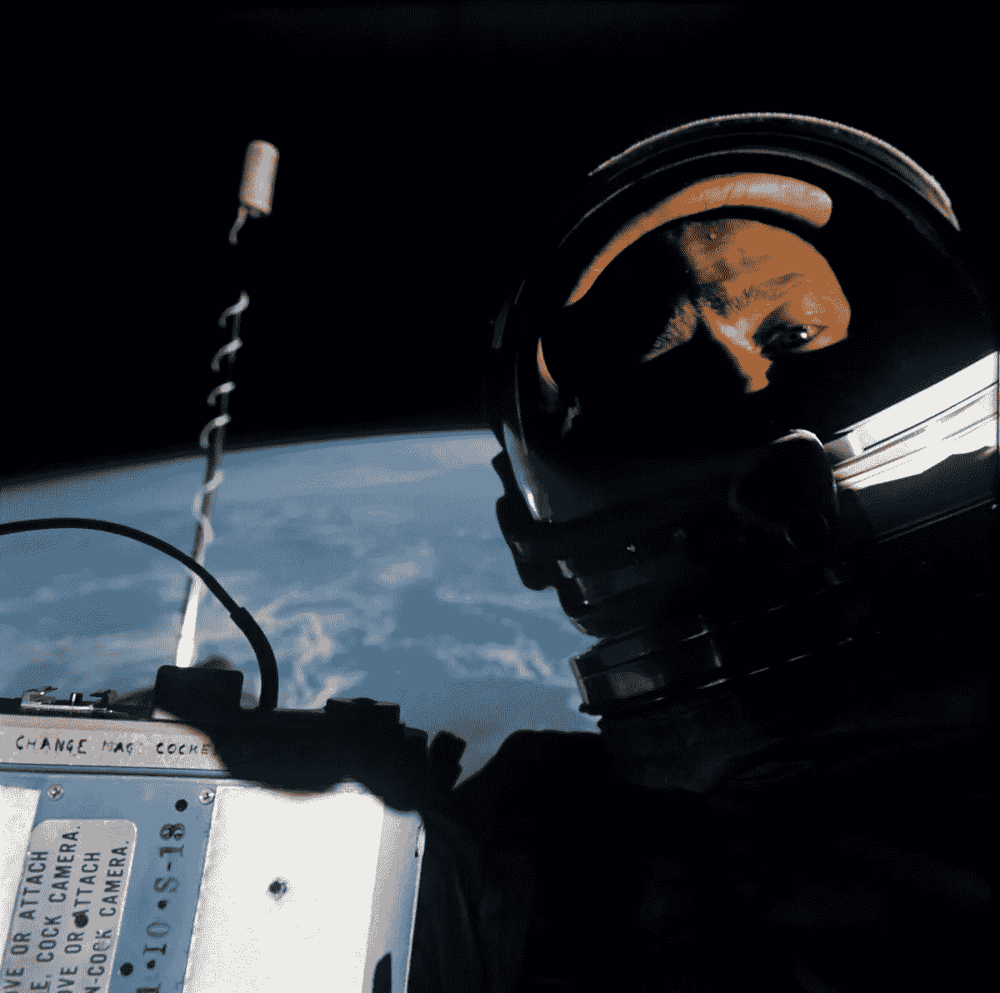

1966 年 11 月——甚至在社交媒体时代开始的几十年前——小埃德温·巴兹·奥尔德林(Edwin“Buzz”Aldrin Jr .)是双子座 12 号航天飞机的飞行员，他成为第一批进行太空自拍的人之一，当时他拍摄了一张自己打开飞船舱门的照片。

在奥尔德林的照片之后，多年来，其他宇航员成功地在太空自拍。

在一些最具标志性的太空自拍中，那些由美国宇航局宇航员里德·怀斯曼发布在他的 Twitter 个人资料上的照片…甚至在 Vine 上。

是啊！在 Vine 上，怀斯曼发布了他著名的[水泡自拍](https://vine.co/v/OAZLrlBjP3V)。

以下是精选的太空自拍合集，包括(从上/左起):巴里“布奇”威尔莫尔与他的太空行走伙伴特里·维尔茨(Terry Virts)在太空行走，在威尔莫尔遮阳板的反光中可以看到他(2015 年 2 月)；迈克·霍普金斯的第二次太空行走(2013 年 12 月)；卢卡·帕米塔诺的太空行走(2013 年 7 月)；克里斯·卡西迪在一次舱外活动中使用数码相机(2013 年 7 月)；Aki Hoshide 使用数码相机拍摄了一张头盔护目镜的照片(2012 年 9 月)；史蒂夫·罗宾逊在他历史性的发现号地下维修工作中把镜头对准了自己(2005 年 8 月)。

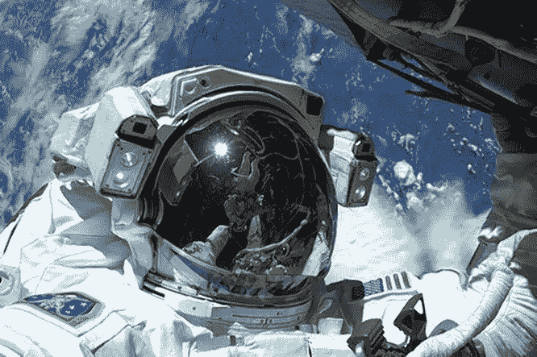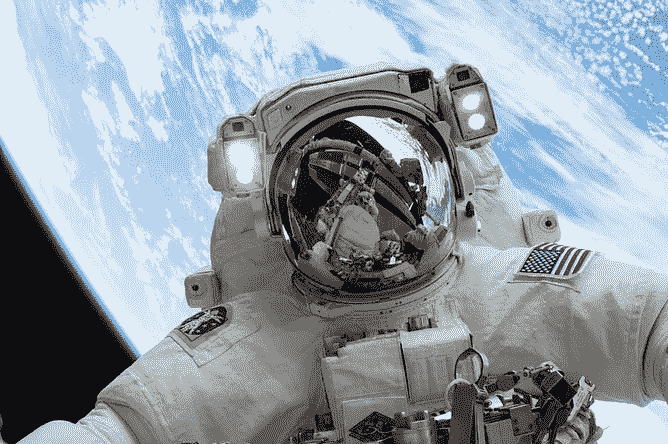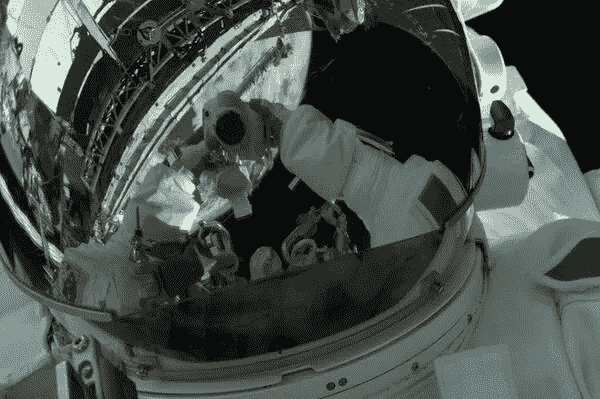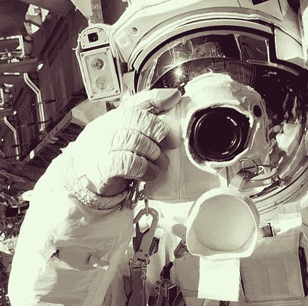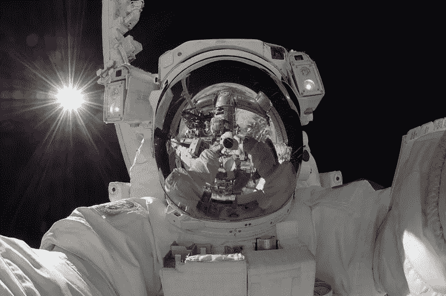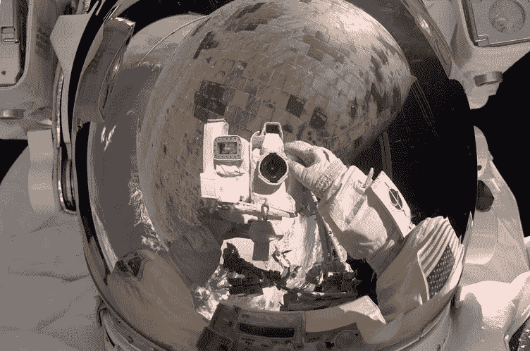

有哪些你一直以来最喜欢的自拍？