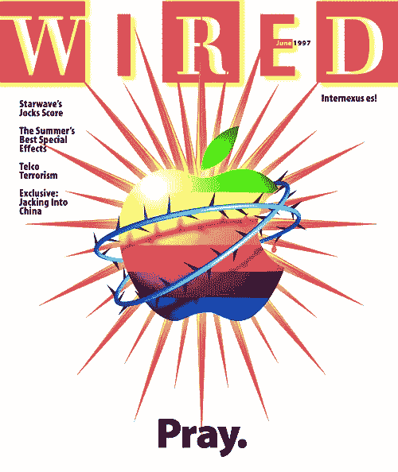

# 在科技世界里，最不可避免的结果就是看起来像个白痴

> 原文：<https://medium.com/hackernoon/the-most-inevitable-way-to-wind-up-looking-like-an-idiot-in-tech-45d1f4fb6e09>

## 就是质疑苹果。

围绕苹果的最新负面报道是关于它是如何愚蠢到令人难以置信，据称从即将发布的 iPhone 7 上取下耳机插孔，从而试图扼杀有线耳机。

如果这是真的，那么耳机插孔只是苹果将要扼杀的最新的过时的[技术](https://hackernoon.com/tagged/technology)。很好的解脱。

尽情哭吧，我们都会因此变得更好。如果你愿意，这是不可避免的无线未来的先兆。

随着多个关于苹果公司计划如何让耳机插头消失的新闻报道出现，主流媒体愤怒了。尤其是在边缘。一个标题尖叫道: [*把耳机插孔从手机上拿掉是对用户的敌意和愚蠢的*](http://www.theverge.com/circuitbreaker/2016/6/21/11991302/iphone-no-headphone-jack-user-hostile-stupid) 。

有趣的是:每次苹果公司做这样的事情，总会引起公愤。

众所周知，苹果公司在推出 iPhone 时完全放弃了手机的物理键盘，在 iMac 还非常流行的时候就放弃了软驱；在没有 PC 制造商使用 USB 的时代，从 ADB 端口转移到 USB；用他们革命性的触控板杀死了鼠标，当它重新设计 iPhone 的 30 针连接器以产生 Lightning 端口时，数百万个充电器变得无用。。。。我可以继续说下去，但你会明白的。

上面所有的故事都上演了一个熟悉的套路:苹果看到了未来，做出了一个不受欢迎的决定“没有人真正要求”，在短暂的愤怒之后，整个行业都纷纷效仿。

## 苹果对未来的愿景一直非常清晰，并一直积极主动地做出它认为必要的大胆设计和工程决策——事实上，这是你在科技行业保持领先的唯一途径。

事实上，我们现在认为理所当然的几项技术进步可能已经停留在过去，如果不是苹果公司强硬地几乎将我们推向未来，而不接受否定的答案。正是这种一心一意的方法让苹果成为这个星球上有史以来最有价值的企业。

是的，我完全明白，我们已经习惯了有线耳机，现在已经学会了忍受它们令人讨厌的纠结，但我们只需要理解席卷全球的趋势，就能预测有线耳机有限的未来。

> 在过去的几年里，蓝牙/无线耳机和扬声器的市场呈爆炸式增长。蓝牙扬声器是整个消费电子领域增长最快的产品类别之一，预计今年的销量将飙升 68%，到 2019 年平均将增长 36%。去年夏天，研究公司 NPD [发现](https://www.npd.com/wps/portal/npd/us/blog/2015/summers-end-no-match-for-stereo-headphone-sales/)虽然耳机销量在前一年增长了 18 %,但蓝牙型号的销量增长了一倍多。

无论如何，市场正在自然地向无线方向发展。产品在不断改进，消费者现在比以往任何时候都更加了解蓝牙和无线技术。很长一段时间以来，无线耳机都是一种耻辱，发烧友们对蓝牙的“劣质音质”嗤之以鼻。但是无线技术已经赶上来了。对于几乎所有情况下的几乎所有人来说，有线和无线已经没有区别了。

从所有这些数据中收集的见解是如此不容错过，以至于一些制造商已经大胆地跳出来摘掉耳机插孔；而不是像往常一样等待苹果先试水。摩托罗拉的下一款旗舰手机[Moto Z](http://www.wired.com/2016/06/motorola-moto-z-moto-z-force/)没有耳机插孔。中国公司 LeEco 最近推出了三款没有耳机插孔的手机。

甚至音频公司也加入了进来:像 Audeze 和 Philips 这样的耳机制造商，以及一长串较小的公司，已经在制造可以插入 USB 和 Lightning 端口而不是那个小圆孔的罐和芽。

# 不过，苹果做出转变的那一刻可能是一个转折点。苹果做一件事，行业一般都会跟着做。

鉴于 2016 年我们听音乐的方式，无线耳机也有意义。几年前，你的音乐是 iPod 上的一堆 MP3 文件。几年前是 CD 和磁带。现在，哪里有 Spotify，哪里就有音乐——Spotify 无处不在。甚至连连接手机听音乐的想法也很快会过时。现在一切都在云上，物理插入或连接不再有意义。

*因为，归根结底，这不是“苹果最懂”，而是进步。如果你不在某个时候切断与过去的联系，你就无法前进。有些人可能会觉得苹果推出这款手机有点太早了，但推动这一突破是所有创新公司的生命线。*

相反，如果苹果没有采取像移除耳机插孔这样的举措，我会感到担心。

> [黑客中午](http://bit.ly/Hackernoon)是黑客如何开始他们的下午。我们是 [@AMI](http://bit.ly/atAMIatAMI) 家庭的一员。我们现在[接受投稿](http://bit.ly/hackernoonsubmission)，并乐意[讨论广告&赞助](mailto:partners@amipublications.com)机会。
> 
> 如果你喜欢这个故事，我们推荐你阅读我们的[最新科技故事](http://bit.ly/hackernoonlatestt)和[趋势科技故事](https://hackernoon.com/trending)。直到下一次，不要把世界的现实想当然！

