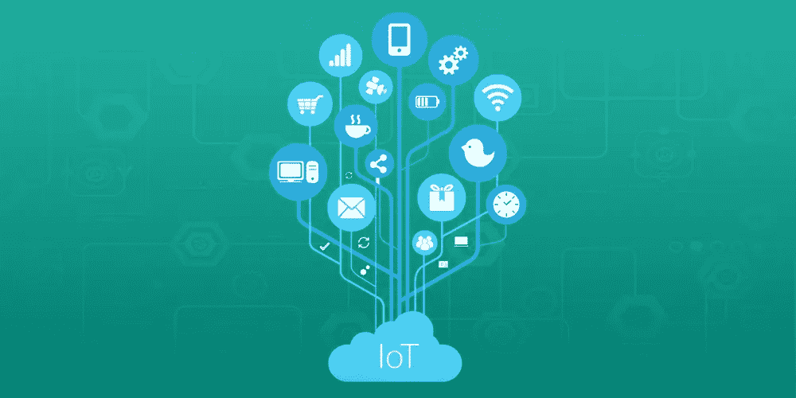
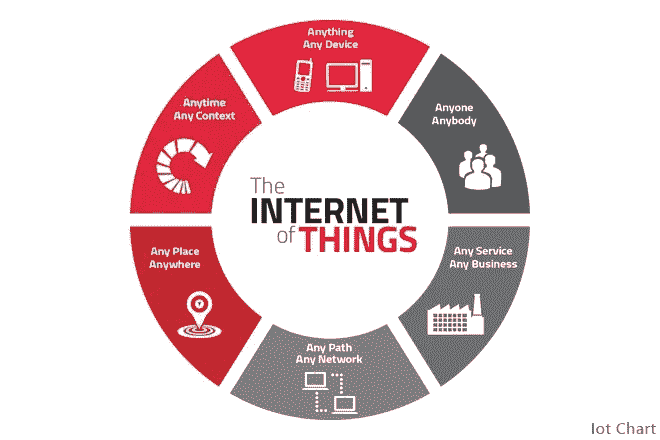
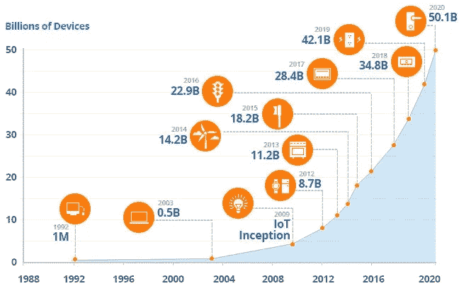
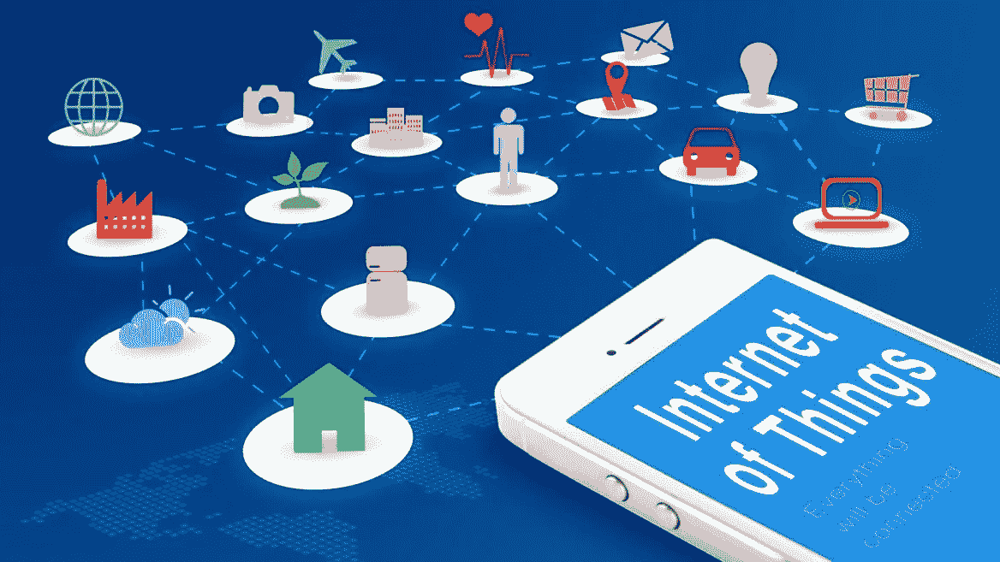
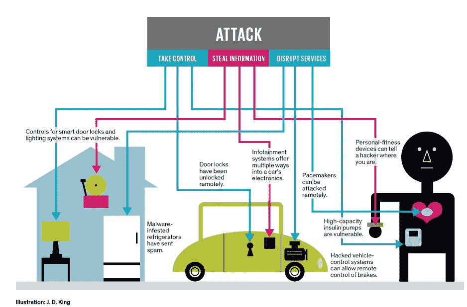
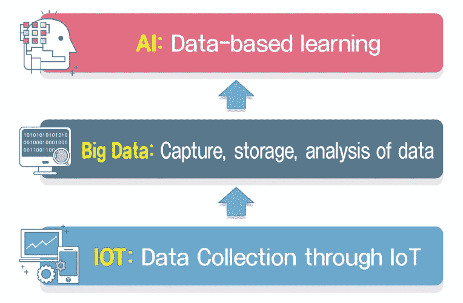

# 2018 年最有前景的物联网趋势

> 原文：<https://medium.com/hackernoon/the-most-promising-internet-of-things-trends-for-2018-10a852ccd189>

物联网是一种全球公认的趋势，正在以令人难以置信的速度普及。秘密在于，物联网改变了许多行业，并将它们带到了一个新的水平，这些行业包括医疗保健、金融等等。难怪会有这样的炒作——每隔几个月，物联网就会出现新的机会，所以我们强烈建议您关注这项技术。为了让你更容易理解，我们决定列出 2018 年最可能的物联网趋势，并解释背后的原因。

# 设备数量的扩展

物联网就是将设备连接在一起并交换数据，所以你猜怎么着——2018 年将会有更多的互联设备。这不仅仅意味着手机和笔记本电脑——我们日常使用的“智能”设备将会越来越多，比如智能门、智能锁等等。“智能”设备数量的增长将允许扩展利用物联网的流程，从而使它们更容易、更准确。此外，物联网将变得更加可用，这意味着它不仅将用于一些行业，还将用于个人日常生活。这导致了智能城市的概念，其中许多流程将由物联网决定。虽然这听起来有点乌托邦，但一些国家已经开始开发和实现智能城市的概念，所以我们可能会看到未来真正革命性的东西。

例如，CSCO 对物联网的增长进行了估计，到 2020 年，联网设备的数量将超过 500 亿。

# 更多地使用移动设备

为了与“智能”设备连接，用户必须拥有用于管理智能家居等的个人设备。由于世界上的移动用户数量庞大，而且还在不断增加，因此很明显，智能手机将在未来的物联网中发挥更大的作用。当然，这将使我们的生活变得更容易，因为我们将在某些行为上花费更少的时间和精力..

# 个性化营销平台

由于能够访问您的个人信息并对大量数据进行全面处理，营销人员将能够根据用户行为和档案在手机或其他平台上投放个人广告。这种方法将改变用户和产品所有者之间的关系，因为更多的注意力将放在用户需求上，企业所有者将获得关于客户的大量信息，这些信息将用于开发最有效的方法和产品。

# 安全问题

然而，互联设备和物联网的如此大量使用将导致对安全性的严重担忧。即使是现在，网络攻击也相当频繁，而且可能会变得更糟。因此，在现实生活中实施所有计划的创新之前，首先我们都需要考虑可能的安全违规和漏洞，并确保数据 100%安全。

> 无处可藏:随着物联网遍布我们的家庭、汽车甚至身体，新的漏洞似乎几乎每天都会出现。你家的智能锁和安全系统可能会被潜在的窃贼破坏。你的车可能会被迫打开车门并启动引擎；小偷只需要上车开车。植入式起搏器和胰岛素泵也容易受到黑客攻击。

# 大数据和人工智能

谈到数据:由于将有更多的智能设备，我们将比现在更多地使用物联网，处理的数据量也将增长。因此，我们将不得不大量使用大数据，因此我们将不得不考虑能够让我们正确处理和分析大数据的资源。在这里，人工智能和机器学习将派上用场，因为与人工计算相比，通过这些技术，我们将获得更精确的结果和分析。

综上所述，物联网潜力巨大，几乎可以用在我们生活的任何领域。如果实施得当，它会引起难以置信的变化，影响政府部门的行业和个人用户的生活。甚至知道物联网被大量使用，许多 IT 公司已经提供与这项技术相关的服务。所以，如果你有一个很棒的项目，不要犹豫，去找一个可靠的软件开发公司。如果他们不能帮助你发展，至少你会收到一个关于你下一步行动的有用的咨询。

[*德米特里·布科*写的](https://www.linkedin.com/in/dmitrybudko/\)

*想了解更多？* [*点击这里查看*](https://dashbouquet.com/blog)