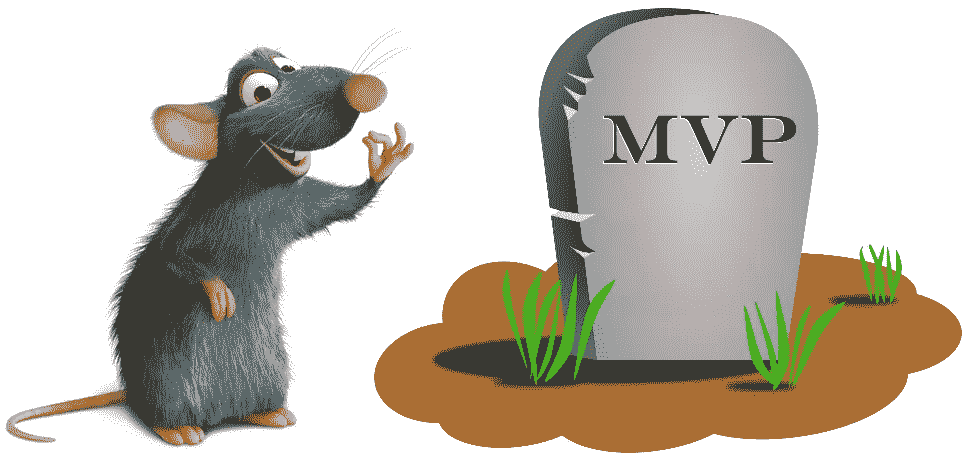
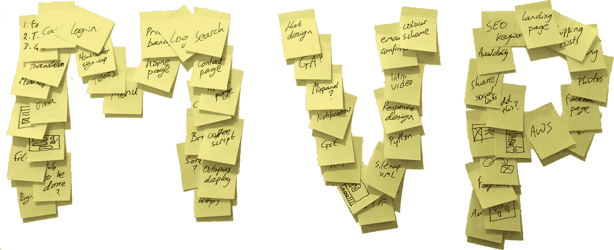

# 最有价值球员死了。老鼠万岁。

> 原文：<https://medium.com/hackernoon/the-mvp-is-dead-long-live-the-rat-233d5d16ab02>

## 为什么你应该专注于*风险最大的假设测试*而忘记 MVP。

最小可行产品这个术语的核心有一个缺陷:它不是一个产品。这是一种测试你是否发现了一个值得解决的问题的方法。降低风险和快速测试你最大假设的方法。与其建立一个 [MVP](https://hackernoon.com/tagged/mvp) ，不如找出你*最危险的假设*并*测试*它。把你的 MVP 换成老鼠会让你少很多痛苦。

MVP 用得太多了，已经失去了它的原意。它经常被错误地应用于初级产品的首次发布。结果，“MVP”最终比预期的快速测试要复杂得多，而且对于一个已发布的产品来说太过粗制滥造。

担心一个二流产品，人们呼吁最少*有价值的*产品或最少*可爱的*产品。然而，这是完全错误的方向。导致你在风险更高的假设上下更大的赌注。从真正的顾客身上学到东西。

最小可行*测试*有时被用作在发布前进行更小迭代的尝试。但是，这没有抓住两个关键点:为什么测试以及测试什么？此外，“最低限度”是含糊不清的。当被问及你的 MVP 应该有多低时，Eric Ries(《精益创业》的作者)回答道:

> “可能比你想象的要小得多。”

最危险的假设测试是显式的。除了测试你最大的未知之外，没有必要建立更多的东西。不要期望完美的代码或设计。没有过早成为产品的危险。

一个 MVP 用一个清晰的、线性的路径来诱惑一个优化的解决方案。最危险的假设测试把重点放在学习上。它是黑暗中的一支蜡烛，让我们一步一个脚印地前进。一旦你验证了风险最大的假设，你就可以继续下一个最大的假设。逐渐建立对你想法可行性的信心。

关键是快速、小规模的测试。为了检验你最大的假设，你能做的最小实验是什么？正如 Google X 的联合创始人 Tom Chi 所说:

> "通过减少尝试的时间来最大化学习的速度."

不仅仅是最小化。极大地减少。即使有像谷歌眼镜这样复杂的想法，他们也在 1 天内制造出了第一个原型！

识别潜在的假设需要大量的精神能量和训练。将机会表述为客户问题，并逆向工作。机会存在的条件是什么？现在，考虑每一个假设，问一问它们背后的主要假设是什么？重复，直到你达到根假设。这类似于[的 5 个为什么](https://www.google.co.uk/url?sa=t&rct=j&q=&esrc=s&source=web&cd=1&cad=rja&uact=8&ved=0ahUKEwi2hfG4rKvPAhWCWhoKHRyLBw0QFggcMAA&url=https%3A%2F%2Fen.wikipedia.org%2Fwiki%2F5_Whys&usg=AFQjCNHk-Yyc9qUqyNM4U3eaQoENhzDN_A&sig2=tPvIBgLHA2qyUXs_dJy8Zw&bvm=bv.133700528,d.d2s)。从底层开始，找出支持每个假设的证据。你现在应该清楚地知道你知识中的关键缺口在哪里。清楚地知道你的*最危险的假设测试*需要是什么。

## 每个新想法都是从一只老鼠开始的

这不仅仅适用于初创企业。对于老牌公司同样重要。也许更是如此。当你已经成功运营了几年，你可能会被一种虚假的安全感所迷惑。这使您面临中断的风险。冒着把金钱和时间投入到没人想用的东西上的风险。

与此同时，你的竞争对手正在发现市场的工作有待完成。他们正在制造符合人们实际需求的产品。他们正在逐渐偷走你的客户。

在成熟的公司进行最危险的假设测试会面临不同的挑战。初创企业的限制推动了节俭思维，这种思维非常适合老鼠。有了丰富的资源，在验证大型项目之前承诺它们的后果似乎更少。最危险的假设测试需要不同的心态。敬业的工程师、设计师和产品经理可能是他们自己最大的敌人。他们的专业精神将他们推向完美的产品。导致了功能的退化和代码的精简。但是如果没有人需要你的产品，那么就没有人关心它是否漂亮，是否有完美的代码质量。

## 最大限度地发现

*最危险的假设测试*对快速验证你的想法所需的关键任务进行优先排序。他们消除了过早创造初级产品的诱惑。但是它们并不容易。你需要坚持不懈地追求它们。警惕范围扩大。整个团队都有责任不断地问对方:

> "这是我们能做的最小的事情来测试我们最危险的假设吗？"

## 想提高你的 A/B 测试吗？

查看我的新网站:[***ExperimentationHub.com/A-B-Sensei.html***](http://experimentationhub.com/a-b-sensei.html) *你需要知道的关于 A/B 测试和假设驱动实验的一切！*👩‍🔬🎯*而且全部免费*😀

[ExperimentationHub.com/A-B-Sensei.html](http://experimentationhub.com/a-b-sensei.html)

> [黑客中午](http://bit.ly/Hackernoon)是黑客如何开始他们的下午。我们是 AMI 家庭的一员。我们现在[接受投稿](http://bit.ly/hackernoonsubmission)并乐意[讨论广告&赞助](mailto:partners@amipublications.com)机会。
> 
> 如果你喜欢这个故事，我们推荐你阅读我们的[最新科技故事](http://bit.ly/hackernoonlatestt)和[趋势科技故事](https://hackernoon.com/trending)。直到下一次，不要把世界的现实想当然！

