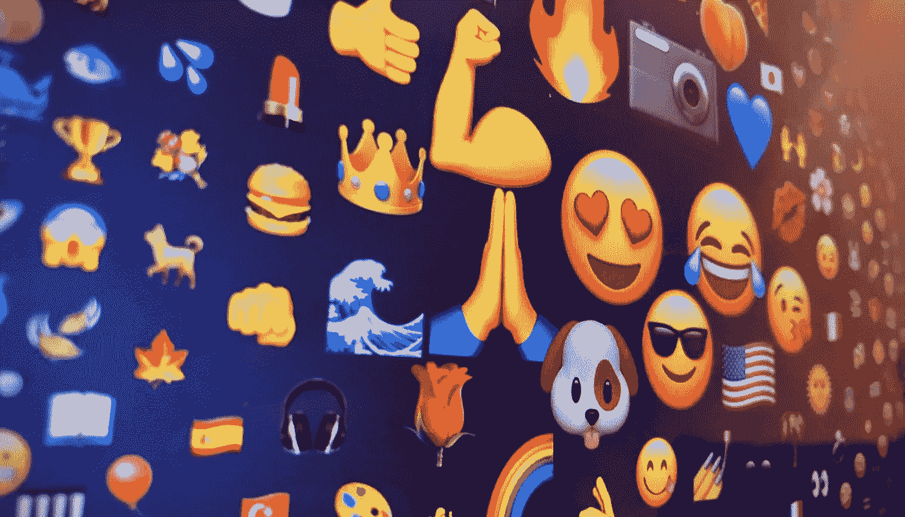
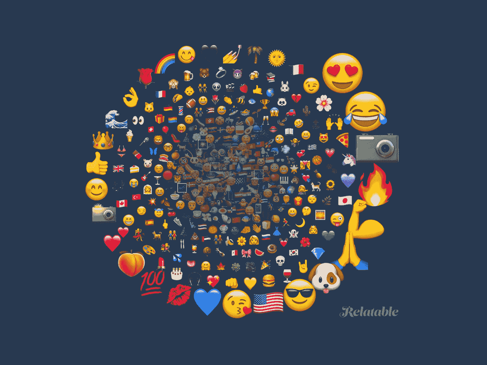
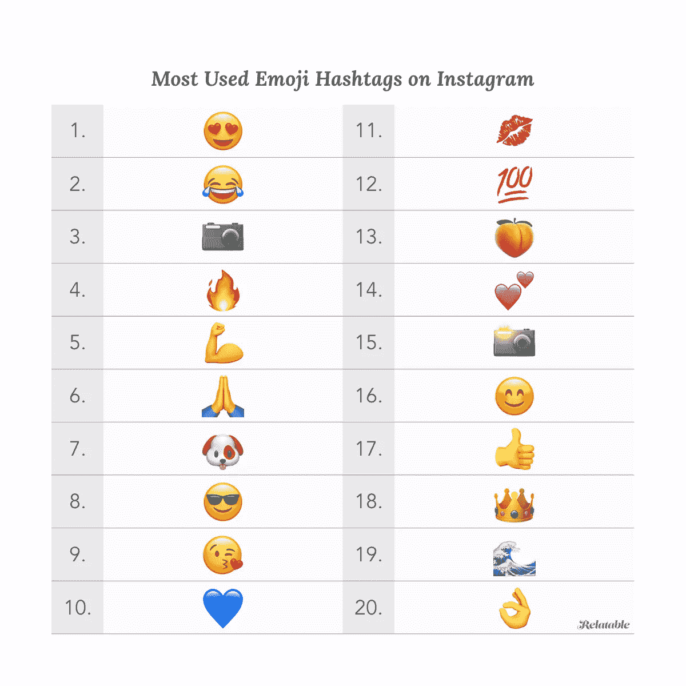
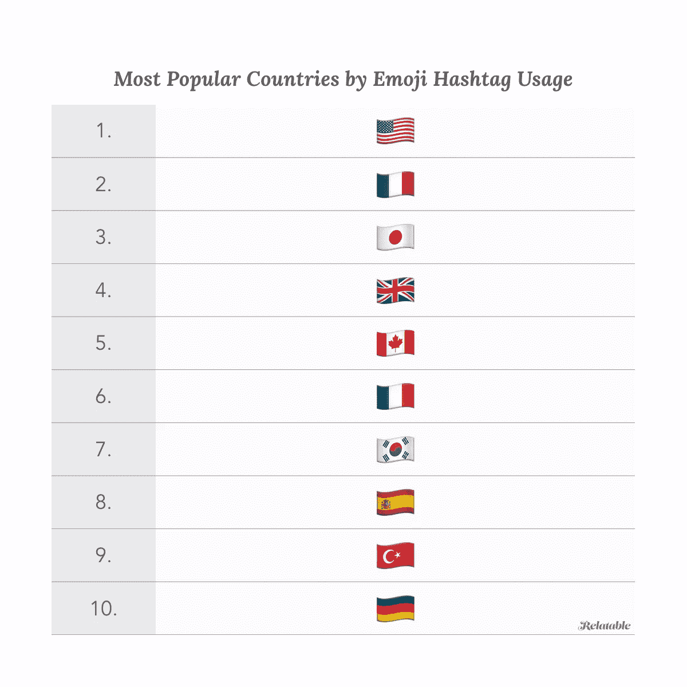
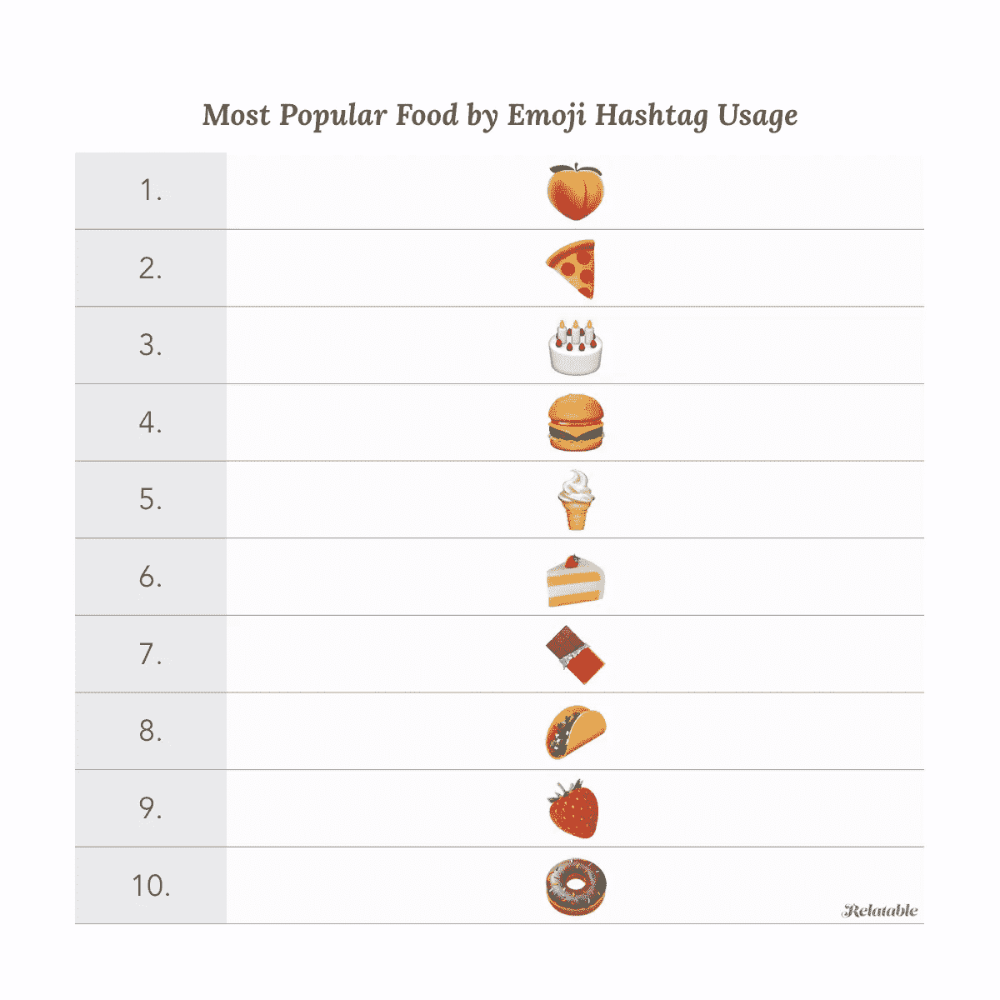
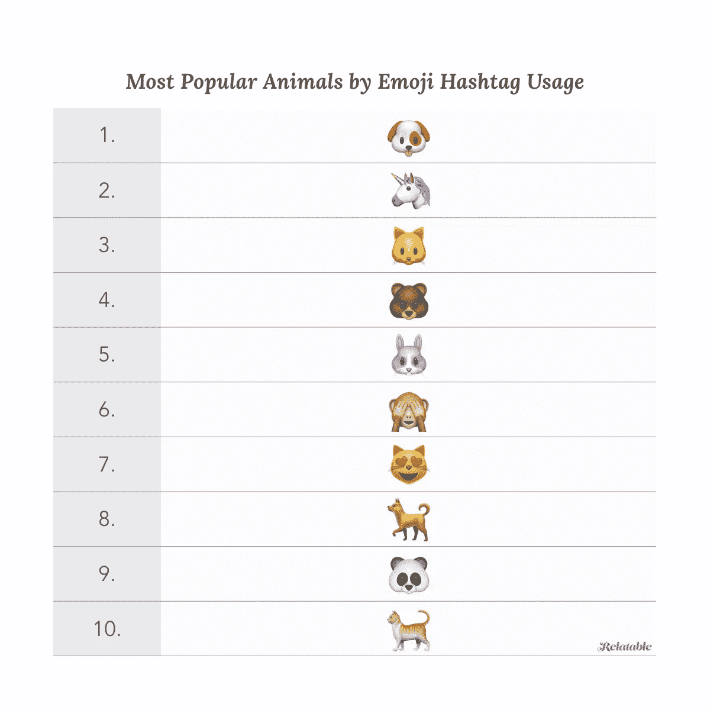

# Instagram 表情符号标签用法的神秘世界

> 原文：<https://medium.com/hackernoon/the-mysterious-world-of-instagram-emoji-hashtag-usage-e91c02fbdd35>

## 2015 年 4 月的最后一周，Instagram 增加了对在 hashtags 中使用 emoji 字符的支持。在那之后不久🍆-标签被禁了。显然，茄子不仅仅是番茄、奶酪和食谱…让我们看看今天的数据告诉了我们什么关于表情符号标签！

在上一篇文章中，我研究了过滤器的意外用法。这次我看了 Instagram 上表情符号标签的特殊用法。这不仅是一种给帖子贴上情感标签的方式，其中一些还像是一个通往志同道合的 Instagrammers 秘密邪教的门户。让我们看一看…

## 他们从哪里来的？

表情符号已经存在很长时间了。这个名字揭示了它们的起源——它在日语中的意思是“图片-字符”，在 20 世纪 90 年代末开始出现在日本手机上。然而，直到 2011 年苹果在 iPhone 中加入表情符号，随后在 2013 年 Android 中加入表情符号，表情符号才在全球范围内流行起来。

有多少表情符号？从标准 Unicode 字符集的 10.0 版本开始，共有 1144 个表情符号。然而，这并不是全部事实，因为许多表情符号可以用不同的肤色来修改。102 人类表情符号可以与除默认之外的五种不同的修饰语组合，例如👦+🏾=👦🏾。此外，表情符号可以以各种组合结合在一起，就像家庭表情符号一样👩‍👩‍👧‍👦由序列组成👩+👩+👧+👦。值得注意的是，Instagram 在索引标签时确实会考虑修饰符，所以如果你看看👩🏽‍🔬与…相比👩🏻‍🔬。

## 受欢迎程度的上升

那么 Instagram 上使用了哪些表情符号标签呢？几乎全部！这是 350 个最常用表情符号标签的可视化，其大小和位置显示了它的受欢迎程度。越大、越远，使用越频繁。

## 最流行的表情符号标签

让我们再仔细看看前 20 名…

Most used emoji hashtags on Instagram

显然， [Instagram](https://hackernoon.com/tagged/instagram) 是一个充满爱的积极媒体😍和快乐😂。毫不奇怪，这是为了拍那张照片📸(不管有没有闪光灯！).天气通常很热🔥人们有肌肉💪。没有人能抗拒小狗🐶在[互联网](https://hackernoon.com/tagged/internet)——和 Instagram 上，它们比那些没有进入排行榜的猫更受欢迎。在食物中，桃🍑似乎吸引了很多注意力…

让我们来看看表情符号的一些子类别。

## 最受欢迎的国家

流行在这里可能不是合适的词，最频繁出现是一个更好的描述。让我们来看看旗子吧！

Most used flag emoji hashtags on Instagram

## 最受欢迎的食物

我们都喜欢食物(还有给食物拍照，这让其他人很恼火)。在苹果通过在 iOS 9.1 中添加 taco 表情符号解决了 2015 年似乎是地球上最重要的需求之一之后，我们没有理由不能通过查看我们的数据来获得最受欢迎食物的代表性排名。

Most used food emoji hashtags on Instagram

如果我们也包括喝一杯酒🍷会成为第三名和啤酒🍺在第五大街。

## 最受欢迎的动物

互联网上全是可爱毛绒绒的动物，对吧？让我们看看谁最受欢迎。

Most used animal emoji hashtags on Instagram

由于大众的需求，虚构的动物也被认为是动物。

感谢阅读！请分享你的想法和反思，并继续关注，不要错过更多关于 Instagram 使用的古怪见解。

合理使用:请随意引用或使用这些发现。这样做的时候，注明作者，并提供一个原始文章的链接。

*斯蒂芬是*[*relable*](https://relatable.me)*的首席技术官和联合创始人，这是一家营销机构，利用数据和技术帮助像* [*谷歌、乐高、Adobe、Tinder、威瑞森和 Spotify*](http://www.relatable.me/case-studies?utm_source=medium) *这样的客户进行超高效、大规模的影响者营销活动。*