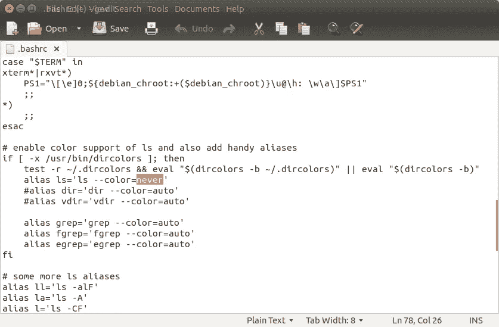

# 将脚本添加到。{bash/zsh}rc 文件

> 原文：<https://medium.com/hackernoon/the-nano-framework-for-adding-scripts-to-your-bash-zsh-rc-files-df2732e3463>



你见过多少次回购与自定义钢筋混凝土安装。巴沙尔或者。zshrc 文件？带有文件的回购，如下所示:

*   [https://github.com/mcorah/configs/blob/master/install.sh](https://github.com/mcorah/configs/blob/master/install.sh)
*   [https://github . com/nathschmidt/bashrc/blob/master/install . sh](https://github.com/nathschmidt/bashrc/blob/master/install.sh)

例子不胜枚举，因为每个人都在重新发明一个轮子。我做过一两次。所以最终，我决定写我自己的“纳米 T4”框架，来解决这个问题，并且可以用于任何配置。下面是我的配置报告的 README.md 的样子:

```
In order to install config please do:cd /tmp
git clone https://github.com/OwnInfrastructure/configs.git
cd configs
RC_PATH=.commonrc
curl -s https://raw.githubusercontent.com/b0noI/rcinstaller/master/install.sh | bash /dev/stdin $RC_PATH
```

我想提请大家注意的主线如下:

> curl-s[https://raw . githubusercontent . com/b0noI/RC installer/master/install . sh](https://raw.githubusercontent.com/b0noI/rcinstaller/master/install.sh)| bash/dev/stdin $ RC _ PATH

这是“rcinstaller”的用法示例，它是将脚本安装到。bashrc 和/或. zshrc .框架的 home [repo](https://hackernoon.com/tagged/repo) 这里是[这里是](https://github.com/b0noI/rcinstaller)。

现在，任何人都可以用 configs 创建一个配置报告，并在 README 文件中使用这个框架来描述安装，而无需重新实现 wheel。

# 我如何使用它？

这很简单，只需将如下内容添加到您的自述文件中:

```
curl -s [https://raw.githubusercontent.com/b0noI/rcinstaller/master/install.sh](https://raw.githubusercontent.com/b0noI/rcinstaller/master/install.sh) | bash /dev/stdin <path_to_my_awesome_rc_file>
```

# “rcinstaller”是如何工作的？

总的来说，该脚本执行以下步骤:

1.  检查~/.profile.d 目录是否存在，如果不存在，则创建它；
2.  添加“[ -f ${HOME}/.profile.d/ *。sh ] & &来源${HOME}/.profile.d/* 。嘘”到了。zshrc(如果它不存在的话)；
3.  同样适用于。bashrc
4.  从输入(或)中复制 rc 文件。commonrc 如果没有输入)从当前目录到:~/.profile.d。

目前，它要求你的 rc 文件有一个唯一的名字。这是必需的，因为脚本将覆盖同名文件中的任何内容。此外，它一次只能处理一个输入脚本。

# 我能帮上什么忙？

如果您愿意提供帮助，有[一些功能请求和问题](https://github.com/b0noI/rcinstaller/issues)需要实施，非常感谢您的帮助。你也可以在回购协议上加一颗星，或者只是把文章分享给你的朋友。

我也有 [Patreon](https://www.patreon.com/b0noi) 页面；)

[](http://bit.ly/HackernoonFB)[](https://goo.gl/k7XYbx)[](https://goo.gl/4ofytp)

> [黑客中午](http://bit.ly/Hackernoon)是黑客如何开始他们的下午。我们是 [@AMI](http://bit.ly/atAMIatAMI) 家庭的一员。我们现在[接受投稿](http://bit.ly/hackernoonsubmission)并乐意[讨论广告&赞助](mailto:partners@amipublications.com)机会。
> 
> 如果你喜欢这个故事，我们推荐你阅读我们的[最新科技故事](http://bit.ly/hackernoonlatestt)和[趋势科技故事](https://hackernoon.com/trending)。直到下一次，不要把世界的现实想当然！

