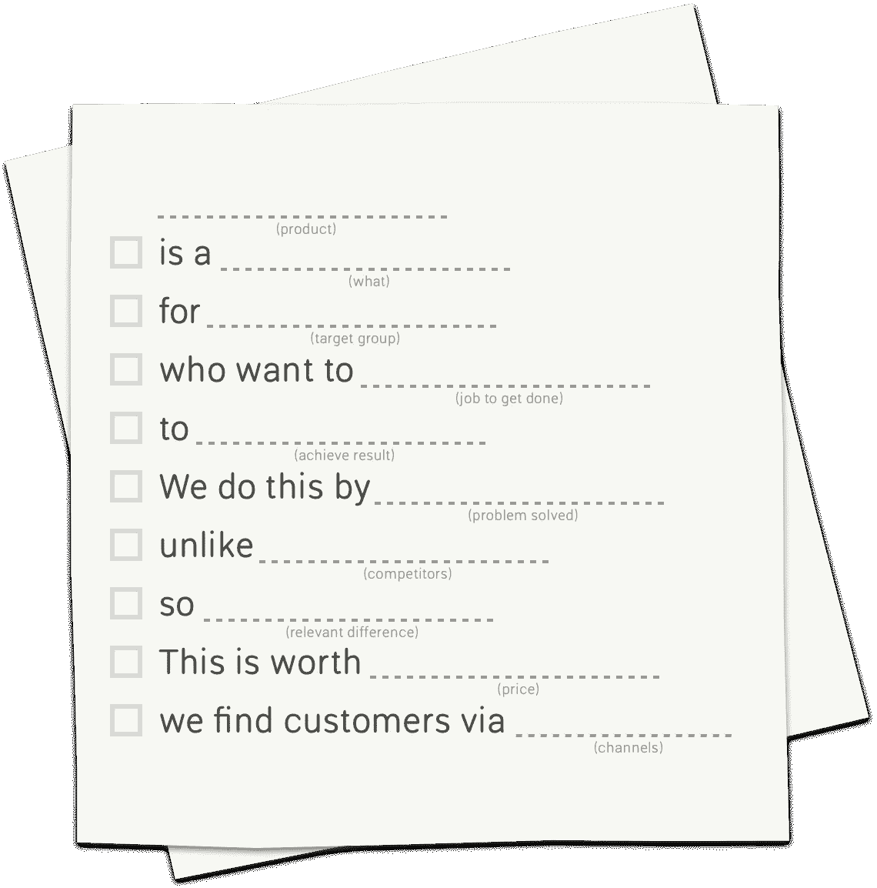

# 餐巾商务画布

> 原文：<https://medium.com/hackernoon/the-napkin-business-canvas-9b019550ae3>

我是亚历山大·奥斯特瓦尔德的商业模型画布和 T2·阿什·莫亚的精益画布的忠实粉丝，但有时两者都有点难以驾驭。

在 [Weld](https://www.weld.io/) 我们不断完善我们的[业务](https://hackernoon.com/tagged/business)模型，我们需要更快的东西。所以我们做了这个:

# **餐巾商务帆布**

餐巾业务画布是一个超级敏捷的业务模型框架。看起来是这样的:

*绘制版本:*

*文字版:*

**【产品】** 【是什么】
**【目标群体】** 【谁想做】**【达成结果】**。
[ ]我们这样做是靠**(问题解决)** [ ]不像**(竞争对手)** [ ]所以**(相关差异)**。
[ ]这是我们的客户通过**【渠道】**
找到的**(价格)**。

# **如何使用**

受[子弹杂志](http://bulletjournal.com/)系统的启发，它遵循一个简单的语法:

1.  用你目前的假设填写所有的占位词。
2.  在左侧框中用点()标记最关键的行。
3.  当你验证你的假设时，把圆点改成“X”。
4.  重复步骤 2-3，直到您的整个业务模型得到验证。

# **下载模板**

我做了[两个 PDF 和 Markdown 格式的模板，你可以从这里下载](https://www.weld.io/blog/napkin-business-canvas)。

# 让我知道你的想法

希望听到您对此的评论。它能变得更加敏捷吗？是否多余？让我知道！

> [黑客中午](http://bit.ly/Hackernoon)是黑客如何开始他们的下午。我们是 [@AMI](http://bit.ly/atAMIatAMI) 家庭的一员。我们现在[接受投稿](http://bit.ly/hackernoonsubmission)，并乐意[讨论广告&赞助](mailto:partners@amipublications.com)机会。
> 
> 如果你喜欢这个故事，我们推荐你阅读我们的[最新科技故事](http://bit.ly/hackernoonlatestt)和[趋势科技故事](https://hackernoon.com/trending)。直到下一次，不要把世界的现实想当然！

