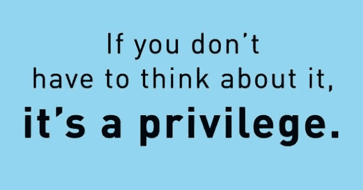

# 特权的网络效应。

> 原文：<https://medium.com/hackernoon/the-network-effects-of-privilege-ba254d5385c0>

我是一个拥有巨大特权的个体。如果你正在读这篇文章，我打赌你也在读。

我出生在一个可以负担生活中大多数物质享受的家庭。我有一个非常快乐的童年，在一些不错的街区长大。我在一些大城市生活了很长一段时间，与一些杰出的人一起工作和会面，他们对我的影响我无法感谢。

我是男性。我是直男。我相当健康，没有任何精神问题。我的朋友多得让我跟不上，我做任何事都有比我愿意承认的更多的成功机会。我勾选了所有正确的方框。几乎所有社会能给予某人的特权和好处都已经被赋予了我。

*我意识到，比大多数人想承认的要多得多的特权。*

我生长在一个鼓励我阅读大量书籍、学习和质疑的家庭。由于我成长的环境，我成长为一个自信的人，有着高度的自我价值感，并坚信我的命运掌握在我自己手中。

我被给予了很多自由去尝试不同的事情，遇见有趣的人，沐浴着爱，被灌输着自信。后来，在我的一生中，我幸运地遇到了一些人，他们让我觉得世界上几乎一切皆有可能。我有过一些经历，并与一些人成为朋友，这些人向我敞开了新的思路，让我看到了我曾经只能梦想的可能性。

在一个充满爱的家庭中长大，在一个体面的社区中长大，很早就能接触到大多数东西，这比财富提供的更有形的优势增加了一个巨大的隐藏优势。这些事情很重要，它们比人们似乎愿意看到的要重要得多。你的关系和家庭提供的安全网让生活变得更加容易。他们为你打开了大多数人可能不知道的门。

然而，不知何故，尤其是在我所在的科技行业，我们似乎故意忘记了自己有多幸运，似乎认为自己恰恰相反。我们让彼此相信，我们已经通过纯粹的天赋和智慧在我们的生活中取得了巨大的成功，而其他任何没有这样做的人都失败了，因为他们不像我们一样“理解”,他们没有我们聪明，只是简单地懒惰或数学不好。

我知道其中一些是从哪里来的。智力确实在这方面发挥了很大作用——但我怀疑这部分被大大高估了。我知道，以任何人使用的标准来衡量，我都相当聪明——但我也意识到，聪明并不是最重要的事情，为什么到目前为止，生活中的大多数事情对我来说都很顺利。

最重要的是，这是因为这个世界被操纵着向我有利的方向发展。像我这样的人注定会成功。这就是社会的设计方式。

事后看来，我进入科技行业纯属运气和巧合。仅仅因为我的特权，巧合才成为可能。

我开发了一些非常酷的产品，只是因为我在正确的时间出现在了正确的地方，因为有些人很友好地给了我一个机会。我和一些非常好的女孩约会，交了一些很棒的朋友，因为我把所有的选项都选对了。我获得了一些很好的工作机会，也和一些优秀的人在一起，因为他们把我当成了“同龄人”。

就像[网络](https://hackernoon.com/tagged/network)效应一样，我们的特权是无所不包的，永远受保护的，自我延续的，但又是无形的。如此多的特权隐藏在系统中，以至于你甚至看不到它。

这就是为什么我可以在晚上独自安全地在街上游荡，而女性却不能。这就是为什么同样的工作，男性比女性赚得更多。这就是为什么当你的简历中有“斯坦福”或“哈佛”字样时，人们似乎更愿意阅读你的简历。这就是为什么如果你以前在谷歌或脸书工作过，风投似乎更愿意资助你。

最后，这是最重要的事情。

无论你认为自己有多聪明，你永远不会真正了解别人的生活是什么样的。你不会真正了解他们的痛苦和问题，事情对他们来说有多难。

我永远不会真正知道什么是贫穷。即使我这样做了，我也会很穷，因为我知道我有一个永远支持我的家庭，我永远不用担心我的住所或食物，我有教育、经验和关系，这些都会帮助我。

有钱人永远不会知道穷是什么滋味。直男永远不会知道同性恋是什么感觉。男人永远不会真正知道做女人是什么感觉。身体健全的人永远不会知道身体不同是什么感觉。

有几件事我们应该牢记并经常记住:我们非常幸运。

我们奋斗吗？是的，我们有。

但也许比那些没有像我们一样中了某种宇宙彩票的人要少得多。当我们稍微谦虚一点的时候，我们可能会更好地想象成为另一个人是什么样子。真正站在别人的立场上是什么感觉。

这对我们科技行业来说尤其重要，在这个行业，战斗口号通常是我们有多聪明，我们总是在拯救世界。硅谷不接受任何囚犯，任何不改变世界的事情都站不住脚。

生活中一些最伟大的教训来自漫画书，本叔叔说得对:权力越大，责任越大。

我们有电吗？

是的。

也许没有我们想要的那么多，但我们仍然拥有它。

我们*有*在这方面做得更好。

这很重要。

有人要求你倾听。

听他们说。试着理解他们。更重要的是，相信他们。你可能认为你听到的故事不可信。更有可能的是，你没有意识到自己的优势，被告知这一点会伤害你脆弱的自尊心。

发挥你丰富的想象力，穿着别人不舒服的鞋子走一英里。这并不难做到。

开门。

尽你所能确认和面对你的偏见。

谦逊地认识到，虽然我们可以试着想象其他人是什么样的，但我们永远不会真正知道。

记住你的特权地位。

知道如何不要说得好像你已经知道所有的答案。闭上嘴听着。

最重要的是，善待你遇到的每一个人。

> 灵感来自我的朋友[萨姆拉特](https://medium.com/u/618bed850757?source=post_page-----ba254d5385c0--------------------------------)在推特上的[帖子](https://twitter.com/samratsingh23/status/884332392919449601)。