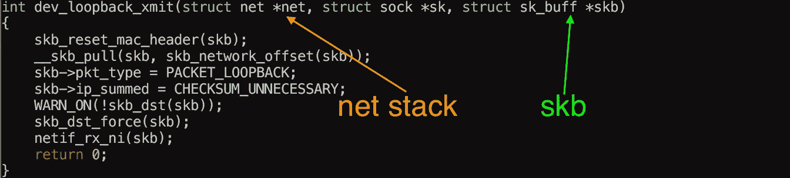
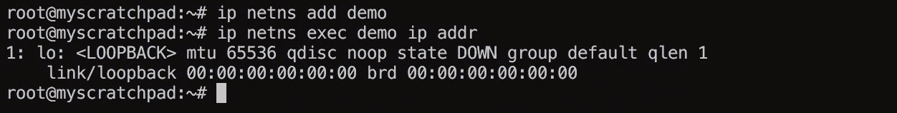

# 网络堆栈

> 原文：<https://medium.com/hackernoon/the-network-stack-153c92e35b26>

如果你一直在阅读关于 Linux 名称空间的文章/书籍，你可能会遇到这种说法的变体"**每个网络名称空间都有它自己的网络栈**"。

如果你以前看过这个，你可能会想知道它到底是什么意思？这似乎是非常抽象的东西，就像有人会猜测，然后一个名称空间将有它自己的和隔离的“方法/函数”来管理进出的网络连接？

我想说的是，一个“**网络栈**对我来说没有意义，它太抽象了，我很想知道一个“**网络栈**在内核中是什么样子的。

这是我发现的，大多数书都称“**网络栈**”为 Linux 内核中最基本的数据结构之一， **struct net** 。

Struct net 位于 [net_namespace.h](https://github.com/torvalds/linux/blob/master/include/net/net_namespace.h#L48) 中，应该是这样的:

因此，想法是每个**名称空间**至少持有一个**结构网**(可以是多个，因为名称空间可以是递归的)。

这个结构非常重要，因为它将在用于**forward/transmit**(xmit)skb**(socket buffers**)的方法中传递，这个结构几乎总是比 **xmit** 函数要求的参数多一个参数:

Struct net 很庞大，但是稍微探索一下，你会发现很多有趣的东西，例如从 **struct net_device** 到 **loopback** 的指针，因此当我们创建一个新的名称空间时，我们总是会得到一个 loopback:

无论如何，这是目前，我想保持这些到最低限度。

谢谢大家的观点和阅读。

> [黑客中午](http://bit.ly/Hackernoon)是黑客如何开始他们的下午。我们是这个家庭的一员。我们现在[接受投稿](http://bit.ly/hackernoonsubmission)并乐意[讨论广告&赞助](mailto:partners@amipublications.com)机会。
> 
> 如果你喜欢这个故事，我们推荐你阅读我们的[最新科技故事](http://bit.ly/hackernoonlatestt)和[趋势科技故事](https://hackernoon.com/trending)。直到下一次，不要把世界的现实想当然！

