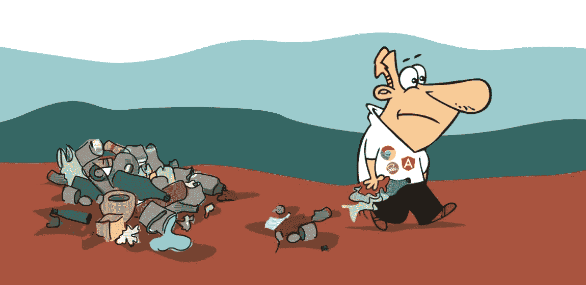
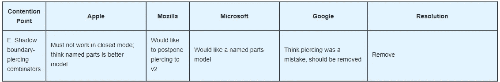

# 新的 Angular ::ng-deep 和阴影穿刺组合下降

> 原文：<https://medium.com/hackernoon/the-new-angular-ng-deep-and-the-shadow-piercing-combinators-deep-and-drop-4b088dbe459>



***本*条** ***原本出现在***[***dormoshe . io***](https://dormoshe.io/articles/the-new-angular-ng-deep-and-the-shadow-piercing-combinators-drop-16)

阴影穿透组合器(`/deep/`、`>>>`和`::shadow`)被 [W3C](https://www.w3.org/wiki/Webapps/WebComponentsApril2015Meeting) 、普通浏览器和工具弃用了一段时间。Sass 和 Chrome 将这种分辨率带入了现实。

> Sass 在任何版本的 Sass 中将不再支持/deep/和> > >；Chrome 改变/deep/自 Chrome 60 以来的行为

Angular 的团队决定为 Angular 添加一个名为`::ng-deep`的新组合子。**新组合子在这里带着上周(7 月 14 日)发布的**[**Angular 4 . 3 . 0**](https://github.com/angular/angular/blob/master/CHANGELOG.md#430-2017-07-14)新版本。

> Angular 的团队建议停止使用旧的组合子，开始使用::ng-deep

在这篇短文中，我们将回顾这种下降的状态，并遵循 Angular 核心团队的建议。

# 一点背景——阴影穿透组合子

`/deep/`的初衷是提供一种方法来处理当作用域边界阻碍了偶尔的实际需求**从作用域外**或全局调整样式时的异常情况。

`/deep/`完全忽略所有阴影边界，并进入任意数量的阴影树。简而言之，`/deep/`允许你深入到元素的内部，并以任何节点为目标。

在定制元素的世界里,`/deep/`组合子特别有用。例如，当一片叶子是一个花园(在任何级别)的后代时，我们可以像这样更改样式:

```
garden /deep/ leaf {
  border: 3px solid dark-green;
}
```

`/deep/`组合子也有别名`>>>`，所以这个例子可以写成这样:

```
garden >>> leaf {
  border: 3px solid dark-green;
}
```

# 放置的状态

移除这些组合器的决定在 2015 年的 Web 应用工作组(WebApps) Web 组件[会议上被接受。](https://www.w3.org/wiki/Webapps/WebComponentsApril2015Meeting)



The meeting discussion and resolution

根据这次会议， [Chrome v45](https://www.chromestatus.com/feature/6750456638341120) 将组合符标记为不推荐使用。在下一个稳定版本的 Chrome 中，版本 60 中**、**、[、**组合符的行为将会改变**、](https://www.chromestatus.com/feature/4964279606312960)。`/deep/`组合子的行为类似于**后代组合子** `` ``，即空间，实际上是无运算的。

# 新的::ng-deep 组合器

`::ng-deep` combinator 是 Angular 的一个新组合，最后一个小版本 4.3.0 发布。`::ng-deep`是/deep/ and > > >的别名，但是因为这些组合符被工具和浏览器抛弃了，Angular 增加了这个新的组合符。

`::ng-deep` **不是解决问题的长久之计，也是不可取的**。根据安格尔核心团队的建议，直到安格尔放弃组合子-

> 为了与工具有更广泛的兼容性，应该首选`::ng-deep '

没有任何关于何时新的组合器将被删除的澄清，但是我们知道，阴影穿透组合器的任何使用将只在有一个清晰的迁移路径时从 Angular 中删除。

# 结论

组合数从工具和浏览器中消失只是时间问题。现在，当 Chrome 和 Sass 正在处理这个问题时，没有选择来解决这个问题。一个由 Angular 团队提供的新替代品，我们应该使用它。很明显，我们将在不久的将来听到这个话题。在此之前，只需使用`::ng-deep`即可获得更广泛的兼容性。


***你可以跟随我在***[***睡鼠宫***](https://www.dormoshe.io) ***或*** [***推特***](https://twitter.com/DorMoshe) ***上阅读更多关于棱角分明、JavaScript 和网页开发的内容。***