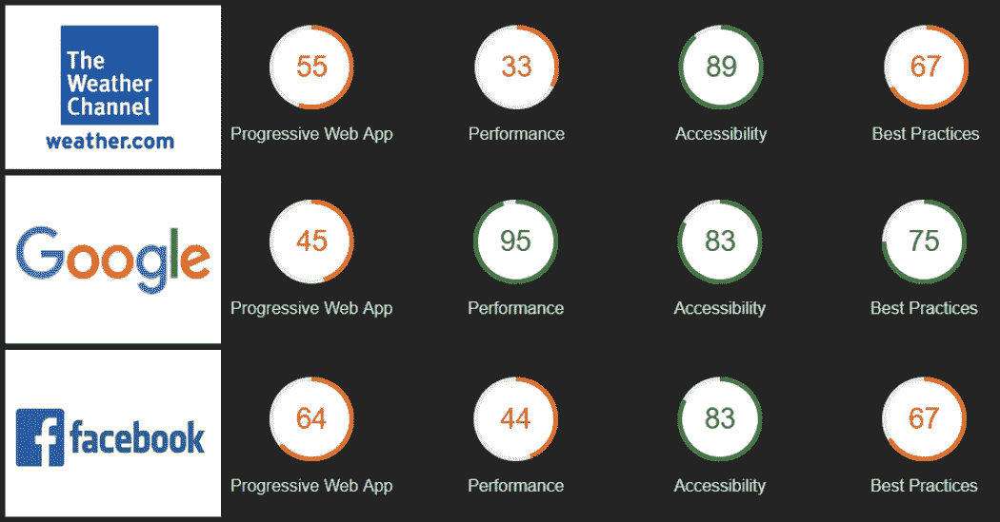
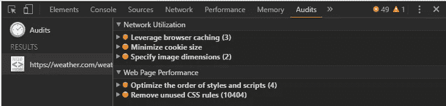
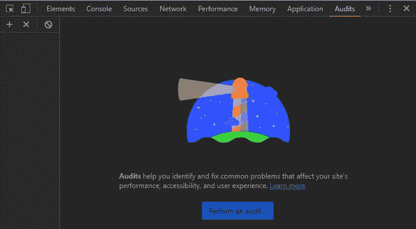
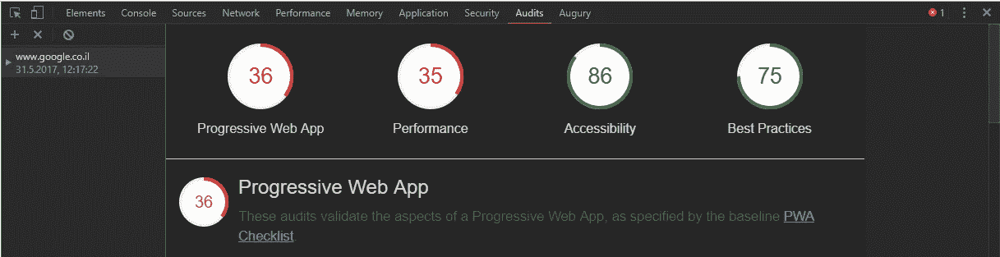
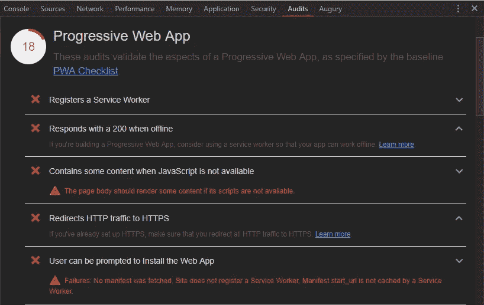
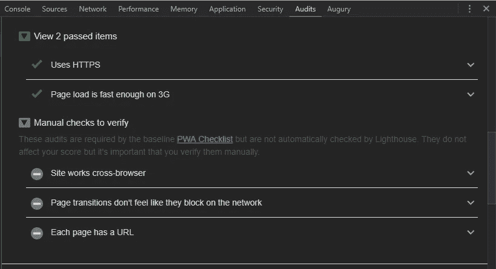
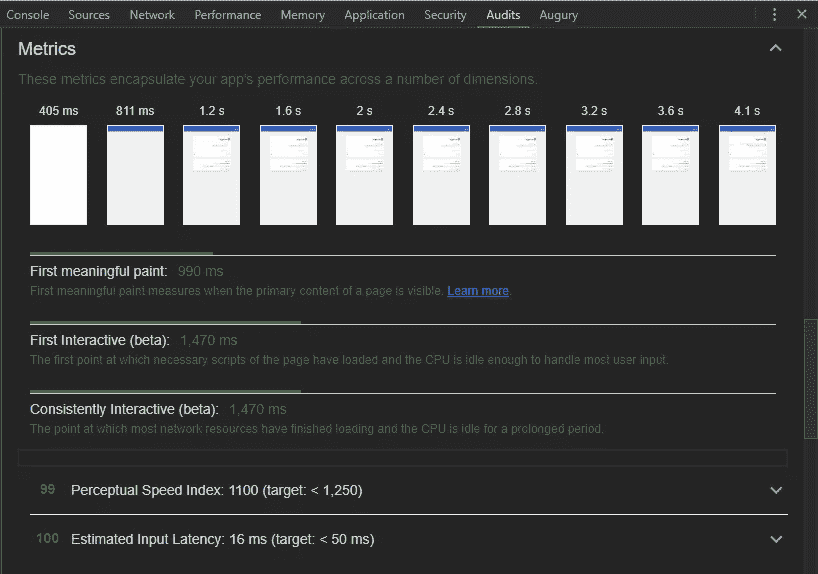
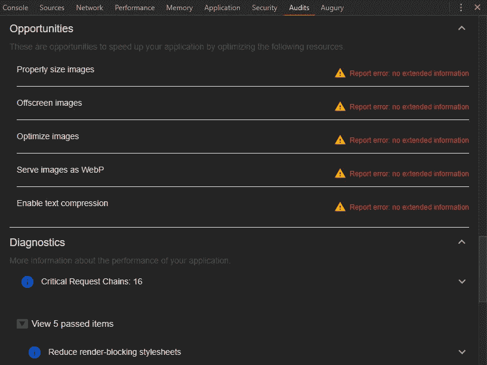
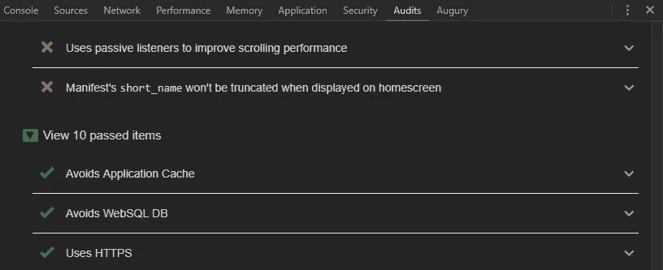
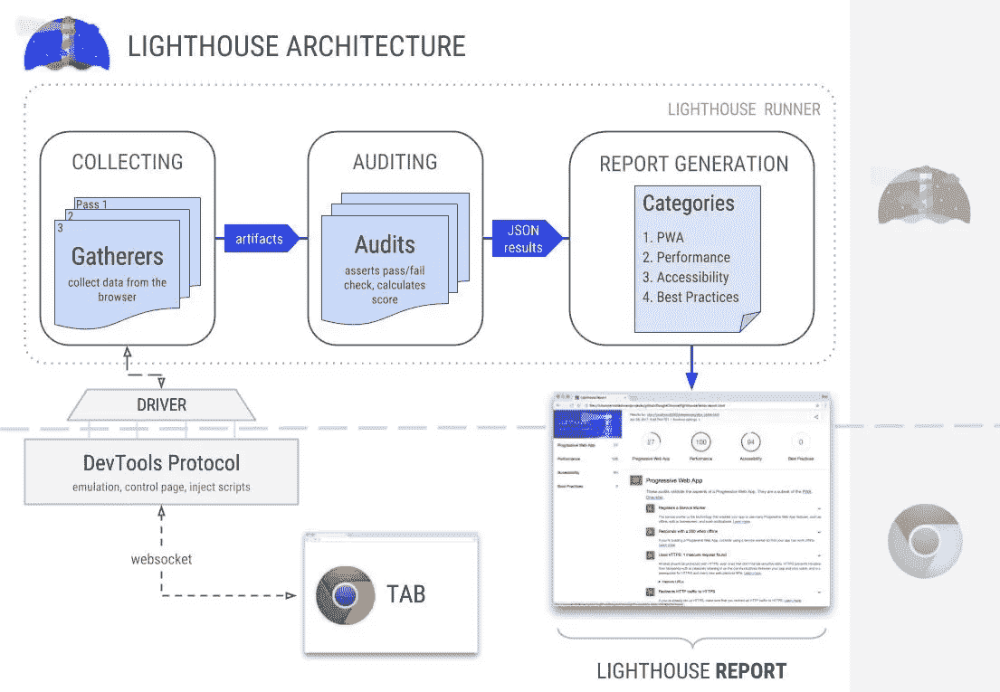

# 你想了解的 Chrome DevTool 新特性

> 原文：<https://medium.com/hackernoon/the-new-chrome-devtool-feature-you-want-to-know-about-c0d2371151d6>

## 使用 Lighthouse 提高您的网页质量

Popular websites scores

***本*条** ***原本出现在***[***dormoshe . io***](https://dormoshe.io/articles/the-new-chrome-devtool-feature-you-want-to-know-about-12)

Chrome 开发团队致力于功能和改进，使我们的浏览和开发体验更好。谷歌 I/O 2017 大会于 4 月举行，有重大消息传出。其中一部分是关于 DevTool 的，所以它影响了我们这些使用 chrome 的 web 开发者。Chrome 60 在 DevTool 中带来了许多新功能和变化。**令人惊叹的功能是新的审计面板。**

审计面板由[灯塔](https://developers.google.com/web/tools/lighthouse)供电。Lighthouse 提供了一套全面的测试来衡量你的网页质量。测试类别包括*性能、可访问性、最佳实践和 PWA* (渐进式网络应用)。

在本文中，我们将探索审计功能，了解类别，在一些流行的网站上运行它，涵盖报告结果，并从灯塔的架构中获得一些经验。

# Chrome 版本< 60

The Audits panel is an existing feature in the chrome DevTool for a while. Before version 60 of Chrome, this panel contained only *网络利用率*和*网页性能*测量。审计面板已经被 Lighthouse 工具的集成版本所取代。

不同版本之间的外观和感觉是如此不同。这些差异是如此重要，以至于谷歌将这一功能作为一项新功能展示出来。在旧版本的 chrome 中有一种方法可以使用 Lighthouse 作为浏览器扩展或作为[节点命令行工具](https://github.com/GoogleChrome/lighthouse/)，但现在它是浏览器的内置功能。

Audits feature before Chrome 60

# 灯塔

审计面板现在由 Lighthouse 提供支持。Lighthouse 是谷歌开发的。它提供了一套全面的测试来衡量你的网页质量。Lighthouse 是一个开源项目。

**“做得更好 web”**是 Lighthouse 内部的一项计划，旨在帮助 Web 开发人员更新他们现有的 Web 应用程序。通过运行一组测试，开发人员可以发现新的 web 平台 API，了解性能缺陷，并学习(更新的)最佳实践。换句话说，在网络上做得更好！DBW 被实现为一组独立的[收集器](https://github.com/GoogleChrome/lighthouse/tree/master/lighthouse-core/gather/gatherers/dobetterweb)和[审计](https://github.com/GoogleChrome/lighthouse/tree/master/lighthouse-core/audits/dobetterweb)，它们与核心灯塔测试一起运行。

要了解它如何工作以及如何为它做出贡献，请查看下面 Google I/O 2017 的灯塔演讲:

Google I/O 2017 talk about Lighthouse

这个演讲介绍了 Lighthouse 的新特性，以及它是如何发展成为现代 web 开发的伙伴的。此外，它还涵盖了 Lighthouse 在不同环境中的使用(Node CLI、Chrome DevTools、WebPageTest 和 headless Chrome)、架构、Github/Travis/CI 集成、headless Chrome，以及您可以通过创作定制审计来扩展 Lighthouse 以针对您自己的站点运行的方式。

# 如何使用它

“审计”选项卡是浏览器开发工具中的最后一个内置选项卡。为了使用它，你需要安装最新版本的 Chrome 60。

为了审计页面，您应该遵循以下步骤:

1.  按 F12 打开**开发工具**。
2.  点击**审计**选项卡。
3.  点击**执行审计**。
4.  点击**运行审计**。Lighthouse 设置 DevTools 来模拟移动设备，对页面运行一系列测试，然后在 Audits 面板中显示结果。

The Audits panel with the Lighthouse Logo before performing an audit.

# 面板

Lighthouse 根据 4 个类别对页面进行分析: ***性能、可访问性、最佳实践和渐进式 Web 应用(PWA)。*** Lighthouse 通过不同的设备大小和网速等一系列测试运行页面。它还检查是否符合可访问性指导原则，如颜色对比和 ARIA 最佳实践。

Audits report result per category

顶部的分数是每个类别的总分数。报告的其余部分是决定你分数的每个测试的细目分类。每个面板关注其中一个类别，并以适当的结构显示类别结果。

## 渐进式网络应用

渐进式网络应用(PWA)是可靠、快速和吸引人的，尽管有许多事情可以将 PWA 从基线提升到模范体验。

为了帮助团队创造最好的体验，Lighthouse 整理了一份清单，其中列出了我们认为成为基线 PWA 所需的所有事项，以及如何通过提供更有意义的离线体验、更快地实现互动以及关注更多重要细节来进一步发展示范性 PWA。

PWA results — failed tests part

当我们点击顶部栏中的 PWA 圆圈时，我们看到的第一部分是**失败测试列表**。我们可以阅读、探索，然后修复失败的测试。

PWA 报告的下一部分是**通过项目清单**和**手动检查**。有些检查必须手动运行才能进行验证。那些检查很重要，但不影响分数。

PWA report — passed items and the manual checks parts

## 表演

网页性能指的是网页被下载并显示在用户的网页浏览器上的速度。Web 性能优化是关于提高 web 性能的知识领域。

事实证明，更快的网站下载速度可以提高访问者的保留率、忠诚度和用户满意度，特别是对于互联网连接速度较慢的用户和使用移动设备的用户。

绩效类别的第一部分是**指标**。这些指标概括了应用在多个维度上的表现。

Performance's metrics

如您所见，有 3 个主要装载点:

*   第一个有意义的绘图-第一个有意义的绘图测量页面的主要内容何时可见。
*   第一次交互——第一次加载页面的必要脚本，并且 CPU 空闲到足以处理大多数用户输入。
*   持续交互——大多数网络资源已经完成加载并且 CPU 长时间空闲的点。

接下来表演的部分是**机会**。通过优化一些资源，比如图像和文本压缩，这些都是加速应用程序的机会。

The Opportunity and Diagnostics parts

最后一部分是**诊断**。这些诊断显示了有关性能的更多信息。其中之一是**关键请求链**，它显示了页面的第一次呈现需要哪些资源。我们可以通过减少链的长度、减少资源的下载大小或推迟不必要的资源的下载来提高页面负载。

## 易接近

可访问性指的是用户的体验，这些用户可能在“典型”用户的狭窄范围之外，他们可能以不同于你预期的方式访问事物或与之交互。具体来说，它关注的是正在经历某种类型的损伤或残疾的用户——请记住，这种经历可能是无形的或暂时的。

辅助功能类别包含分析屏幕阅读器和其他辅助技术在页面上正确工作的能力的测试。例如，元素的属性用法、ARIA 属性最佳实践、元素的可识别名称等等。

Accessibility category report

## 最佳实践

最佳实践类别检查了一些使页面现代化和避免性能陷阱的建议。例如，应用程序缓存、HTTPS 使用、弃用的 API、用户的权限请求等等。该部分包含**未通过和通过测试列表**。

Best practices category report

# 热门网站分数

在这一部分，我们将看到 3 个热门网站的最高得分。首先是 Weather.com 的登陆页面。第二个是谷歌的结果页面。最后是脸书的墙页。

Popular websites scores

我们可以看到，PWA 是得分最低的类别，可能是因为 PWA 是网络中的一个新领域。我们可以看到，虽然谷歌的性能是最好的，但 weather.com 的性能很差(持续互动超过 25 毫秒)。所有测试网站的可访问性都很好，得分都大于 80。无障碍是一个领域，现在得到了广泛的关注，最近在一些国家已经成为法律的一部分。

# 它是如何工作的——架构

灯塔的流程包含一些主要步骤。部分步骤发生在浏览器中，其他步骤由 lighthouse runner 执行。

Lighthouse architecture

这是灯塔的组成部分:

*   **驱动** —与 [Chrome 调试协议](https://developer.chrome.com/devtools/docs/debugger-protocol) ( [API 查看器](https://chromedevtools.github.io/debugger-protocol-viewer/))接口
*   **Gatherers** —使用驱动程序收集关于页面的信息。最少的后处理。gatherer 的输出被称为**工件。**
*   **审核** —使用工件作为输入，审核评估测试并分配通过/失败/得分。
*   **类别** —将审计结果分组到报告中面向用户的部分(例如最佳实践)。对区段应用加权和总体评分。

# 结论

可访问性和 PWA 成为现代 web 开发的主要手段。公司投入时间和金钱来改善他们的网页。将 Lighthouse 集成到开发工具中是可行的。它将帮助 web 开发人员变得更加专业，并以更高的质量交付页面。我真的相信我们会花很多时间在审计选项卡上，在我们在一些流行的网站上运行它之后，不仅仅是我们。

***您可以关注我的***[***dormo she . io***](https://www.dormoshe.io)***或***[***Twitter***](https://twitter.com/DorMoshe)***了解更多关于 Angular、JavaScript 和 web 开发的内容。***