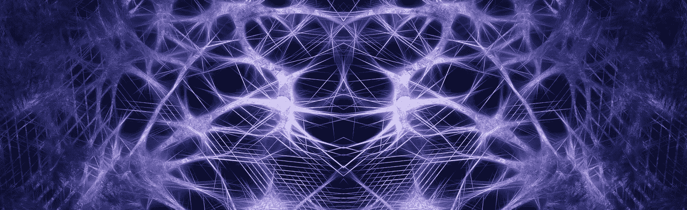

# 工业主义的新联系

> 原文：<https://medium.com/hackernoon/the-new-connectivity-of-industrialism-6dafa4f5409d>

Matthew Putman，Nanotronics 首席执行官

C **连接**几乎总是与[互联网](https://hackernoon.com/tagged/internet)的力量联系在一起，以及它所实现的近乎即时的交流。近年来，这种想法已经扩展到与物体的交流，现在几乎是老生常谈的术语“物联网”。

我们无意削弱定义了我们时代的信息技术的力量，但在关于进步的有价值的讨论中，仍然缺少一些东西，而这些东西对于世界看到一个互联世界的普遍丰富是至关重要的。这其中大部分是直到现在才成为可能的发现和发明的碰撞，所以它们没有完全实现是很自然的。虽然连接通常被认为是人类交互的可访问性，但新的普遍连接将是机器之间的连接，人类将扮演教师、学生和发明家的角色。就工业而言，这将会以比第二次工业革命以来我们所看到的更加戏剧性的方式改变制造业的本质。

我们所有人都知道的现代技术联系，甚至新范式的未来可能性，在很大程度上都要归功于微电子工业的产品。当看到处理器性能的不断提升，以及从 led 到自动驾驶汽车的激光雷达等各种产品都采用了节能半导体时，这一点尤为明显。即使在最近，这些软件也被认为在经济上是不可行的，但是从历史上看，它们比使用它们的软件更先进。当我们启动计算机时，我们都会直观地感受到这一点，2017 年的操作系统与 1995 年基本相同，尽管运行它们的处理器已经从运行 33MHz 的单核处理器发展到运行 5000MHz 的多核处理器。这个操作系统，以及许多我们最常用的程序，如 Word、Power Point 和 Excel，实际上是一样的。有了这种几乎不可思议的巨大进步，这些程序应该是不可思议的优越。至少有一个例外，这是我们正在发生的变化的催化剂，并将在一个更多地由机器中的智能而不是机器本身驱动的世界中看到。这是在游戏优化人工智能。自从 1997 年 IBM 的“深蓝”击败国际象棋世界冠军加里·卡斯帕罗夫(Gary Kasporov)以来，人们一直觉得软件可能会有所不同，但这种不同直到最近才在这个星球上的许多人的日常生活中得到承认。这种新的脱节并不太相信软件的力量，而是了解哪些功能没有被利用，以及为什么这些功能是教育、可访问性和连接性的未来的关键。

如果被问及为什么 2017 年比过去更加互联和先进，工厂工程师、装配工、检查员或 IT 专业人员很可能会在提到自己的工作之前提到客户。一部 IPhone、一部亚马逊 Echo、一份网飞推荐，以及除了人类之外，几乎所有我们拿着或与之交谈的东西，都吸引并影响了我们所有人。与此同时，在制造那些使这些产品得以存在的技术的工厂里，人们可能看不到他们一天中花在工作上的 8 个小时使用了他们所羡慕的任何先进技术，并指望这些技术用于现代娱乐，有时甚至用于生存。这可能是因为在过去两代人的时间里，发明以特定的方式转移到了计算机上。计算机科学家的角色已经被提升为通往稳定甚至财富的道路，以至于孩子们被认为是成功的，并且具有在计算机上使用技术编写程序的惊人能力，而他们被认为是懒惰和分心的，因为他们实际上利用了我们拥有的最复杂的互联数字工具，如在线游戏。这很有道理，但未来对工厂员工和孩子来说都呈现出非常不同的面貌。布尔逻辑存在一些限制，这些限制并没有利用它所运行的硬件的能力，即使是在软件占主导地位的情况下。然而，就在最近几年，人工智能算法正在搜索、语音识别和推荐引擎的消费技术中得到应用。构成使能技术的工厂并不像它们的客户那样严重依赖人工智能。通过人工智能连接机器将提高产量，消除废料，通过使用数据分类器对过程控制进行 70 年来的第一次重大变革，加快产品迭代。让公司变得更有效率不是最终目标，或者肯定不是吸引学生或公众的最令人兴奋的方式，但它带来了两个重要的副产品:一种新的工作方式，以及让生活变得更美好的新一代产品。

计算机科学是许多人的职业选择，但 120 多年来，制造业一直是发达国家经济的最大组成部分。然而，一个工厂仍然是一个工厂，与 120 年前的工厂大同小异，只是在避免浪费和更快生产出质量一致的产品的能力上有了重大改变。这发生在计算机革命之前很久，70 年前第二次世界大战刚刚结束。通常，空白的进展与现有技术和方法的直接迭代同样重要。当美国和欧洲参与重建几乎完全被摧毁的战后日本时，情况就是如此。组织制造业的努力并不是来自建造工厂的普通人，如商业领袖和生产工程师，而是来自数学家 w .爱德华兹.戴明。基于近 30 年前在贝尔实验室所做的工作，戴明将一个叫做统计过程控制(SPC)的理论概念付诸实践。SPC 是革命性的，因为它承认构建任何东西的过程都是一系列的生产节点，每个节点都随着时间的推移而变化，甚至是一整天。SPC 承认，如果被跟踪的信息是可操作的，那么跟踪这些变化是创造统一产品的更好途径。重点不是看一个部件在通过一个节点时是否发生故障，而是看它在统计上是否与上次发生的情况相同。SPC 慢慢地消除了产品只应检查质量的严重依赖和常识，代之以依赖一致性的产品，这反过来产生了更好的质量。这仍然存在一个问题，即使现在计算机充斥着工厂，这个问题仍然存在。作为数据的统计抽样，留下了大量数据所拥有的细节。尽管其有用的电力数据可以被视为新的污染。大数据本身会产生积压，这与提供快速流程控制背道而驰。相比之下，实时人工智能检测和分类有可能消除绝大多数不需要的数据。在工厂之外，谷歌的目标是找到对提问者重要的搜索答案，而不仅仅是搜索栏中包含单词的所有内容的列表。为了让人工智能在工厂中取得成功，并取代 SPC 成为制造工作方式的核心，仅需要从大量可用数据中提取有意义的信息。这些信息非常有用，因为它可以确定因果关系，并最终做出实时决策来优化流程。

这种新的观点可以被称为人工智能过程控制(AIPC)。这将是一个独立的生态系统，机器之间通过优化最终产品而不是优化流程的各个部分来产生解决方案。这很像一个身体作为一个独立的蛋白质工厂和代谢过程的调节器来优化生命的工作方式。

虽然编程、工业实践和创新作为几乎独立的概念之间可能有一个飞跃，但它们本身是联系在一起的，这是真正的新连接。工作变成了优化更好更有趣的产品。传统的工厂控制被现在只能在消费技术中看到的智能所取代，我们学习和教授的价值观和技能从我们单独通过编程构建的价值观和技能转变为连接机器来完成我们曾经认为是成功的主要途径的工作。我们所建立的联系将是那些通过构建事物来构建未来的联系，而不是一个只有正在构建的事物才能将我们联系在一起的未来。