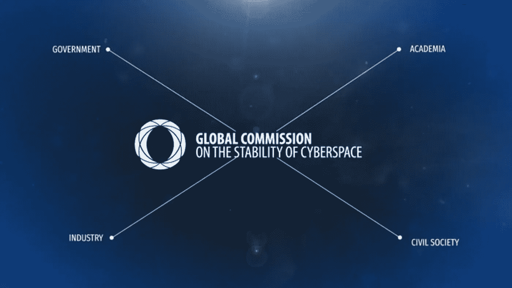

# 网络空间的新守护者

> 原文：<https://medium.com/hackernoon/the-new-guardians-of-cyberspace-414e10387f89>

## 网络空间稳定性全球委员会今天首次亮相。

随着国与国之间的冲突转移到网络空间，互联网和技术的和平利用受到威胁，使我们的自由、经济和安全受到威胁。鉴于过多的行为者和参与者，找到解决方案是一项挑战。这是一个复杂的生态系统，新成立的网络空间稳定全球委员会希望保护和帮助推进所有人的利益。

今天在 2017 年慕尼黑安全会议期间启动的全球委员会是一项独特的倡议，汇集了代表政府、行业、学术界和民间社会的关键声音。它旨在创建负责任行为的政策建议和规范，这些建议和规范是一致的，并得到所有利益攸关方的广泛支持，以加强网络空间的稳定和安全。

该倡议由荷兰政府、海牙战略研究中心(HCSS)和东西方研究所(EWI)宣布，主要支持者包括 T4 互联网协会(T5)和微软。

“网络空间正变得越来越被利用。这需要我们所有人加强协调。它需要制定规范来提供一个稳定和安全的环境。所以我们都能受益，”荷兰外交大臣贝尔特·肯德尔斯说。

> 我们即将进入一个新时代。是时候保卫我们的网络空间了。

总部设在海牙的全球委员会将由爱沙尼亚前外交部长玛丽娜·卡尔尤兰(Marina Kaljurand)担任主席，并将由来自超过 15 个国家的 20 多名杰出的独立委员组成，他们拥有就网络空间的不同方面发表意见的专业知识和合法性。

“随着网络空间继续快速发展，它为我们的生活方式提供了独特的优势，同时也带来了特定的威胁，”Kaljurand 说。“正是由于这个原因，这个机构被设计成确保政府、商业界、学术界和有关公民之间交流知识和思想的一种手段。在塑造网络空间的过程中，每一方都受到影响，并发挥着促进作用。”

联席主席是前美国国土安全部部长迈克尔·切尔托夫和前印度副国家安全顾问莱莎·雷迪。委员中有瑞典前首相兼外交大臣[卡尔·比尔特](https://medium.com/u/8cb52f1c4971?source=post_page-----414e10387f89--------------------------------)、T4 哈佛大学[哈佛大学](https://medium.com/u/cb35da43ade5?source=post_page-----414e10387f89--------------------------------)哈佛大学哈佛大学[哈佛大学](https://medium.com/u/cb35da43ade5?source=post_page-----414e10387f89--------------------------------)哈佛大学[哈佛大学](https://medium.com/u/7fc5f24a06ca?source=post_page-----414e10387f89--------------------------------)[哈佛大学](https://medium.com/u/7fc5f24a06ca?source=post_page-----414e10387f89--------------------------------)哈佛大学[哈佛大学](https://medium.com/u/7fc5f24a06ca?source=post_page-----414e10387f89--------------------------------)[哈佛大学](https://medium.com/u/7fc5f24a06ca?source=post_page-----414e10387f89--------------------------------)[哈佛大学](https://medium.com/u/7fc5f24a06ca?source=post_page-----414e10387f89--------------------------------)哈佛大学[哈佛大学](https://medium.com/u/7fc5f24a06ca?source=post_page-----414e10387f89--------------------------------)[哈佛大学](https://medium.com/u/7fc5f24a06ca?source=post_page-----414e10387f89--------------------------------)[哈佛大学](https://medium.com/u/7fc5f24a06ca?source=post_page-----414e10387f89--------------------------------)[哈佛大学](https://medium.com/u/7fc5f24a06ca?source=post_page-----414e10387f89--------------------------------)[哈佛大学](https://medium.com/u/7fc5f24a06ca?source=post_page-----414e10387f89--------------------------------)[哈佛大学](https://medium.com/u/7fc5f24a06ca?source=post_page-----414e10387f89--------------------------------)[哈佛大学】哈佛大学](https://medium.com/u/7fc5f24a06ca?source=post_page-----414e10387f89--------------------------------)哈佛大学[哈佛大学](https://medium.com/u/7fc5f24a06ca?source=post_page-----414e10387f89--------------------------------)[哈佛大学】哈佛大学](https://medium.com/u/7fc5f24a06ca?source=post_page-----414e10387f89--------------------------------)[哈佛大学](https://medium.com/u/7fc5f24a06ca?source=post_page-----414e10387f89--------------------------------)[哈佛大学](https://medium.com/u/7fc5f24a06ca?source=post_page-----414e10387f89--------------------------------)[哈佛大学谷歌的温顿·瑟夫是特别顾问。](https://medium.com/u/7fc5f24a06ca?source=post_page-----414e10387f89--------------------------------)

> [黑客中午](http://bit.ly/Hackernoon)是黑客如何开始他们的下午。我们是阿妹家庭的一员。我们现在[接受投稿](http://bit.ly/hackernoonsubmission)并乐意[讨论广告&赞助](mailto:partners@amipublications.com)机会。
> 
> 如果你喜欢这个故事，我们推荐你阅读我们的[最新科技故事](http://bit.ly/hackernoonlatestt)和[趋势科技故事](https://hackernoon.com/trending)。直到下一次，不要把世界的现实想当然！

