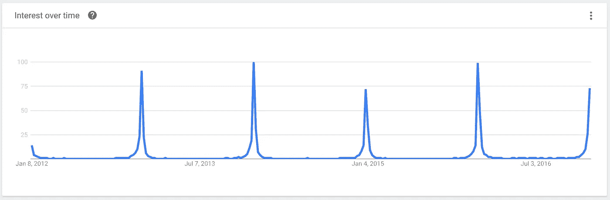

# 新的一月决议

> 原文：<https://medium.com/hackernoon/the-new-month-resolution-c8f27a191d80>

放下新年的[决心](https://hackernoon.com/tagged/resolution)。没错，放下它，开始每个月做决心。

这不仅会给你的生活带来更多的改善，还会带来更高的坚持率和更大的整体影响。

# 为什么是每月？

根据定义，新年决心一年只有一次。理论上，新的一年是你反思的大好时光，也是你计划的大好时光。

然而，在实践中，做出承诺并坚持一整年实际上是为失败做准备。在这一切结束的时候，你有整整一年的时间来回顾过去，并且只有一次反思的机会。实际上，反思和决心最终成为 12 月 31 日和 1 月 1 日的惯例，仅此而已。

想一想——在 2016 年，你有多少天想过你的 2016 年决心？大概很少。[谷歌](https://hackernoon.com/tagged/google)趋势显示，对绝大多数人来说，这个数字低得离谱:

Google searches for “new years resolution” spike between the last week of December and the first week of January.

如果你制定了一整年的计划，你应该让自己坚持一整年，并且每周或至少每月提醒自己检查你的进展，确保你在正轨上。如果这没有成功，那么很明显有问题。

# 每年与每月

新年决心涉及每年 1 个周期。相比之下，新的月决心有更快、更频繁的周期——每个月一个。

新年决心的特点是:

*   极少观察和解决
*   实施周期长，目标巨大，难以满足
*   用最少的信息收集进行长时间的反思

新的月份决议的特点是:

*   频繁的观察和解决期
*   短的、可管理的实施周期，具有现实可行的短期目标
*   在信息仍然新鲜的情况下进行短时间的思考

# 我 2016 年的新年决心

2016 年，我开始做新年决心。我决定每个月进行一次实验来改变我的行为，然后看看我是否能坚持下去。我是这样做的:

*   **七月:**每日阅读
*   八月:没有电视或电影
*   **九月:**没有乳制品
*   **十月:**无面筋
*   **十一月:**每日冥想
*   **12 月:**没有新闻或社交媒体

如你所见，几个月是消除月，几个月是日常行为月。

淘汰的那几个月很有意思，因为我知道我不再那么依赖我淘汰的东西了。我现在看电视和电影少了，吃面包和面筋少了，我仍然屏蔽新闻和我的社交媒体。我唯一恢复的是乳制品，因为我选择继续食用它。

日常行为月很有趣，因为它给了我一个保持某些行为的入口。我仍然每天冥想，虽然我不每天阅读，但我阅读的频率接近于此。

# 我 2017 年的新年决心

现在我已经在 2016 年尝试了 6 个月的实验，是时候开始我 2017 年的实验了。我的元目标是再做 12 个新的月决心。

以下是我对 2017 年的一些想法，我会继续添加更多想法:

*   一个月来每天写日记
*   使用“100 块”方法进行一个月的时间预算
*   一个月的更仔细的开支预算
*   一个月来每周都去看我的父母
*   一个月不喝酒

# 你 2017 年的决心

我给了你我 2017 年的新年决心。现在我想听听你的，以及你是否认为每月解决方法是一个好方法。欢迎在 Twitter 上或在下面的回复中分享你的想法。

> [黑客中午](http://bit.ly/Hackernoon)是黑客如何开始他们的下午。我们是 [@AMI](http://bit.ly/atAMIatAMI) 家庭的一员。我们现在[接受投稿](http://bit.ly/hackernoonsubmission)并乐意[讨论广告&赞助](mailto:partners@amipublications.com)机会。
> 
> 如果你喜欢这个故事，我们推荐你阅读我们的[最新科技故事](http://bit.ly/hackernoonlatestt)和[趋势科技故事](https://hackernoon.com/trending)。直到下一次，不要把世界的现实想当然！

