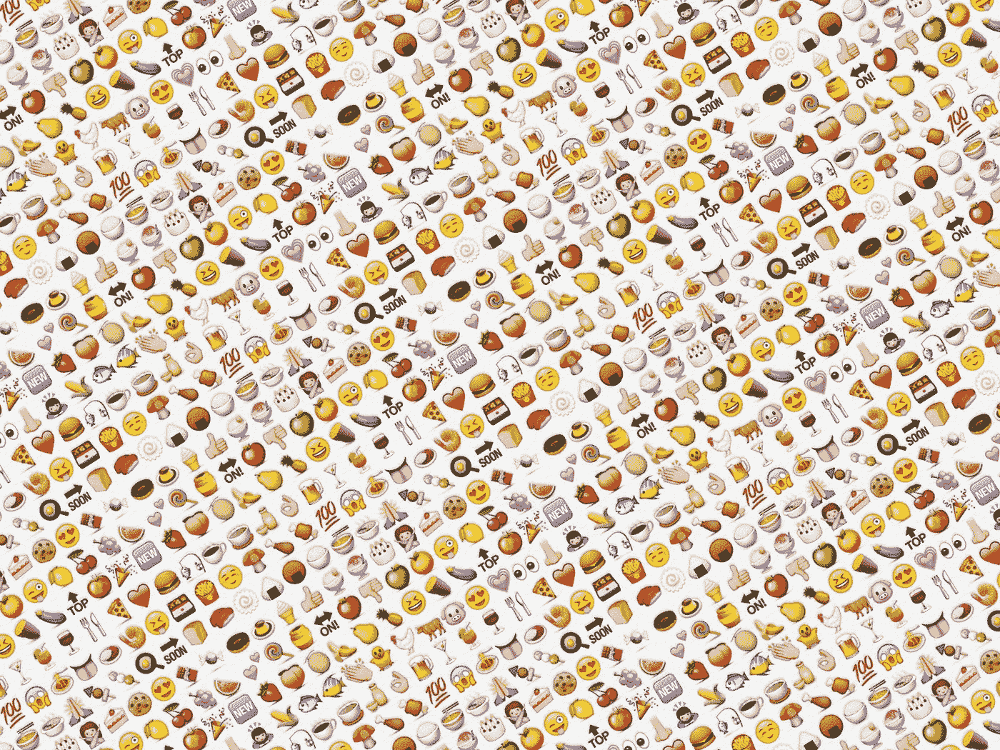

# 发短信的新方法:使用表情符号、表情符号和 gif 来提高参与度

> 原文：<https://medium.com/hackernoon/the-new-new-way-to-text-use-emoticons-emojis-and-gifs-to-up-engagement-865e8d74ab25>

Made by Dilek Dundaralp #MovieLaLa :)

我们通过文本交流的方式发生了巨大而迅速的变化。就在几年前，我们还在来回发短信，然后我们添加了表情符号，next 表情符号开始流行，现在 gif 风靡一时。

众所周知，当我们发短信时，丰富多彩的图像显示主宰了我们表达情感的方式。由于图像被证明是传达思想和表达感情的有力方式，营销人员正在学习如何以一种更加动态的方式使用表情符号、表情符号和 gif。大品牌开始在他们的营销策略中使用表情符号，如多米诺骨牌、IHOP、麦当劳、Foot Locker 等。).多米诺创造了一个比萨饼表情符号，供顾客下单。这个创新的想法使他们赢得了钛大奖赛奖。电影营销人员也在使用 gif 和短片——如 vine、vimeo 等——来吸引观众。

那么什么是表情符号、表情符号和 gif 呢？

*   表情符号是带着假笑的小而圆的黄色面孔；)，微笑:)或者皱眉:(
*   表情符号是一种更加丰富多彩的表情符号，是目前最流行的将文字和图像分开的方式。根据 2015 年表情符号报告*，92%的网络社区使用表情符号。*
*   *gif 是下一代，充满动作和生动的表情符号。这个简短的内容很有趣。Tumblr 报告称，每天有 2300 万张 gif 被发布在网站上。这些静止图像增加了文本的深度、幽默和趣味性 GIFs 在本质上只是病毒式传播。Twitter 看到他们与发布 gif 的用户的互动增加了 5 倍( [Twitter 统计](http://expandedramblings.com/index.php/march-2013-by-the-numbers-a-few-amazing-twitter-stats/5/#.VA3ZC7ywKcE))。*

*gif 和其他短片是在营销电影中抓住人们注意力的最佳方式。这些一口大小的视频不会透露太多电影的内容，非常具有娱乐性，而且不像预告片那样，不会透露太多电影的内容。粉丝们很快就能看到即将上映的电影，并对这部新电影感到兴奋。*

***2016 年 gif 的使用将继续增长***

*脸书和其他社交渠道开始在其平台中增加对 gif 的支持，这一事实证明了 gif 的病毒式传播。而且，随着更多发布 GIF 的机会，更多的 GIF 制作工具将进入市场。2015 年，我们看到 imgur、 [gifmaker.io](http://gifmaker.io) 和其他公司推出了让普通用户更容易制作自己的 gif 的产品。*

*2016 年，gif 世界将继续繁荣，因为这些社交平台认可并赋予图像以生命，允许创作者继续通过他们的短格式内容、gif 和无处不在的动画来娱乐我们。*

******

> *[黑客中午](http://bit.ly/Hackernoon)是黑客如何开始他们的下午。我们是 [@AMI](http://bit.ly/atAMIatAMI) 家庭的一员。我们现在[接受投稿](http://bit.ly/hackernoonsubmission)，并乐意[讨论广告&赞助](mailto:partners@amipublications.com)机会。*
> 
> *如果你喜欢这个故事，我们推荐你阅读我们的[最新科技故事](http://bit.ly/hackernoonlatestt)和[趋势科技故事](https://hackernoon.com/trending)。直到下一次，不要把世界的现实想当然！*

**