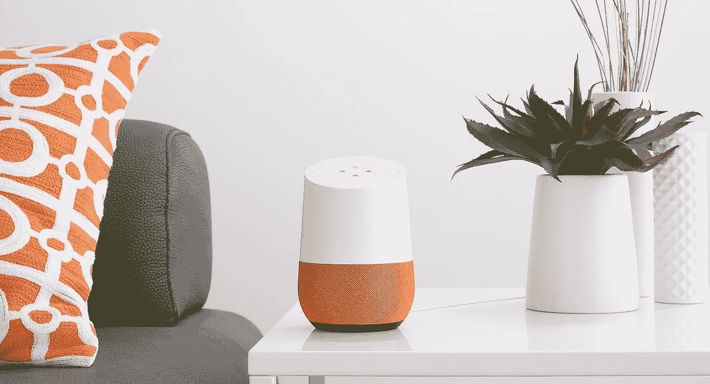

# 家庭的最新成员:Google Home

> 原文：<https://medium.com/hackernoon/the-newest-member-of-the-family-google-home-ae497df378a4>

## 虽然它并不完美，但 Google Home 几乎已经成为我们家的一部分

Image source: [Google Home product page](https://madeby.google.com/home/)

所以我在大约 2 个月前购买了一个谷歌主页，它已经成为了这个房子里一个有趣的小玩具/工具。对于那些不知道的人，这是一个语音激活设备，可以帮助你执行类似谷歌的搜索，播放音乐/播客，添加提醒和许多其他事情——类似于亚马逊 Echo。

起初，尽管我着重解释了它将如何改变我们的生活，我妻子还是不明白它的意义(“你可以让它告诉你天气..问一下最近的药房在哪里..和..呃..嗯大概就是这样”)。在开始的几个小时里，我问了它所有的问题(“嘿，谷歌，宜家什么时候关门？”，“嘿谷歌外面冷吗？”，“嘿谷歌，350 华氏度等于多少摄氏度？”)，我设法发现了它有什么用，有什么没用。

完美吗？当然不是。我们要克服一些限制。例如，该设备被吹捧为游戏改变者，因为你可以进行基于上下文的对话(即，如果你的第一个问题是“今晚有电影上映吗”，你可以问后续问题“有喜剧上映吗？”？”)，但是当句子之间有间隔时，总是在句子之间喊出激活码“嘿谷歌”是非常不自然的。

在另一个限制上，你不能更新你的日历的事实非常令人沮丧——讽刺的是，你可以在 Amazon Echo 上这样做！！我的另一个烦恼是购物清单功能。这是我非常期待的，也就是当我正在做饭的时候，可以对着谷歌喊‘嘿，谷歌，把鸡蛋加到我的购物清单上’(我总是忘记把它写在购物清单上)。然而，购物清单应用程序(Google Keep)非常糟糕——笨拙的用户界面让它在 iOS 上有些不可用

但是，从有用的功能来看，我们已经习惯了将它用于以下目的:

1.  天气——我们每天都用这个来了解外面的天气:“嘿，谷歌，外面会下雨吗？”
2.  播放播客——我喜欢这个功能，让它播放儿童故事播客来娱乐我的孩子在工作日吃早餐时会很有帮助“嘿，谷歌，你能播放 Storynory 播客吗？”(遗憾的是,“播放音乐”功能似乎在美国以外的地区不起作用)
3.  小计算——即换算，数学计算:“嘿谷歌，你能把华氏 350 度换算成摄氏吗”(网上每个菜谱好像都是华氏！)
4.  闹钟——这是一个非常有用的烹饪功能:“嘿，谷歌，设置 15 分钟的闹钟”(以前是对妻子的请求:“嘿，亲爱的，你能在 15 分钟内提醒我 xxx 吗，这样我就可以检查炉子了？”)
5.  声音——我 4 岁的孩子最喜欢问谷歌的问题是“嘿，谷歌，xxxxx 发出什么声音？”其中 xxxxx 可以是从奶牛到消防车的任何东西。

虽然这些都是小物件，是新奇的东西，但它们很快就成了我们家的日常用品。我们没有预料到的是，我们 4 岁的孩子哈维会多么喜欢谷歌的存在。

起初，哈维对谷歌主页既好奇又怀疑，就像他对陌生人一样。当我第一次向他展示我认为会打动他的东西时，比如问谷歌:“嘿谷歌，救护车发出什么声音？”事实上，哈维对此印象深刻，但也很紧张。演示了几次后，我问哈维，你希望谷歌发出什么声音？哈维想了一会儿，回答道:“嗯……一只鸭子”。对此，我鼓励哈维:“当然，哈维，你看到了我是怎么做的，去问谷歌吧”。我的儿子看起来很不好意思，一头扎进我的怀里，然后小声说“不，爸爸，你去问谷歌”。

仅仅过了一个星期，一切都变了。现在，每天早上哈维吃早餐时，他都会坚持听一段故事播客(顺便说一下，Storynory 或 T2 的故事工厂都很棒)，并坚持查看谷歌主页上的天气预报。有一段时间甚至 Google Home 回应说当天不会下雨，但后来我看到外面乌云密布，还是伸手去打伞。哈维为谷歌主页辩护说:“爸爸，不要带伞——谷歌已经说过不下雨了”。我心软了，把伞留在家里(‘谷歌’没错，那天没下雨)。

我的一个朋友对我提到，这是一个相当有趣的时期，随着语音用户界面的进步，这将定义年轻人与计算机交互的方式。上世纪 90 年代是键盘，2000 年代末是触摸屏，现在 2010 年代末看起来将是语音。

对我来说，这是一个了不起的机器，但对我 4 岁的孩子来说，这样的设备似乎很正常，似乎很适合放在家里。它感觉就像一个家庭成员，就像小猫或小狗这样的宠物一样。前几天我们离开家时，哈维在门口大喊“再见，谷歌，回头见”，就是一个很好的例子。

> 感谢阅读！如果你能推荐这篇文章(点击下面的“推荐”按钮)，让其他人也能找到它，我将不胜感激。你也可以在[推特](http://twitter.com/pubs12)上找到我

> [黑客中午](http://bit.ly/Hackernoon)是黑客如何开始他们的下午。我们是 [@AMI](http://bit.ly/atAMIatAMI) 家庭的一员。我们现在[接受投稿](http://bit.ly/hackernoonsubmission)，并乐意[讨论广告&赞助](mailto:partners@amipublications.com)机会。
> 
> 如果你喜欢这个故事，我们推荐你阅读我们的[最新科技故事](http://bit.ly/hackernoonlatestt)和[趋势科技故事](https://hackernoon.com/trending)。直到下一次，不要把世界的现实想当然！

