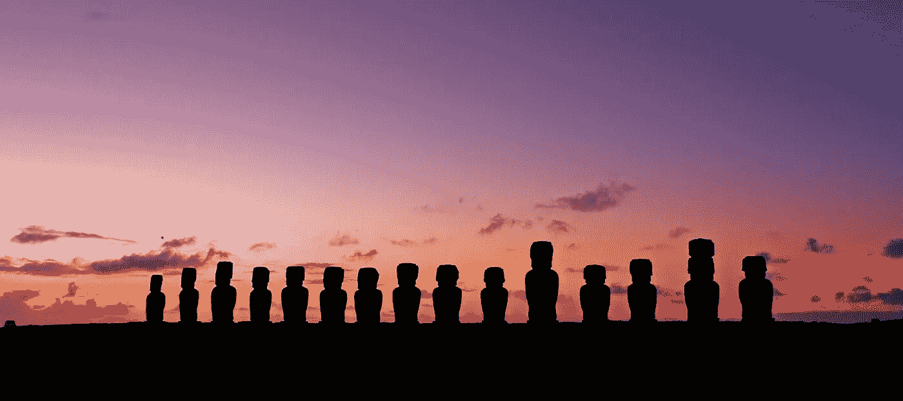

# “下一个奥斯汀”不会在美国

> 原文：<https://medium.com/hackernoon/the-next-austin-wont-be-in-the-united-states-ff0c6d25df6c>

[Pixabay](https://pixabay.com/en/chile-easter-island-rapa-nui-moai-1477188/)

人们喜欢猜测“下一个奥斯汀”——美国下一个古怪的小城市，年轻人将成群结队地搬到那里，推动房地产价格飙升，让这座城市充满艺术和文化。

在这件事上，我可能在某种程度上处于自己偏见的迷雾中，但每当我听到这段对话时，我都会暗自发笑。“下一个奥斯汀”不在美国..

为了框定我的大声思考环节，下面是“下一个奥斯汀”可能会如何发展:

*   低廉的租金和宽容的文化吸引着有创造力的人。
*   创造氛围导致技术创新。
*   技术革新导致经济繁荣。
*   三年前搬到那里的人开始抱怨现在搬到那里的所有人。(看到了吗？奥斯汀。)

[“我们做到了”](https://medium.com/u/11e81ed9d7f#.5erzbn9dw)用技术。派对结束了。

*   美国仍然有租金低廉的地方，也有宽容的文化——但还没有“宽容”到不能公开讨论疯狂的想法而不担心触发某人。看看当前对政治正确性的抵制，以及一个绝对的疯子有将近 100%的机会赢得许多州的事实。

那么，美国还有哪些地方呢？除了这个国家的天气在一年中的一段时间是绝对糟糕的，令人兴奋的技术问题越来越难解决之外，似乎没有什么负担得起的地方留下宽容的文化。罗利？变性人浴室法。底特律？糟糕的天气。奥马哈？以上都有。

“下一个奥斯汀”已经在崛起，而且已经很久了。它不是一个特别的地方。如今，我们可以看到创意人才从柏林流向清迈、布达佩斯、麦德林、布宜诺斯艾利斯，然后再返回。

当你想到每周工作 4 小时的*门徒时，你可能会想到一群被社会抛弃的人在做自动站长套利，或者卖可疑的减肥药。你可能会认为他们的游牧生活是拒绝与周围环境联系。*

*但对于我们这些从美国移居海外的人来说，回报总是惊人的。我们还没走出机场的移民线，就意识到我们被梦游般追求享乐的人包围了。他们甚至不能站在一条线上 2 分钟而不生气或叹气。*

*这对美国吸引创新人才的前景来说不是好兆头。我没有解决的办法，但是在你的公司校园里有滑板车是不合适的。*

*但是现在，我们将留在原地——至少在我们前往下一个地方之前。我们享受着人类的劳动成果，在我们喜欢的任何地方建立诚信的企业——甚至成为一些非常聪明的公司的员工。我们在优步里四处走动，像你一样使用杂货递送应用程序，但与此同时，我们使用谷歌翻译与世界的另一部分联系。虽然有一天去火星会很酷，但我们知道地球上还有很多值得探索的地方。*

******

> *[黑客中午](http://bit.ly/Hackernoon)是黑客如何开始他们的下午。我们是 [@AMI](http://bit.ly/atAMIatAMI) 家庭的一员。我们现在[接受投稿](http://bit.ly/hackernoonsubmission)并乐意[讨论广告&赞助](mailto:partners@amipublications.com)机会。*
> 
> *如果你喜欢这个故事，我们推荐你阅读我们的[最新科技故事](http://bit.ly/hackernoonlatestt)和[趋势科技故事](https://hackernoon.com/trending)。直到下一次，不要把世界的现实想当然！*

**