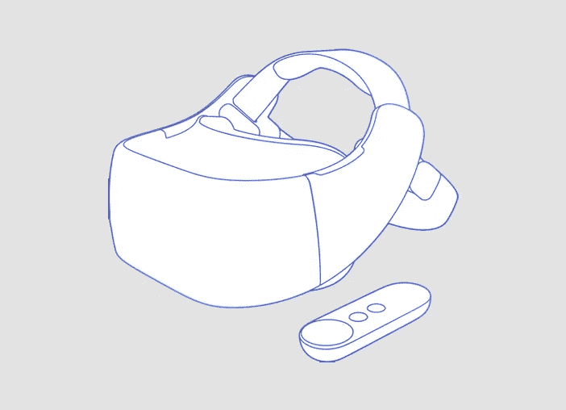

# 下一代虚拟现实技术即将到来:独立的虚拟现实耳机

> 原文：<https://medium.com/hackernoon/the-next-gen-virtual-reality-tech-is-coming-standalone-vr-headsets-6532a619a7bf>

事实上，独立 VR 头戴设备的出现将改变游戏规则，带来现有虚拟现实浪潮的下一代。独立的 VR 头戴设备是那些不需要智能手机或 PC 来供电的设备。所有的东西，如显示器，处理器，电池，传感器，连接和摄像头都将配备在设备内部。

毫无疑问，在过去几年里，我们已经看到了一些不太知名品牌的类似产品。然而，当谷歌和 Oculus 表示计划推出独立的 VR 头戴设备时，一种新的趋势刚刚开始。它有可能成为现实，甚至可能在未来几年改变虚拟现实空间。

**独立 VR 头戴设备的需求**

独立的 VR 头戴式耳机将提升无线体验，并将提供便携式 VR 设备的便利。它将拥有高端 VR 体验的能力和像素。

然后就是价格了。在 100 美元到 400 美元的价格范围内没有太大的竞争。Oculus 最近对其 Rift + Touch 设备进行了打折。还有 PlayStation VR 和即将上市的戴尔、联想、华硕等的 Windows 混合现实头戴设备。有吗？

尽管如此，独立的 VR 头戴设备仍处于有利地位，因为用户不需要购买昂贵的游戏 PC 或智能手机来消费 VR 内容。单机版的成本将是合理的，因为它将包括内置的硬件和软件，以提供虚拟现实体验。

再者，还有一个实际原因。如果手机电池放电，与智能手机相关的虚拟现实体验很容易被破坏。PC 和 VR 也是如此。当一个人在桌面上使用 VR 时，他的其他家庭成员会对 PC 的使用感到苦恼。

**谷歌领先**

今年的谷歌 I/O 强调了在谷歌 Daydream VR 平台上运行的独立耳机的倡议。联想和 HTC Vive 都在开发独立的 Daydream 耳机。Vive Daydream 耳机的预告图片揭示了即将推出的耳机的笨重而好看的外观。

据推测，这两款耳机都具有六度 WorldSense 跟踪功能，并且没有外部传感器来跟踪 3D 空间中的身体运动。相比之下，单机版将在耳机上配备一切。

用户可以不受限制地转动、行走甚至移动，耳机将保持轨迹。HTC 此前证实，单机版不会与 SteamVR 有任何交叉。

其次，Oculus 的第一款独立耳机被认为代号为 Santa Cruz，该耳机的第一个外观已经在 2016 年 10 月出现。在最新的发展中，据传该公司还在开发一款代号为 Oculus Pacific 的经济型独立 VR 耳机。

Oculus 的独立耳机可能会在明年推出，建议价格为 200 美元。Santa Cruz 原型预计将不同于 Rift 2，而 budget Pacific 耳机据传缺乏位置跟踪系统。

此外，谣言工厂暗示 Oculus 正在开发一系列不同的 VR 头戴设备，其中一些将具有完整的运动跟踪功能。然而，预计今年不会推出新的硬件。

**路线被采用……**

目前，这些发展都不令人惊讶。不仅仅是 Oculus，每个耳机玩家都在追求提供真正独立的 VR 耳机。早在 2016 年，三星就表示，它正在开发专用的虚拟现实耳机，不需要任何 Galaxy 智能手机来消费虚拟现实内容。据称，这款耳机还带有位置追踪功能，以及手部和手势追踪功能。通过 Exynos VR 3，我们可能已经在上海世界移动通信大会上第一次看到了它。

去年，高通吹嘘了一款超级规格的不明耳机——高通 820 智能手机 SoC，18 毫秒延迟，VR820 采用 AMOLED 显示屏，分辨率为每只眼睛 1440x1440。据称耳机被认为与谷歌有密切关系，尽管没有证据表明这一点。

另一方面，据传谷歌将开发一款独立的 VR/AR 耳机，具有位置跟踪和眼球跟踪功能。

英特尔也拥有其 Project Alloy VR + AR 参考设备，尽管它似乎不如高通的好。

之前的 IFA 展示了阿尔卡特视觉耳机，这是一款真正的一体化耳机。它由电池供电，具有蜂窝连接功能。然而，从那以后，我们没有听到多少关于阿尔卡特愿景的消息。

**我们应该等待下一代吗？**

由于最新的发展和创新，虚拟现实的未来似乎非常有趣。尽管如此，这取决于是等待还是从可用的选项中获得一个 VR 头戴设备。此外，决定你想要在 VR 头戴设备上花多少钱也很重要。独立的虚拟现实耳机肯定会很贵，因为它将拥有成熟的硬件和软件产品。

现有的[智能手机虚拟现实耳机](https://www.mobikart.com/mobile-accessories/vr-headsets/)有能力以低得多的成本提供高质量的虚拟现实体验，所以只要独立耳机到来，它们就是完美的。然而，如果你正在寻找一款需要 PC 的中档 VR 头戴设备，那么等待独立的 VR 头戴设备是值得的。不过，要实现这一点还有很长的时间。