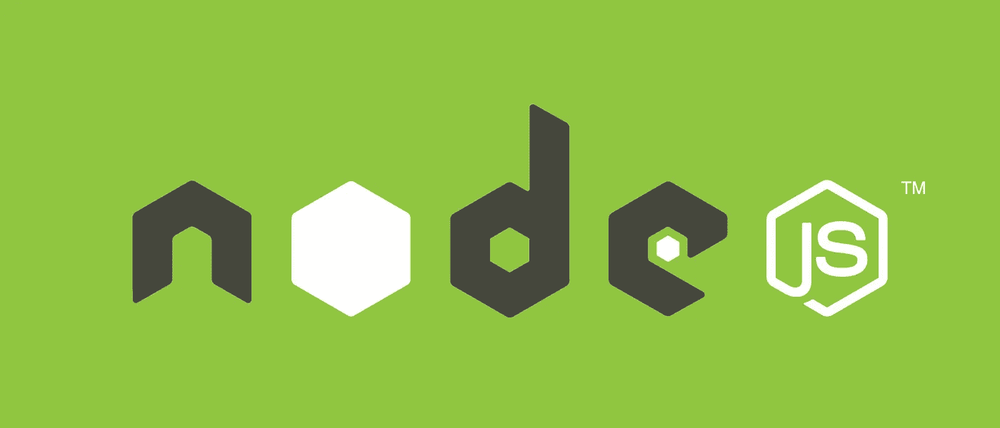
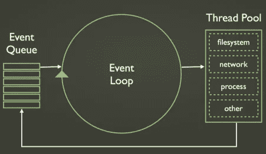

# Node.js 系统

> 原文：<https://medium.com/hackernoon/the-node-js-system-51090c35dddc>

刚开始学 [Node.js](http://www.nodejs.org) 的时候，我一直在想，它是怎么工作的？在 Node.js 里面怎么样？*事件循环和事件队列*术语被消化。但是到底是怎么回事呢？那些术语*事件循环和事件队列*从何而来。为了满足我的好奇心，也为了知道我之前的问题的答案，我尽可能地深入研究，发现了一些事情，我想与你分享。简而言之，本文是关于 **Node.js 系统**——Node 内部工作的一瞥。

如果您熟悉 Node.js，那么 Node.js 是单线程的是一个众所周知的事实。如果你有编程/计算机科学背景，你会知道线程意味着什么。考虑这个场景:传统上，一个 I/O 请求到达一个 web 服务器，并被分配给一个可用的线程，对于每个并发连接，都有一个可用的线程。该请求在特定线程上处理，直到完成并发送响应。

这个场景是**阻塞 I/O** 的一个很好的例子，因为当一个特定的线程处理一个特定的请求时，当操作正在进行时*会有一些空闲时间(比如检索一个文件，打开它，读取它，等等。).*单线程消耗内存。在 Node.js 的[世界中，为每个连接运行一个更长的线程，然后闲置一段时间被认为不是一种有效的方式](/@amanhimself/the-node-way-philosophy-of-a-platform-f9738ed5f9d2#.w77h292q9)

## 输入反应器模式 Node.js 的中心

**反应器模式**是 Node.js 中非阻塞 I/O 操作的一种思想，该模式提供了一个处理程序*(对于 Node.js，是一个* ***回调函数*** *)* ，与每个 I/O 操作相关联。当产生一个 I/O 请求时，它被提交给一个*解复用器*。

这个*解复用器*是一个通知接口，用于在*非阻塞 I/O* 模式下处理并发，并以事件的形式收集每个请求，并将每个事件排列在一个队列中。于是，解复用器提供了我们经常听到的**事件队列**。当解复用器收集到一个请求时，它会将控制返回给系统，并且不会阻塞 I/O。同时，还有一个**事件循环**，它会遍历事件队列中的项目。每个事件都有一个与之关联的回调函数，当事件循环迭代时，该回调函数被调用。

回调函数通常还包含其他回调函数，用于表示一些异步操作。这些操作由解复用器插入到事件队列中，一旦事件循环遍历它们，就可以处理这些操作。这就是为什么对其他操作的调用必须是异步的。

当处理完事件队列中的所有项目，并且没有未完成的操作时，Node.js 会自动终止应用程序。

# Node.js 的构建块

*   反应器模式
*   libuv
*   一套装订
*   Chrome 的 V8
*   核心 JS 库

## [*libuv*](http://docs.libuv.org/en/v1.x/)

发音为“lib u v”，是用 C 语言编写的库，使 Node.js 与每个操作系统兼容，并提供非阻塞 I/O 行为。 [*libuv*](http://docs.libuv.org/en/v1.x/) 是实现*反应器模式*的低级引擎，从而提供用于创建事件循环、管理事件队列和运行异步 I/O 操作的 API。它是专为在不同操作系统上提供统一体验而构建的。

## 需要 libuv？

每个操作系统都有自己的解复用器接口。比如 Mac OS X 的 [Kqueue](https://en.wikipedia.org/wiki/Kqueue) ，Windows 的 [IOCP](https://en.wikipedia.org/wiki/Input/output_completion_port) ，Linux 的 [Epoll](https://en.wikipedia.org/wiki/Epoll) 。不同的多路复用器在处理 I/O 请求时会有不同的表现。然后，在同一个操作系统中，每个 I/O 操作的行为会有所不同。这就产生了不一致性，为了克服这种不一致性 *libuv* 是解决方案。

我不打算在这里谈论 libuv 的内部工作方式，我自己也不是这方面的专家。要了解更多关于 libuv [*的信息，请查看他们的文档*](http://docs.libuv.org/) *或* [*这张幻灯片*](http://www.slideshare.net/saghul/libuv-nodejs-and-everything-in-between) *由****Saul Ibarra corretgé****(*[*@ sag hul*](https://twitter.com/saghul)*)是一个好的开始。*

[*还有，libuv 是由牛逼开发者独立维护的。*](https://github.com/libuv/libuv)

## 绑定集

这些绑定集负责包装并向 JavaScript 公开 *libuv* 和其他底层功能。

## V8

这是谷歌为 Chrome 浏览器开发的一个运行时引擎[。这就是 Node.js 快速高效的原因。](https://developers.google.com/v8/)

## 核心库

这是一个 JavaScript 库，实现了高级 Node.js API ( *又名 node-core* )。

More accurate image of Event Loop inside Node.js

上面借用的图片阐明并表示了一个完整的 Node.js 系统。我希望这篇文章让事情变得更清楚，就像它对我一样。

想要收到更多像这样的文章吗？订阅我 [**这里**](https://patreon.us17.list-manage.com/subscribe?u=ad4c168a6d5bb975f2f282d54&id=39e959cecd) **。有时，我会向我的订户发送“从未见过”的内容。**