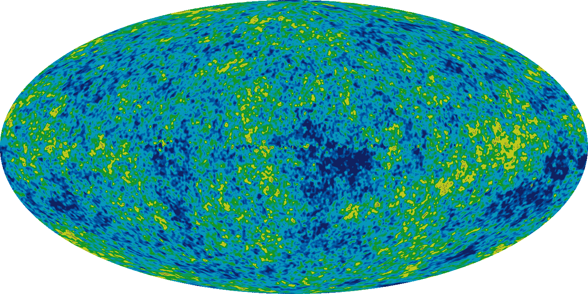

# 噪音论点是什么？

> 原文：<https://medium.com/hackernoon/the-noise-argument-2d547fa69414>

## 当讨论开始聚焦于“噪音”而不是真正的问题时



A visual representation of the Cosmic Microwave Background effect on Planet Earth

讨论是[软件开发](https://hackernoon.com/tagged/software-development)的基本部分，它们是增加可伸缩性的必要摩擦。从这些讨论中可以得出一些模式，当这些问题可能对结果的质量产生影响时，这些模式允许我们及早发现问题。其中之一就是**噪音论证**。

在软件开发中，当一段代码被认为“太吵”时，**噪声参数**就会作为反馈出现。众所周知，在代码风格讨论或代码评审中会出现这种情况，在这种情况下，不是指出给定风格的实际问题(例如，当一致的使用会导致意想不到的后果时)，而是仅仅因为屏幕上有更多的[标记](http://www.webopedia.com/TERM/T/token.html)，这在大多数情况下会被认为是许多人之间不一致的个人意见，与经验水平无关。

> 当有人质疑一段代码的可读性，说它的语法“太吵”时，噪音的争论就出现了

最根本的错误是，仅仅因为屏幕中有更多的标记，并不意味着代码不“易读”，这是我们想要达到的最终结果。如果这是真的，那么更少的代码会使它更“易读”，但并不总是这样(例如，一些抽象可能会忽略重要的信息)。决定代码是否“易读”的主要因素不在于单一的标准，而在于许多属性的组合，由于软件开发的特点，这些属性不容易被单个个人所察觉。

让我们以一个在 JavaScript 条件语句中总是使用花括号的常见一致性规则为例，这是 jQuery 核心风格指南在撰写本文时使用的:

```
if (condition) {
  return;
}
```

有人可能会说，相对于在只有一个语句的特定情况下省略花括号的方法，上面的内容太“嘈杂”了:

```
if (condition) return;
```

我遇到过认为第一种方式比第二种方式更好的人，以及认为第二种方式比第一种方式更好的人，他们都强烈地为对方辩护，却没有证明这种辩护水平的真实论据。像这样的讨论可以被认为是没有意义的，是否使用带花括号的代码是无关紧要的，因为真正重要的是一致性。这个例子清楚地表明“吵闹”没有充分的理由。

> 噪音论点可以被认为是一个主观论点，提供有用答案的可能性很低

噪声论证可以与[的近因和终极因果律](https://en.wikipedia.org/wiki/Proximate_and_ultimate_causation)的问题联系起来。有时“噪音”可能有更深层次的问题——比如死代码或重复——但构建论点的常见方式未能揭示这一点，迫使讨论停留在表面。我们应该努力关注为什么 T2 闻起来不一样的根本原因。最好是，我们需要尝试将任何假设简化为[第一原理](https://en.wikipedia.org/wiki/First_principle)。

鉴于争论的特点，它可以很容易地被简化为 [bikeshedding](https://en.wikipedia.org/wiki/Law_of_triviality) 因为讨论开始集中在不相关的方面，这些方面过于主观，而不是深入挖掘更基本的问题。

> 噪音的争论可以很容易地把讨论归结为骑车出行

当进入讨论时，在使用“嘈杂”一词来忽略一段代码时要格外小心。假设这种说法可能有问题，并且可以通过深入挖掘为什么它看起来不好来改进论点，这可能会揭示这种想法的最终原因。

最终的原因是真正重要的事情。

感谢阅读。如果您有一些反馈，请通过 [Twitter](https://twitter.com/FagnerBrack) 、[脸书](https://www.facebook.com/fagner.brack)或 [Github](http://github.com/FagnerMartinsBrack) 联系我。