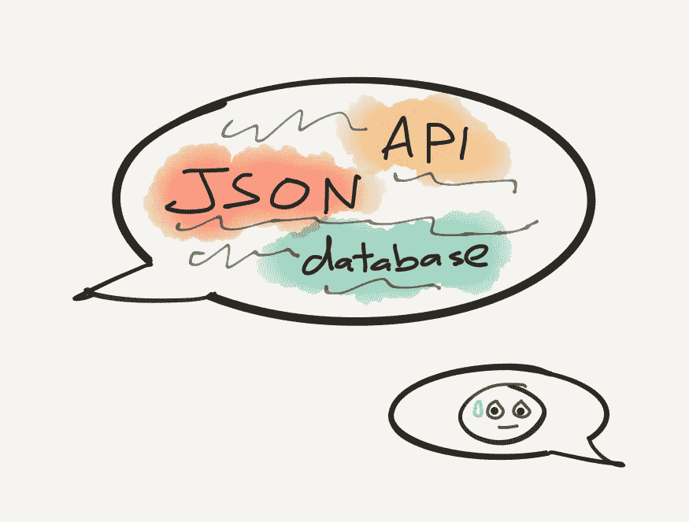
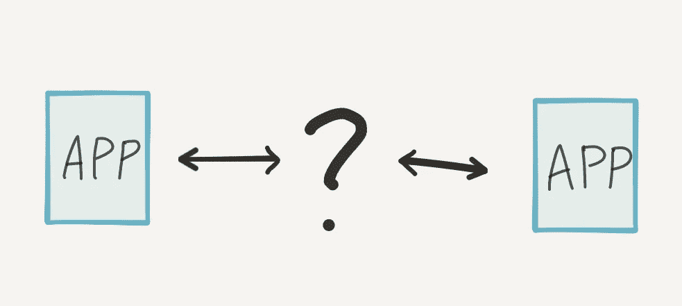
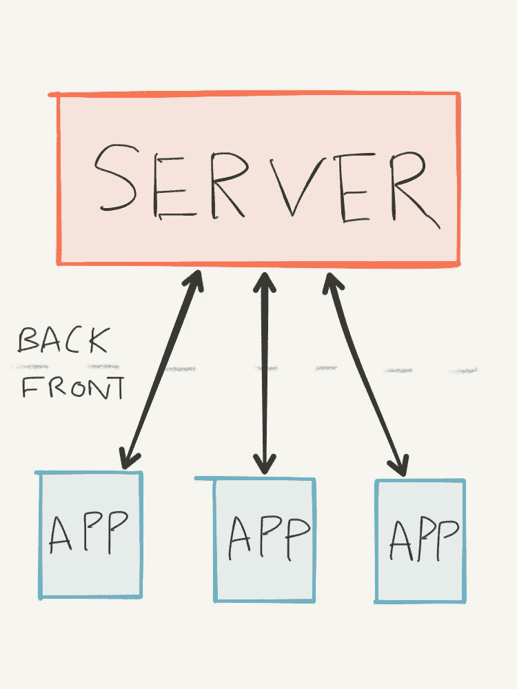
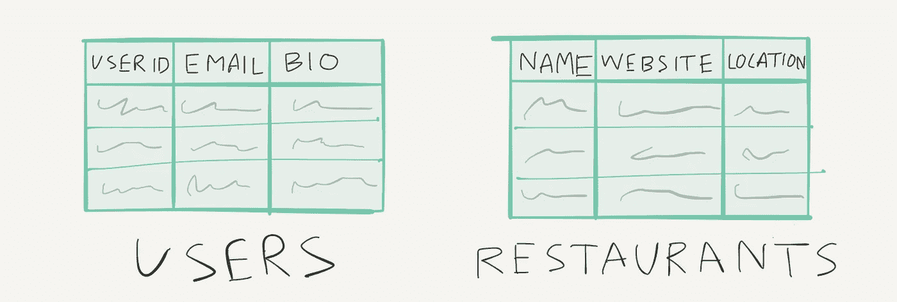
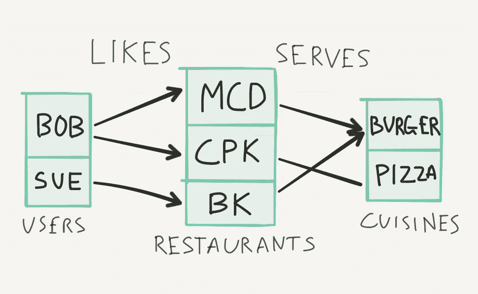
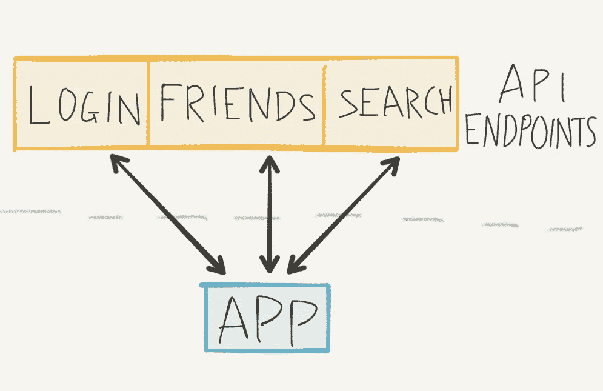
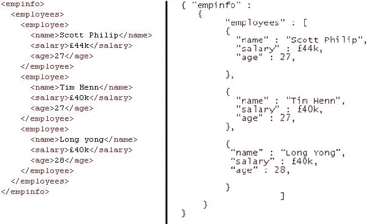
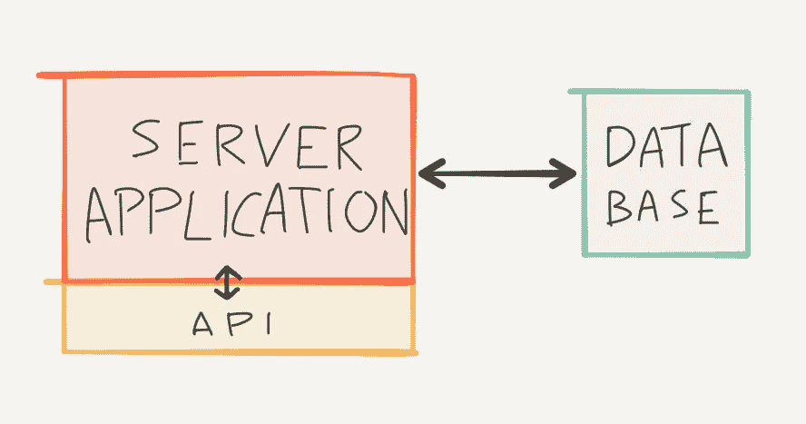
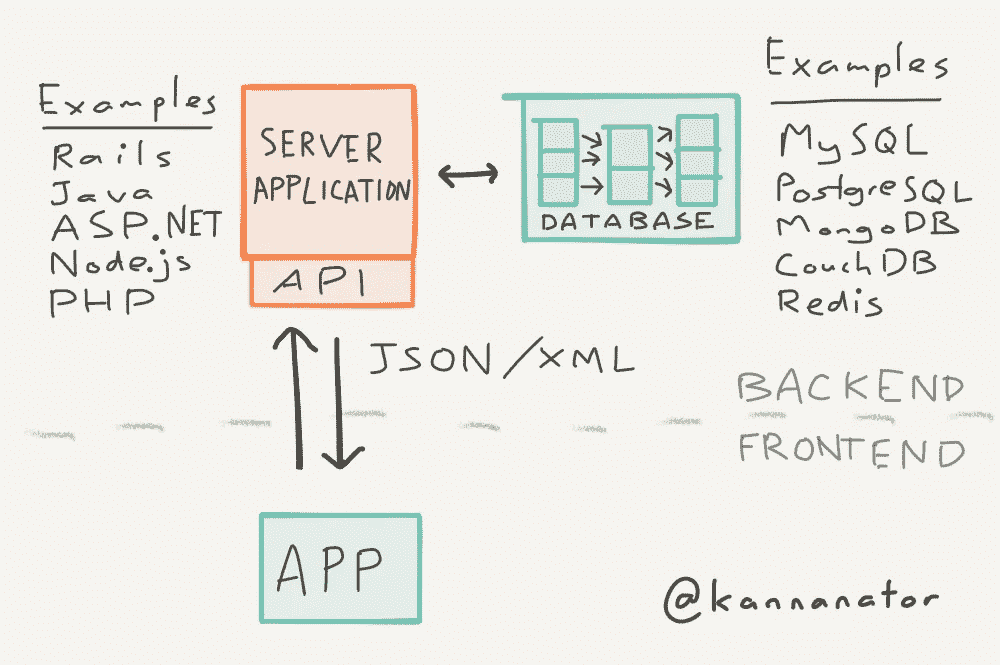

# 非技术人员的服务器指南

> 原文：<https://medium.com/hackernoon/the-non-techies-guide-to-servers-af1fa3dbf7d8>

你碰到了你的一个软件工程师同事。你不是故意的；她正走向桌上足球桌，而你正从康普茶自动售货机里拿饮料。但是你们两个在这里。希望能和你交谈，你先试探性地，

“那么……你具体是做什么的？”

她开始告诉你，你就明白了。你知道什么是用户界面。你用过应用程序。脸书是一个网站。你明白了。你点头同意她的回答，然后你们俩分道扬镳。避免尴尬。

但是有时候，你会遇到其他人。服务器工程师。后端开发人员。你不知道自己在做什么，你询问他们那种神秘的方式。

听着这些外来词，你的脑海中会出现一连串的问题。"**什么**是 API？**我们什么时候使用数据库？谁是杰森的**

**你的工程师朋友说的是一个**服务器**。也许你以前听说过这个术语，但是不知道它是什么。今天，我们改变了这一点。**

# **掉进兔子洞**

**我们在使用一个 app 的时候，看到的都是 app。我们作为消费者的体验始于此，也止于此。将整个体验视为“应用程序”似乎很自然。**

**事实是，这款应用只是所谓的**前端**。它构成了用户体验的全部。但这并不是应用程序功能的全部。**

**比方说你在一个消息平台上给我发消息，比如 Whatsapp。似乎这条信息从你的手机传到了我的手机。但是让我们仔细看看这个。假设你在我关机的时候发信息。然后你关掉手机，我打开手机。尽管我们的手机从来没有同时运行过，我还是收到了这条信息！**

**很明显，我们忽略了一些东西。**

****

**缺少的组件是**后端**或**服务器**。**

# **服务器**

**服务器是一台连接到互联网并一直运行的计算机。**

> **服务器有两个主要作用:存储数据和促进通信。**

****

**因此，当你发送 Whatsapp 消息时，你手机上的应用程序会将消息发送到服务器，并存储在那里。当我的应用程序向服务器登记时，服务器会发送任何存储的消息。**

> **服务器是应用程序“呼叫总部”的地方。**

**当应用程序需要任何信息时，它会询问服务器。当应用程序需要与应用程序上的另一个用户交谈时，服务器就是促进这种连接的工具。**

**术语**服务器**、**后端**和 **API** 经常互换使用。**

# **储存；储备**

**服务器的主要职责是存储东西。**

**其中包括**文件**，如照片、视频、文档等。服务器以结构化的方式储存它们，类似于电脑上的文件夹，以便应用程序可以访问它们。**

**一个服务器也存储**信息**。所有的应用程序都有一些对应用程序如何工作很重要的信息。**

****

**你可以把它想象成一堆电子表格。例如，应用程序需要存储用户信息，以及他们的登录信息，这样他们就可以被认证。您的应用程序可能是一个餐馆目录，在这种情况下，服务器将存储每个餐馆的信息。**

**除了信息，服务器还记录信息位之间的**关系**。例如，如果用户在应用程序上“喜欢”一家餐馆，服务器会记住该用户和该餐馆之间的关系。**

****

**这让我们得到了许多问题的答案，例如:**

> **“有多少人喜欢过这家餐厅？”**
> 
> **“这个用户喜欢过哪些餐厅？”**
> 
> **"这两个用户都喜欢什么样的美食？"**

**信息和它们之间的关系存储在**数据库**中。有许多不同种类的数据库，但它们都有一些核心特性:**

*   **它们可以储存信息**
*   **它们可以存储信息位之间的关系**
*   **他们可以被**询问**有关信息，然后他们根据我们的要求用单个信息或大量信息来回应**

**不同类型的数据库[太多了，我无法一一列举，它们各有优缺点。如果你听到有人使用“SQL”(发音为“Sequel”)、“MongoDB”、“CouchDB”、“Redis”等术语，他们谈论的是数据库。](https://www.eversql.com/most-popular-databases-in-2017-according-to-stackoverflow-survey/)**

# **沟通**

**服务器的主要职责是与应用程序和其他服务器通信。**

****

**应用程序上的许多活动都需要与服务器通信。例如，如果用户搜索某样东西，搜索词会被发送到服务器，服务器会以结果作为响应。如果一个用户向另一个用户发送消息，该消息会上传到服务器。然后，它会被发送到其他用户的应用程序，通常是以推送通知的形式。**

**服务器提供的接口，以便应用程序可以与之对话，通常被称为 **API** 。界面上的单个功能可称为**端点**。**

**对于外行人来说，这些交流看起来很奇怪。两种最常见的通信格式是 JSON 和 XML。**

****

**XML on the left, JSON on the right**

**乍一看，这些格式似乎很难阅读。**

**要记住的是，服务器只是一台电脑，就像你的笔记本电脑或手机一样。你手机上的应用程序以触摸或语音的形式接收用户输入。它处理这些信息。然后它在屏幕上以图像的形式给出输出。电话是一台能与人交谈的计算机，因此输入和输出都是对人友好的。**

**服务器是一台只与其他计算机通信的计算机。**

**人类使用字体大小、文本颜色和布局来表达意思。但这些对电脑来说没有意义。**

> **服务器通信以另一台计算机易于解析和理解的格式进行。**

# **服务器应用程序**

**就像你编写一个在手机上运行的应用程序一样，你需要一个在服务器上运行的应用程序。服务器应用程序是使用服务器端框架构建的。热门选项有 **Ruby on Rails** 、 **PHP** 、**ASP.NET**、 **Java** 、 **Node.js** 。**

****

**API 是你的服务器的网关，应用程序知道在那里调用。你的数据库储存了你所有的信息。您的服务器应用程序是将所有东西结合在一起的“大脑”。**

**它监听并响应来自 API 的请求，从数据库中添加和检索信息，并做出决策。例如，当应用程序发送登录信息时，请求通过 API 进入，正确的登录信息存储在数据库中。但是比较这两者是服务器应用程序的工作，并通过 API 对应用程序做出适当的响应。**

# **五金器具**

****

**当有人说“服务器”时，这可能是你脑海中闪现的东西。锁着的房间里一排排闪烁的灯，等着汤姆·克鲁斯从天花板上爬下来偷东西。**

**许多大公司确实拥有这样的服务器。脸书和谷歌在全世界拥有数百台服务器。当你运行一个拥有数百万用户的大型服务时，运行你自己的服务器会更便宜并提供更好的性能。**

**许多开发人员使用某种云服务，而不是运行他们自己的物理服务器。像[亚马逊网络服务](https://aws.amazon.com/)、 [Azure](https://azure.microsoft.com/) 和[数字海洋](https://www.digitalocean.com/)这样的服务可以提供“虚拟服务器”。这些服务拥有并维护硬件，开发人员只需上传服务器应用程序。**

**甚至还有一些[后端即服务提供商](https://en.wikipedia.org/wiki/Mobile_backend_as_a_service)，让你拥有一个简单的后端，而无需自己编写服务器应用。**

# **所有的应用程序都需要后端吗？**

**你看到的大多数应用程序可能都有后端组件。肯定有不支持的应用，比如某些生产力应用。判断是否存在某种后端的简单方法是:**

> **如果你切换到飞行模式，这个应用程序还能用吗？**

**如果答案是否定的，那么很可能在某个地方涉及到了后端服务器。**

**希望你现在对应用程序的后端有了更好的理解。也许，下一次你遇到你的朋友时，你甚至可以不经意地在对话中提到“JSON”。**

****

**如果你觉得这篇文章有用，你可以分享给我！你也可以订阅我的邮件列表，确保不要错过我的下一篇文章。**