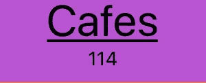
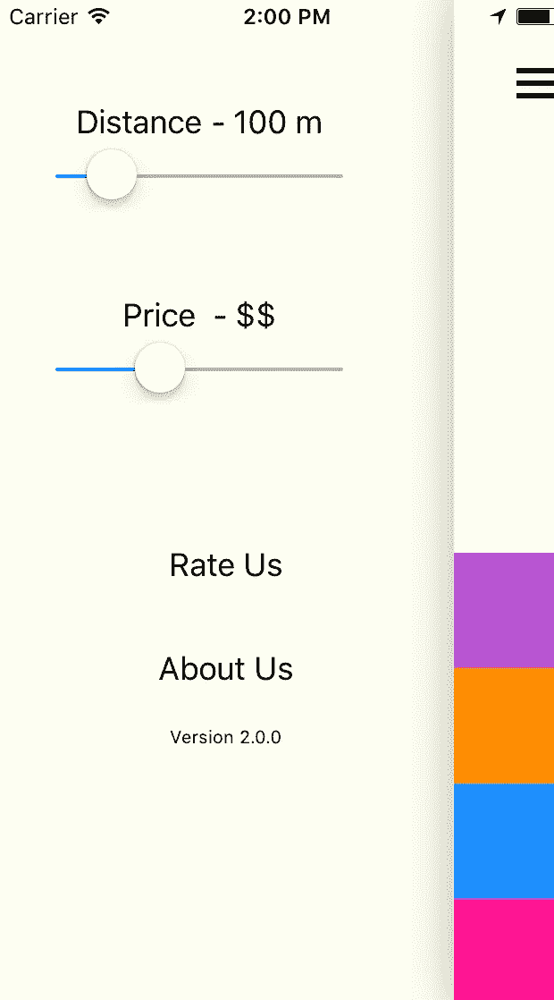

# 第一:做出选择很难，为什么你应该使用这个应用程序

> 原文：<https://medium.com/hackernoon/the-one-making-choices-is-hard-and-why-you-should-use-this-app-5a4b3c80bcdd>

“学会选择是很难的。 [*学习*](https://hackernoon.com/tagged/learning) *要选择好更难。在一个充满无限可能的世界里，学会做出正确的选择更难，或许太难了。”*
*―* ***巴里·施瓦茨*** *，* ***选择的悖论:为什么多就是少***

# 基本原理

我使用许多推荐应用程序来计算要去的地方，无论是在工作日之后还是在周末。在很大程度上，这些应用程序按照我希望的那样工作。但是，也有推荐 app 就是不切实际的情况。发生这种情况的一些场景可能是—

*   你和一大群人一起出去，每个人都有自己的想法
*   你和一个无法决定自己想做什么的人在一起
*   你想做一些事情，但所有这些过滤器和选择对你来说太多了，因为你不知道你想要什么。

输入“那个人”。**One 是一款移动应用，其前提是选择被高估了，如果一个人被给予一个特定的位置，而不是经历许多选择，决策将变得简单得多。有一个有趣的 TED 演讲叫做[选择悖论](https://www.ted.com/talks/barry_schwartz_on_the_paradox_of_choice)，它强调了选项的可用性是如何延迟决策的，并且在某些情况下会导致负面影响。我强烈推荐听这个演讲。**

# 获取应用程序

该应用程序在 Google Play 商店(Android)中可用，您可以在此处下载[。如果对它有任何需求，我会考虑将其放在 App Store (iOS)上。](https://play.google.com/store/apps/details?id=org.tnc.theone)

# **关键特性**

我最初设计了一个流星应用程序(名为我们去哪里？)几年前它还是基于网络的，但这次我决定让它成为一个移动应用。让我来强调一下这款应用的几个关键特性—

*   该应用程序提供了 4 个类别，供您选择要去的地方。这些是“食物”、“饮料”、“咖啡馆”和“随机”(如果你真的不知道你想做什么！)

*   一旦你选择了一个类别并得到一个推荐，在接下来的 2 分钟内，你不能为该类别选择新的位置(你仍然可以选择其他类别)。这个想法是，如果给你反复换地方的选项，你会陷入和其他任何推荐 app 一样的陷阱。
*   为了帮助您了解 2 分钟的计时器限制，一个小的倒计时计时器将出现在您选择的类别，让您知道还有多少秒，然后您可以选择一个新的地方在同一类别。

*   当您选择一个类别时，显示的结果将显示名称、地点的地址(可以在 Google Maps 中打开)、地点的价格($ -$$$$)以及地点的评级(1–10)。结果的背景颜色也给出评级的快速指示——绿色代表评级≥9，黄色代表评级≥ 7，以及< 9 and red for rating < 7
*   The category whose result you are viewing currently, is marked by a subtle underline
*   The only 2 filters you can choose ( by accessing the menu ) are Distance and Cost. The defaults are preset, so you’d never need to ever tweak these settings if you don’t want to. If you do change either one of these, you will get a fresh set of places based on your filters only after all the countdown timers are reset.

*   There is no signup required for the app. It just works! The results are powered by the Foursquare [API](https://hackernoon.com/tagged/api) 。
*   由于我没有任何设计背景，应用的外观和感觉是非常惊人的。颜色是大胆和明亮的，以显示一种果断感加上简单。

# 技术架构

**后端**

*   表达
*   休息
*   码头工人
*   Nginx

**前端**

*   使用 Expo 对 Native 做出反应

**托管**

*   数字海洋

# 结论

我花了几个周末开发了这个应用，亲眼目睹了这个想法的实现，我玩得很开心。向 [InYong Chung](https://medium.com/u/136fdf19ace5?source=post_page-----5a4b3c80bcdd--------------------------------) 致谢，感谢你们在产品反馈方面给予的帮助，并感谢你们借给我一台 Android 设备，让我得以顺利进行产品部署！如果您有任何反馈，请通过应用程序菜单中的“评估我们”表单发送。如果没有，可以在[联系我](http://www.arjunrao.co/contact)给我发信息。你也可以在 Twitter 上联系我。如果你喜欢这个应用，不要忘了在 Play Store 上对它进行评级，并且在使用 The One 时享受其中的乐趣！

*“选择更少，感觉更好。”
――巴里·施瓦茨*****选择的悖论:为什么更多就是更少****