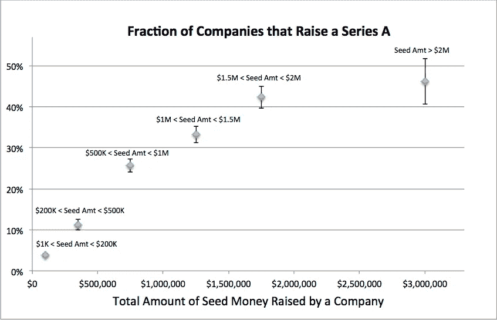
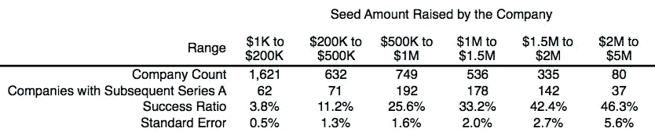

# 在首轮融资中最有帮助的一件事

> 原文：<https://medium.com/hackernoon/the-one-thing-that-helps-most-in-raising-a-series-a-round-d5de2c5550c0>

Raising a larger amount of Seed money is the strongest predictor of Series A fundraising success. Error bars are +/- One Standard Error. Data from CrunchBase.

我的上一篇文章([加速器 vs 天使](/@everploeg/accelerators-vs-angels-a79ba5154acc#.6aqf72v8o))表明，从天使投资人那里筹集资金比从加速器毕业更能[预测创业公司的能力](https://hackernoon.com/tagged/important)[筹集 A 轮融资](https://hackernoon.com/tagged/raise)。但是，筹集小额和大额种子资金之间似乎有很大的不同。这篇文章更仔细地研究了这个问题。

有大量统计上显著的属性与成功筹集 A 轮融资相关。但是，如果你想最大化你的初创公司成功筹集 A 轮融资的机会，有一点很重要:

> ***筹集大量种子资金。***

上图非常清楚地显示了这一点。当然，潜在的因果关系是一个独立的问题，几乎不可能确定地确定。并且因果关系可能因公司而异。但是可能的主要原因是(按照可能性的大致顺序):

1.  从种子阶段获得更多资金，让该公司能够在产生牵引指标方面走得更远，这将使它能够筹集 A 轮融资。
2.  该公司自成立之初就获得了巨大的客户/用户吸引力。同样吸引了大量种子资金的牵引力，也使得该公司极有可能筹集到首轮融资。
3.  无论是在种子阶段还是首轮融资阶段，创始人都非常擅长融资。
4.  创始人都是摇滚明星(例如，1B 已经退出),几乎在任何阶段都很容易筹集资金。

使用 CrunchBase 数据集，并遵循上文提到的方法，我们可以为 2010 年至 2013 年期间筹集种子资金的公司构建下表。这是上图中绘制的数据。

Data used to produce the graph above, with addition of company counts in each range. CrunchBase dataset.

这些结果真的很惊人。从历史上看，一家筹集 15 万美元种子资金的公司大约有 25 分之一的机会获得首轮融资，而一家筹集 75 万美元的公司大约有四分之一的机会获得首轮融资。

[Tom Tunguz 最近发布了一篇关于一个非常相似主题的精彩分析](http://tomtunguz.com/seed-followon-rates/)。他的结果和我的相似，尽管在人口定义上有很大的不同。所以，我想我的帖子可以被视为对他的结论的半独立(我们使用了相同的 CrunchBase 数据集，所以它不是真正独立的)证实。

> [黑客中午](http://bit.ly/Hackernoon)是黑客如何开始他们的下午。我们是 [@AMI](http://bit.ly/atAMIatAMI) 家庭的一员。我们现在[接受投稿](http://bit.ly/hackernoonsubmission)，并乐意[讨论广告&赞助](mailto:partners@amipublications.com)机会。
> 
> 如果你喜欢这个故事，我们推荐你阅读我们的[最新科技故事](http://bit.ly/hackernoonlatestt)和[趋势科技故事](https://hackernoon.com/trending)。直到下一次，不要把世界的现实想当然！

