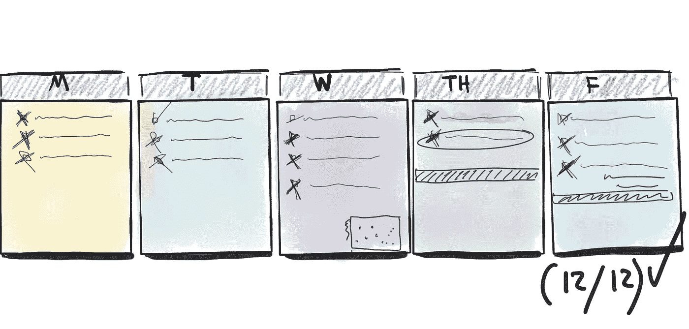

# 为期一周的产品管理挑战

> 原文：<https://medium.com/hackernoon/the-one-week-product-management-challenge-97a23092473c>

# 好的经前综合症。让这一周变得精彩。少积压宾果。不太忙。想想高杠杆率，然后摇摆它。试着进去…

1.  3 小时结构化客户访谈(记录、转录、邀请团队，但可选)
2.  1 小时观察客户使用软件完成工作(邀请团队、记录、转录，但可选)
3.  就最近发布的“功能”向团队进行 3000 万次演示，并提供数据/见解
4.  向团队进行 30 分钟的演示，介绍他们的工作如何影响业务成果
5.  有意义地缩小你正在做的任何事情的范围
6.  在某件事情上与队友紧密配合(1-2 小时)
7.  带支持/成功团队的人出去吃午餐，了解他们的世界
8.  积极寻求团队所有成员对你工作表现的反馈
9.  留出 2 小时的职业发展时间(书籍，YouTube)
10.  创建包含产品 KPI、健康指标等的仪表板。获取团队反馈
11.  1 人力资源竞争研究。浓缩您的学习并与团队分享总结
12.  与团队分享一些好消息(用客户的话说，用支持数据)