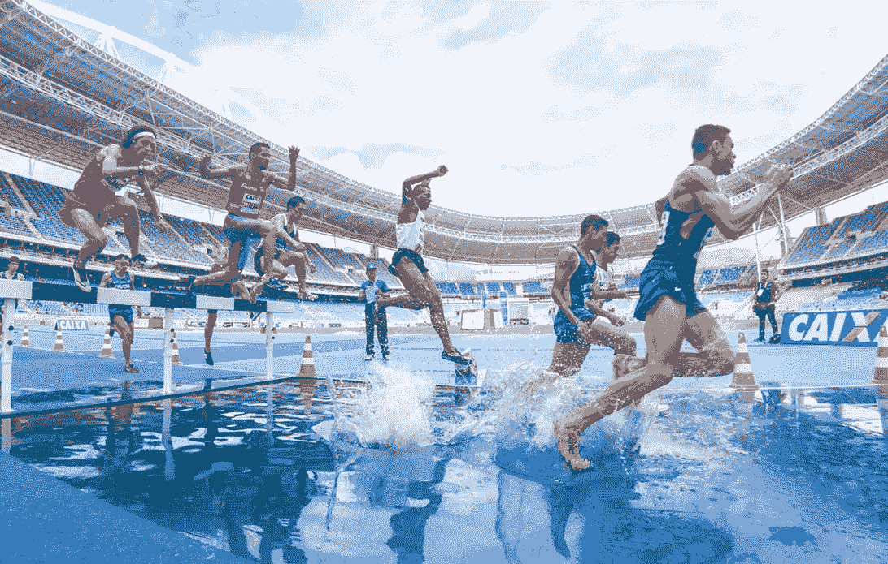
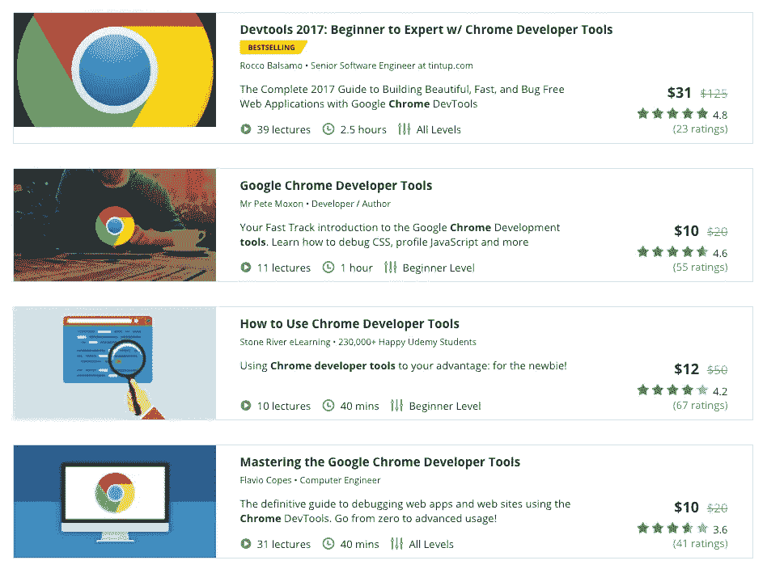
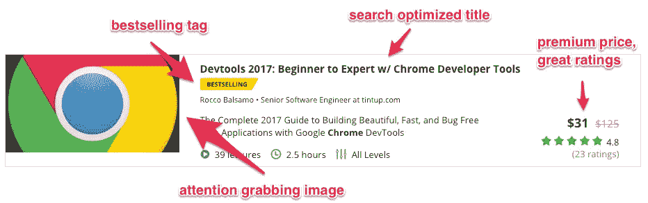
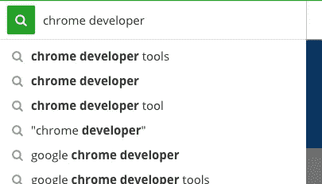
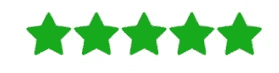
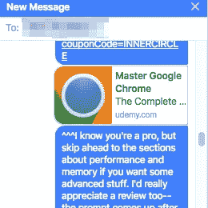
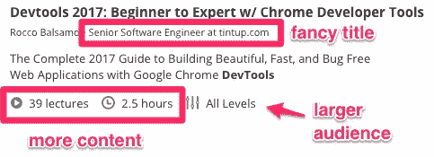

# 力争上游:在线技术教学热潮

> 原文：<https://medium.com/hackernoon/the-online-tech-teaching-hustle-race-to-the-top-search-result-b8c7ef0d448b>

自从我在 [Udemy](http://udemy.com) 上推出我的在线课程已经一个月了，它超出了我的预期！这就是我如何爬到顶端的。

*这更新了我的上一篇文章，《在线技术教学的喧嚣》，我是在发布大约两周后写的。*

## 搜索结果

以下是我搜索`chrome developer tools`的结果。我的课程以“畅销”标签名列榜首。

Find my course here, with a better price tag!

**老实说，我没想到会这样，**但我很聪明，我的努力得到了回报。

## 精品课程第一，[市场营销](https://goo.gl/ey72rU)第二

在我进入我以前在这里得到的营销技巧之前，我想提醒潜在的指导者**贴好屎**。

Quora:在你的博客上获得流量的最好方法是什么？SEO，SMM，PR 等？

> 谷歌有数以万计的博士在研究如何为搜索提供最佳答案。你要做的就是 [**贴好屎**](https://www.quora.com/What-is-the-best-way-to-get-traffic-on-your-blog-SEO-SMM-PR-etc) ，让谷歌做它做的事。
> 
> —盖伊·川崎梅赛德斯-奔驰品牌大使

我就是这么做的。我为我的课程感到骄傲！它给真实的人的生活增加了真实的价值。

## 但是我想要更多！

我将解释我是如何很快到达列表顶端的，但是首先，我需要一些帮助来完成我的下一门关于 WebGL 和 Unity 的课程！你愿意加入我的早期访问团队，帮我完善一些讲座吗？

Limited to the first 15 signups. Get on it!

# 清单剖析

如果你是一名教师，知道搜索结果屏幕是你应该投入大量时间的地方。

让我们来看看清单中的一些东西

## 引人注目的图像

我花了五分钟来裁剪和创建这张图片，但我猜谷歌花了 50 万美元来开发 Chrome 标志——进行了几十次 [A/B 测试](https://www.optimizely.com/ab-testing/)。它有明亮的颜色和向内的线条来吸引你的注意力。

这张图片看起来比其他球场图片更丑，更不精致，但我认为吸引眼球的性质才是这里真正重要的。

## 搜索优化标题

潜在的学生会寻找一些东西

*   Chrome 开发者工具
*   开发工具
*   Chrome 开发工具
*   谷歌 Chrome 开发者工具

这些术语中的每一个都包含在标题、副标题和描述中。

当我键入这些术语时，我用 Udemy 的自动完成功能进行了试验，看看潜在的学生会搜索什么。

我还添加了术语“2017 ”,以表示该材料是最新的。和“初学者到专家”来表示这将有助于包括初学者和专业人士在内的广大受众！

## 溢价

我提供了更多的内容和(我认为)一个更好的课程。如果我是一名学生，我宁愿花钱去接受正确的培训，也不愿浪费时间去上一堂降价课。

对于那些寻找便宜货的人来说呢？网络上到处都是优惠券链接，[就像这个](https://www.udemy.com/master-google-chrome-developer-tools/?couponCode=MEDIUMDISCOUNT)。

## 收视率很高

以下是我如何获得高收视率的。

最重要的是，我遵循了“贴好屎”的方法(见上)。但我也招募了一些我的 webdev 朋友来提前上课，并留下他们的真实反馈。我用脸书的个人信息做到了这一点。

> 嘿 XXX-我正在进入在线教学行业，我想你可以看看我的课，留下你的真实评论。大约 12 分钟后会出现查看提示。专业提示:用下角的控制器以双倍速度看着我！

对于每 30 米的视频，我有一个 5 秒钟的间歇，要求人们留下评论。锦上添花？我将为前 50 篇书面评论中的每一篇向 [Mission Bit](https://www.missionbit.com/) 捐赠 10 美元。

facebook friends to the rescue!

## 你已经读到这里了

我在上面提供了 19 美元的优惠券，但是既然你已经读到这里了，这里是我的 devtools 类的[10 美元优惠券](https://www.udemy.com/master-google-chrome-developer-tools/?couponCode=CINCODEMAYO)。这是我能提供的最低价格，5 月 5 日结束。

## 畅销标签

万岁。

这个，我直接控制不了。我想这个标签是在发布三周后出现的。我确信我不会得到它，因为我没有在网上张贴免费优惠券，而且我的学生人数低于竞争课程。

显然，销售率是这里的关键，而不是免费用户！霍雷。

免费学生不理想的原因有很多，但我会在以后的文章中写。请务必在媒体上跟踪我以获取独家新闻。

## 其他东西

还有另外三个项目让我的课程脱颖而出。

1.  **更多内容**:比竞品课程多，但不会太多！仅提供全面、简明的信息。
2.  **花哨的标题**:我不喜欢花哨的标题。但是，特别是对于没有经验的人来说，这暗示了某种权威。有一天我可能会把它改成“tintup.com[的软件人”。](http://tintup.com)
3.  吸引大量观众:我开发这个课程是为了让它适合初学者，但也加入了一些高级开发人员可能还不知道的信息。后期讲座进阶。

## 目前就这些了

这就是我如何运用一些聪明才智来建立一个伟大的课程列表，并获得最佳成绩！

**请💚如果你今天学到了新东西**。这给了我很多动力继续写这样的文章！别忘了我的 WebGL 课程的[顾问委员会](https://www.fogcitylearning.com/webgl)。

> [黑客中午](http://bit.ly/Hackernoon)是黑客如何开始他们的下午。我们是 [@AMI](http://bit.ly/atAMIatAMI) 家庭的一员。我们现在[接受投稿](http://bit.ly/hackernoonsubmission)并乐意[讨论广告&赞助](mailto:partners@amipublications.com)机会。
> 
> 如果你喜欢这个故事，我们推荐你阅读我们的[最新科技故事](http://bit.ly/hackernoonlatestt)和[趋势科技故事](https://hackernoon.com/trending)。直到下一次，不要把世界的现实想当然！

