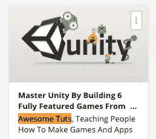
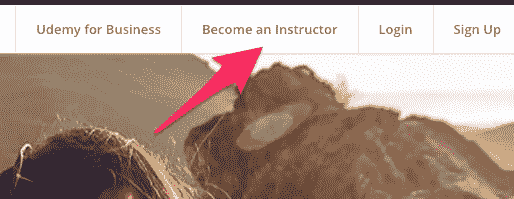
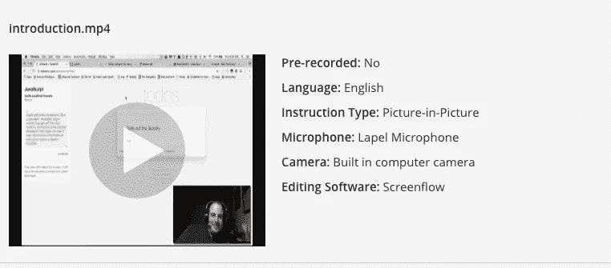
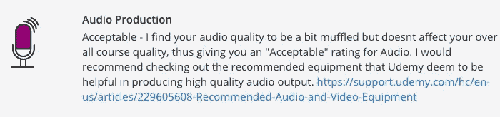
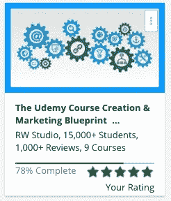
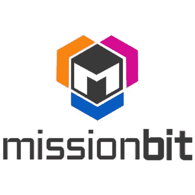
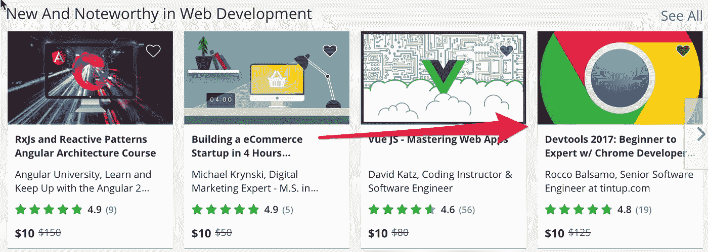
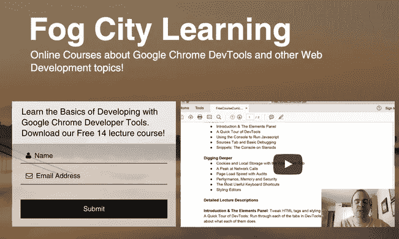
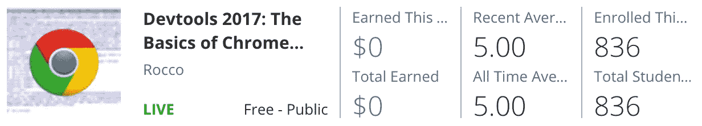
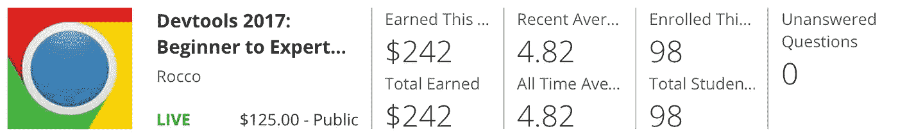

# 在线技术教学热潮

> 原文：<https://medium.com/hackernoon/the-online-tech-teaching-hustle-w-udemy-bdad05e49d02>

我在 Udemy 的在线教学实验进行了大约 45 天，这篇文章记录了我在教学、营销和这个过程中所学到的人生意义。

> 我每天都在奔波——里克·罗斯

# **用 Udemy 学习**

几个月前，我在 [Udemy](http://udemy.com) 上了第一堂网络课，上课的是一家名叫 [AwesomeTuts](http://awesometuts.com) 的小店。这是一堂关于 Unity 平台上游戏开发的完整课程。我认为这钱花得很值。我想我花了 19 美元上了 35 个小时的课。

Great Class

在那堂课之后，我能够开发并(几乎)发布一款类似于《导弹司令部》的 2D iPhone 游戏！

所以我开始思考，我已经做了几次[会议](https://forwardcourses.com/lectures/208) [演讲](http://html5devconf.com/speakers/rocco_balsamo.html)——为什么我不能把我擅长的事情货币化呢？(我的情况是[谷歌 Chrome 开发者工具](https://www.udemy.com/master-google-chrome-developer-tools/?couponCode=MEDIUM10))。

我想看看已经有的课程，所以我搜索并购买了关于这个主题的其他五个课程。它们是很好的入门课程，但我知道我可以创造一些更全面的东西。

# 成为一名教师

所以我冒险点击了“成为一名讲师”。

那天晚上，我把耳机从工作中带回家，录制了一个视频样本并上传到 Udemy，讲述了我为什么很高兴教授 Chrome Devtools。灯光很糟糕，声音也很微弱，但我抱着“把事情做完”的态度。我的第一次尝试永远不会是最棒的，但这是一个起点。

My Sample Video

第二天我得到了批准，里面有一堆关于如何更好地制作视频的建议。完美。

## 加速

我不想 40 小时的制作工作听起来像废话，所以我买了 Udemy 建议的蓝色 Yeti 麦克风。我还为我的投屏软件投资了 Screenflow。总费用约为 200 美元。

# 向他人学习

> 外面有淘金热，很多人愿意卖给你镐。

但是我想获得一些发布课程的好技巧，所以我选了一门关于制作课程的课(太元了！)我以为是真实的，没有过度制作的。

Nice Class on Course Creation from RW Studio

[Udemy 课程创作&营销蓝图](https://www.udemy.com/create-course-and-sell-online-udemy-courses/)是一堂好课。最大的收获是超越竞争对手，创造一个明显更好/更长/制作更好的球场。

第二个外卖是[每个人都有优惠](https://www.quora.com/Why-are-courses-on-Udemy-hundreds-of-dollars-and-then-go-on-sale-for-90-off-Does-this-mean-theyre-no-good)。不要看着一个 100 美元的班级，就想当然地认为，因为它有 14000 名学生，所以教师的收入是 140 万美元。

最后一点是，你需要做一些自己的营销来启动你的课程。五个好的评论可能会让你进入你的类别中的“新的和值得注意的”部分。

我质疑的一些建议是把免费优惠券代码放到各种网站上。也许我错了，但我宁愿让高质量的学生上我的优质课，而不是那些只收集课程的人。(我最终选择制作一个完全免费的课程，并将学生名单作为一个营销机会)。

## 播客

我还听了一个名为[在线课程大师](https://www.videoschoolonline.com/podcast)的播客，由 Udemy 的顶级讲师之一 Phil Ebiner 主持。这很好，因为它采访了其他顶级制作人，而且很容易在路上听。(我建议跳过第一集，直接看采访集)。

## 电子邮件

还记得我在 Udemy 上的第一堂关于游戏开发的课吗？

我找到了[牛逼 Tuts](http://awesometuts.com/) 家伙的电子邮件地址(他的名字是法希尔)，我问了他几个关于他的经历的问题。我得到了一些不错的建议，关于我可以期望赚多少钱(如果你有好的课程，一个月可以赚几千)，以及其他可以将你的内容货币化的平台。

如果你伸出手，人们愿意帮助你！

# 生产

我是一名程序员。如果说软件开发教会了你什么的话，那就是你会做事效率低下，或者第一次就完全错了。这是一个反复的过程。以下是我下次可以改进的地方:

## 生产中的错误

我希望我一开始就想出了一个更好的大纲。我再次采取了“搞定”的方法，想出了我的主题，并尽快开始记录。但是如果我先想出一个完整的大纲，我可能会让课程进行得更好一点。

A pic of me from [The San Francisco Chronicle](http://www.sfgate.com/style/article/What-do-S-F-programmers-look-like-6266643.php#photo-7908905)

我也**希望不要那么多提到 Udemy**。我可能想在未来重新调整我的内容，这将使一些重新记录成为必要。

我的**音质**也有点参差不齐。我用旧耳机录了几堂课，然后用蓝色雪人录了几堂新课。我也没有把我的[蓝色雪人摆好](https://www.youtube.com/watch?v=PzHW6Jybp9g)来听一些讲座，导致一些背景噪音。

我没有注入足够的我自己的幽默和个性。我谨慎行事，结果，我从我的密友那里得到了一些反馈，说我真的应该用我伟大的个性来 pwn 它。我相当爱热闹，有一种天生的讽刺和幽默的感觉，这种感觉本可以为我所用。我的几个上过这门课的朋友很惊讶没有看到更多这样的东西！

我希望我从一开始就有**创造的练习**。显然，许多学生发现有练习和测验的课程更有吸引力。

## 我做对的事情

我从一开始就开始**考虑营销**。我制作了一些视频剪辑，旨在让人们立即进行评论，我承诺为班级收到的前 50 份书面评论中的每一份捐赠 10 美元给 [MissionBit](https://www.missionbit.com/) 。我目前欠 MissionBit 大约 170 美元，我希望能得到全部 500 美元的捐款。

I volunteer for [Mission Bit](http://missionbit.com) and we teach public school kids how to code.

我查看了 [StackOverflow](http://stackoverflow.com/questions/tagged/google-chrome-devtools) 中关于谷歌 Chrome 开发者工具的最常见问题，这样我可以确保在课堂上解决这些问题。

我查看了该科目的其他讲师所教授的内容，这样我就能确保获得最好的信息。

我还确保**的信息量是竞争课程中显示的信息量的两倍。**

我学会了如何避免和删除含糊不清和犹豫不决，这样我就不必无数次地重复记录。

# 营销

我在星期一提交了课程，在那个星期三它被批准了(有更多的反馈)。当我看到我被批准的时候，我做的第一件事就是给我的同事发电子邮件，要求他们看一看(并且评论！)下班后。谢天谢地，我在一个支持性的地方工作，那里鼓励副业和企业家精神！

那天晚上，我亲自给脸书的人发信息，让他们查看课程。

几天之内，我得到了大约 15 条评论(全部是五颗星，除了我妈妈给了我 4.5 分**哎哟**),没错！我进入了新的&显著页面。万岁。

woot!

在我的核心圈子之外，我决定**而不是**发放免费优惠券。我仍然不确定那个策略是否是最好的。关于这个主题的其他课程有更多的学生(社会证明)。我要等一等，看看有机增长如何。

## 初次出售

我在第一天就完成了前两笔销售(来自 Udemy 网站的有机销售)。谈一个匆忙。过去，我曾尝试启动过其他几个项目，但我从未在第一天就赚到钱。每笔销售额是 10 美元，Udemy 得到一半。但是**他们有平台和用户**，所以这看起来完全公平。如果没有他们，我可能赚不到 0 美元。

Thanks for Photoshopping me in this ridiculous pic, [Daniel](https://www.linkedin.com/in/danielbaldwinco/)

# 加速增长

## 科技文章

我决定自己做一些营销来帮助加速增长。我试图在 30 天内写完 [30 篇文章](/p/write-a-beautiful-engaging-tech-article-in-30m-d3649db7b2d7)！我拿一个[速成](/hacker-daily/get-code-out-of-chrome-devtools-and-into-your-editor-defaf5651b4a) [tech](/hacker-daily/debug-node-js-with-chrome-devtools-aca7cf83af6b) [科目](/hacker-daily/debug-node-js-with-chrome-devtools-aca7cf83af6b) [相关](/p/hacking-yelp-w-chrome-devtools-to-find-a-better-dinner-reservation-2f7d8e1ecab5) [到](/p/never-pause-here-undoing-breakpoints-in-chrome-devtools-97e64cd06086) [我的](/p/the-most-underutilized-feature-of-chrome-devtools-986398b86afb) [课程](https://dev.to/theroccob/emulate-print-layout-with-chrome-devtools)，写一篇关于它的文章，并配以大量截图！

我把这些贴在[推特](http://twitter.com/TheRoccoB) & [黑客新闻](http://news.ycombinator.com)和其他一些地方。一件超级棒的事情是这个家伙 [David Smooke](https://medium.com/u/7f91547ce9c9?source=post_page-----bdad05e49d02--------------------------------) 找到了我，并让我在 [HackerNoon](https://hackernoon.com/) 上发表，这是一个也是媒体平台的出版物。那里发表的文章比我自己发表的文章吸引了更多的关注。我建议使用 Medium，然后[提交到出版物](https://writingcooperative.com/the-beginners-guide-to-medium-1-how-to-get-published-in-publications-92c466ca5d73)以获得更多的浏览。

我还不确定这篇文章是否值得。我几乎在所有这些商品上都有折扣券代码(用于跟踪)，但从我自己的推荐来看，我迄今只卖出了一件商品。很难与 Udemy 竞争，因为我的课程总是以 10 美元的最低价进行促销。我希望有办法把他们的促销限制在 15 美元，这样我就可以用 10 美元买我的，让人们觉得他们得到了一笔交易。

## 建立一个网站

我白天是一名网络开发人员，但是我选择使用 [Wix](http://wix.com) 作为我网站的第一个版本。为什么？我没有时间手动设置 SSL 证书，整合电子邮件列表，并使[我的网站](http://fogcitylearning.com)响应移动设备。如果这次冒险成功了，我会回来做一个漂亮的定制网站。

我需要一个网站的原因是增加一个电子邮件列表，这样我就不会为了任何未来的努力而完全依赖于 Udemy 平台。

## 制作免费课程

对我来说，事情的进展仍然不够快，所以我决定创建一个只有基础知识的免费课程。我为此录制了 90%的新内容，并从付费课程中剪辑了几个片段。哇，我是不是快招到很多学生了！

836 students in 3 days!

我以这样一种方式制作了这个免费课程，我也可以把它发布到 [Udemy](https://www.udemy.com/devtools-2017-the-basics-of-chrome-developer-tools/) 和 [Youtube](https://www.youtube.com/playlist?list=PLkinLw-1_vNmcddfq8DIeVl9YKI7bLnOb) 和[fogcitylearning.com](http://fogcitylearning.com)。我把可下载的课程放在我网站的电子邮件墙后面。希望获取练习文件的动机能帮助我获得电子邮件地址。我不知道这是否有效，因为我在过去的 48 小时里做了所有这些。

# 资产负债表

这是我在课程结束两周之后的资产负债表:

## **费用**

*   蓝色雪人麦克风:120 美元
*   Screenflow 视频编辑软件:100 美元
*   Wix 网站+ Gmail 集成:200 美元(预付一年)
*   使命比特捐赠:170 美元
*   购买竞争对手的课程:60 美元
*   我的时间:4000 美元(40？每小时 100 美元)

## **学分**

*   Udemy 课程收入:$242 *(注意这只是 1.5 周，我希望这个数字会增长！)*

不算我的时间，我有 650 美元的支出，242 美元的收入，让我有大约 400 美元的亏空。如果你把我开发课程的时间加到我的工资里，我就亏本了！

# 值得吗？

用两个字来说

> **《地狱耶》**

My sister and I after a day of hard child labor at my dad’s warehouse.

我过去开发了一堆副业，但从未赚过钱。被证实我创造了一些能帮助人们并能盈利的东西，这真是太棒了！不管我在付费课程上赚了多少钱，我正在帮助数百人通过免费课程提高他们的技能。

## 其他奖金

*   我已经开始理解内容营销，并且我已经发布了大量的信息。来自 **80 个国家**的学生和我一起学习。
*   我学到了很多关于谷歌 Chrome 开发者工具的知识，在开发这个课程的时候，**磨练了我作为程序员的技能**。
*   我放在网上的所有内容都将**加强我的个人品牌**，使我成为未来职业发展不可抗拒的候选人。
*   最后，每天都有看新销售的热潮。

我想知道 Udemy 有没有分析我在他们的教师面板上点击刷新按钮的次数？我肯定那会很尴尬！

# 敬请关注

关于成功的故事数不胜数，但是还有无数像我一样的人在战壕里，争先恐后地努力让事情发生！

**请💚，跟着听听效果如何！**如果你对谷歌 Chrome 开发者工具感兴趣，这里有[免费](https://www.udemy.com/devtools-2017-the-basics-of-chrome-developer-tools/)和[付费](https://www.udemy.com/master-google-chrome-developer-tools/?couponCode=MEDIUM10)类。

后续文章现已发布:[力争上游！](/@theroccob/the-online-tech-teaching-hustle-race-to-the-top-search-result-b8c7ef0d448b)

> [黑客中午](http://bit.ly/Hackernoon)是黑客如何开始他们的下午。我们是 T21 家庭的一员。我们现在[接受投稿](http://bit.ly/hackernoonsubmission)并乐意[讨论广告&赞助](mailto:partners@amipublications.com)机会。
> 
> 如果你喜欢这个故事，我们推荐你阅读我们的[最新科技故事](http://bit.ly/hackernoonlatestt)和[趋势科技故事](https://hackernoon.com/trending)。直到下一次，不要把世界的现实想当然！

