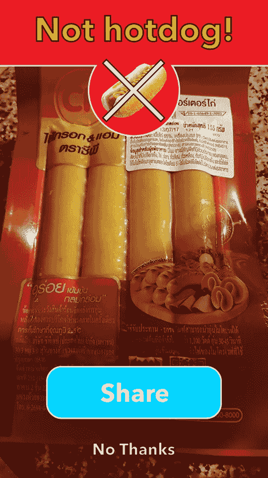
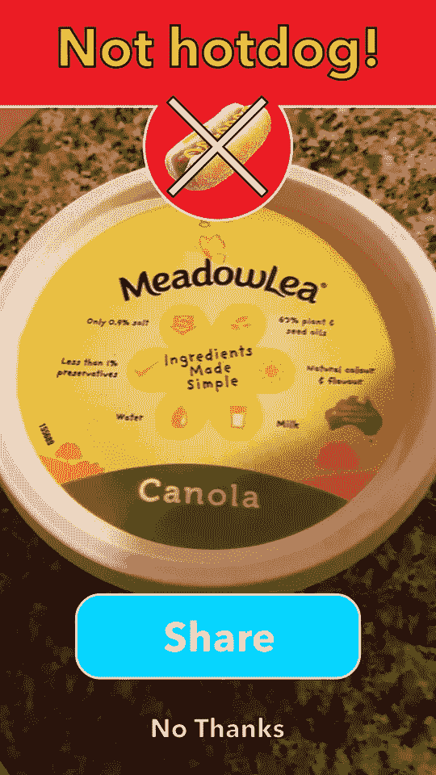
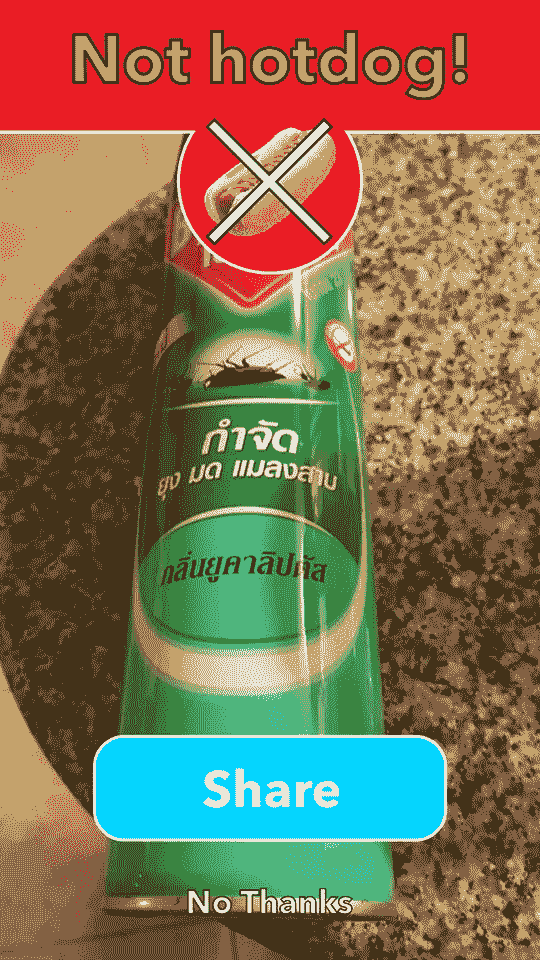
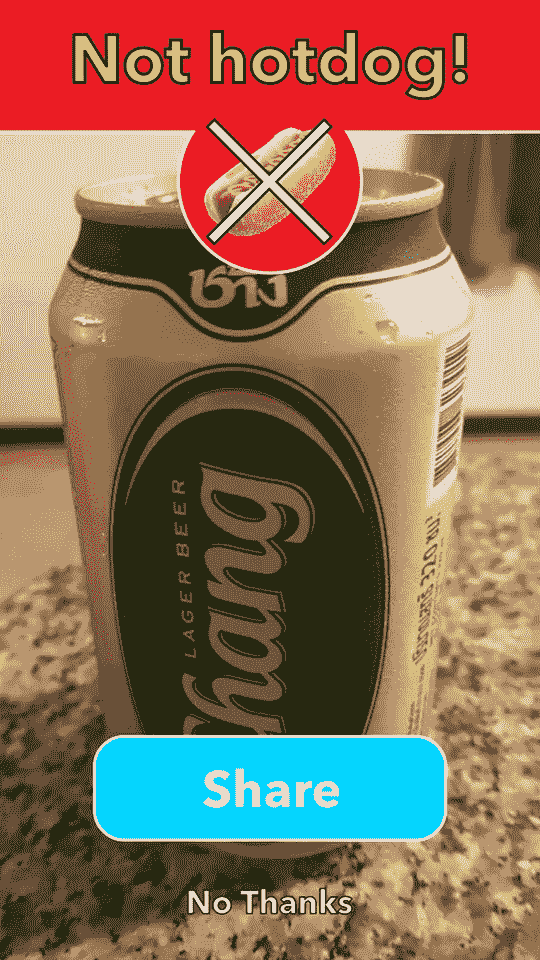

# 唯一值得一读的 SeeFood Technologies 'Not Hotdog '评论

> 原文：<https://medium.com/hackernoon/the-only-seefood-technologies-not-hotdog-review-you-should-read-fb0614266c33>

在 HBO 的硅谷秀上发布其产品的初创公司 SeeFood Technologies Inc .终于在 iOS 和 Android 商店上发布了其主要应用程序“不是热狗”。有些人可能对讽刺节目中的产品发布会不太认真，这在一个 1 亿美元以上 ICO 的时代是很讽刺的，事实上我并不认真。我是在我偶尔阅读的 Medium 帐户上写这篇文章的，而不是在我主要工作的地方，但每个应用程序都值得审查。

SeeFood“不是热狗”应用程序今天是合法可用的，在苹果公司的癌症闭店 [App Store here](https://play.google.com/store/apps/details?id=com.codylab.seefood&hl=en) 以及我们的上帝和救世主在此开设 Google[Play Store](https://play.google.com/store/apps/details?id=com.codylab.seefood&hl=en)。这有一个附带条件:尽管 HBO Asia 存在，并在泰国电视的免费数字频道上为 Traveloka(基本上是一个附属于其他旅游网站的应用程序)的广告和可爱的孩子在“DG”、“Dairy Goat”和“Dairy Goat New Zealand”之间唱泰语的广告做广告，但没有一个广告提到“Not Hotdog”应用程序。这是因为它在美国之外是不可用的，这让我感到难过，就像他们在泰国审查《权力的游戏》中的每一个裸体镜头一样:(

但我跑题了，有志者事竟成，Google.co.th 搜索，我最终设法从第三方网站下载了“不是热狗”应用程序。

我想对这款应用持积极态度，当我为 Techcrunch 撰写文章时，HBO 上的宣传比某些人向我推销他们的创业公司好几百倍，而我却没有像其他同事一样不断被尖叫……是的，我现在不会了。

所以，实际审查…我希望它是好的，但它不是。

不幸的是，我没有美国热狗来测试它，但是泰国香肠尝起来和看起来都像热狗，所以我用它们来测试…嗯

然而，非常昂贵(在泰国)的英国奶酪显然可以算作热狗。220 泰铢热狗…嗯

积极的是，其他各种各样的东西也不符合热狗的标准，包括澳大利亚人造黄油，泰国 Baygon 杀虫剂和一罐 Chang 啤酒。

公平地说，鉴于我没有真正的美国热狗来测试它，五分之零的测试命中率可能不完全公平。事实上，我的昂贵的奶酪是一个热狗，令人不安，但我仍然打算吃它。

对于那些对人工智能这一奇妙应用感兴趣的人来说，如果你在美国，你可以从这里的苹果 iOS 网站下载它。

> [黑客中午](http://bit.ly/Hackernoon)是黑客如何开始他们的下午。我们是 [@AMI](http://bit.ly/atAMIatAMI) 家庭的一员。我们现在[接受投稿](http://bit.ly/hackernoonsubmission)并乐意[讨论广告&赞助](mailto:partners@amipublications.com)机会。
> 
> 如果你喜欢这个故事，我们推荐你阅读我们的[最新科技故事](http://bit.ly/hackernoonlatestt)和[趋势科技故事](https://hackernoon.com/trending)。直到下一次，不要把世界的现实想当然！

