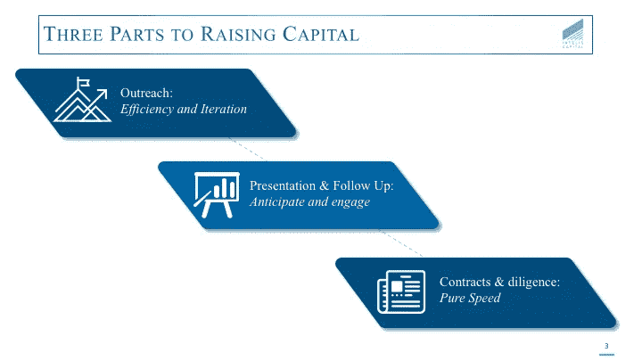
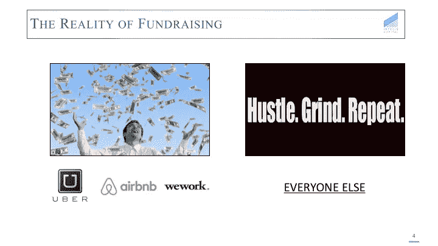
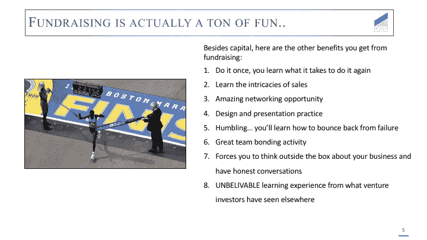
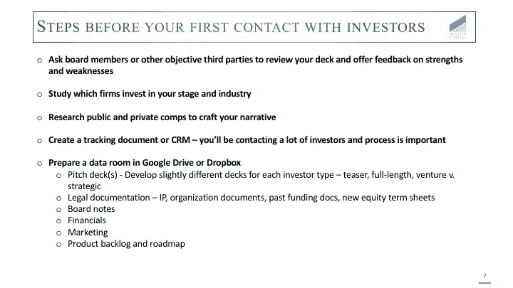

# 筹款的运作第一部分

> 原文：<https://medium.com/hackernoon/the-operations-of-fundraising-part-1-d5a696f7ffce>

受最近与有抱负的企业家的谈话和他们问的问题的启发，我最近一直在张贴一些在筹资过程中有用的话题。

我已经讲述了讲故事作为一种[工具](https://hackernoon.com/tagged/tool)来帮助其他人在情感上参与业务，并通过提高客户知识的程度来展示对用户的同情。在这里，我将介绍更多的融资过程本身，以及一些可以让事情变得更顺利的技巧。

融资通常是一个漫长的过程，在实际路演和投资发生之前就开始了。我们认为融资分为三个不同的部分。

*   **第 1 部分:准备和迭代** —这里的关键里程碑包括准备演示文稿，邀请关键利益相关者提供反馈，组织包含所有必要信息的数据室，以及创建一个跟踪投资者外联的地方。
*   **第二部分:演示和跟进**——这一步是不言自明的，包括向投资者的演示以及初始推介后的跟进对话。在下一篇文章中，我将深入探讨如何识别和排列这些潜在投资者，以及沟通的最佳实践。
*   **第三部分:结束** —速度很重要。在得到肯定的答复后尽快完成交易，如果允许的话，不确定性会破坏交易过程。

通常情况下，浏览一下 VentureBeat 和 TechCrunch 等网站的头条会给人一种印象，即每个人都在筹集资金，而且不费吹灰之力。

缺少的是真实的故事，除非一家创业公司获得巨大成功，否则交易很少会很快达成。事实上，筹款通常是一场马拉松，将考验决心，并需要沿途的运气。

尽管事实如此，筹款是一个惊人的职业经历，如果态度正确，可以有很多乐趣。你会在很短的时间内遇到比职业生涯中任何时候都多的有趣和成功的人。

利用每次互动并从中学习很重要。伟大的投资者会迫使你跳出框框思考业务，并强调他们作为经营者和投资者从经验中学到的潜在障碍。听着，你会为下一次推销会议做好更充分的准备，并更好地管理整个企业。

除了学习机会之外，其他好处还包括增加新技能:

1.  销售——举个明显的例子，筹资就是学习销售。
2.  领导能力——筹款可能只有一个接触点，但需要一个团队来构建一个表达全面愿景的平台。更不用说，工作可能依赖于结束这一轮，更加强调沟通。
3.  演示——另一个明显的例子，在一大群不熟悉的面孔面前演示只会越来越容易。此外，制作一副精心设计的套牌的能力也会派上用场。人们喜欢照片。

也许最重要的是，在教导谦逊和从失败中恢复方面，筹款是无与伦比的。即使是小型风险投资家，每年也会看到约 500 笔交易，进行 8-12 笔投资，这意味着 98%的情况下答案是“不”。虽然理解几率很大很重要，但筹资过程是一次不可思议的经历，给你的职业生涯上了一堂只有它才能上的课。

既然我们已经认识到筹款是一项困难但有益的任务，那么知道何时开始这个过程就变得至关重要。通常情况下，我们看到许多初创公司认为这个过程需要 3-4 个月。我们的建议是抓住这个时间框架，*至少*加倍。

我们看到的另一个关键错误是，没有为给定的烧钱速度筹集到足够的资金。这通常是对两个变量的误解的结合，如前所述，第一个是过程的长度，但另一个更微妙:为随后的融资谈判杠杆。

在现金余额处于危险低位时试图平仓，很可能会抵消任何谈判优势，并为投资者提供加入不太有利条款的机会。这些术语往往会在最糟糕的时候成为一个问题。

我们建议筹集不少于 12 个月的运营资本，更希望看到初创公司的融资目标是购买 15-18 个月的跑道。这为不可预见的情况创造了缓冲，如比预期的平均销售周期慢或比预期长的资本筹集造成现金短缺。

最后，始终了解收入和销售的季节性或周期性。下降趋势，即使同比增长很大并且可以解释，也会造成不必要的障碍。例如，如果 Q1 和 Q2 的销量上升，但在第三季度降温，那么最好在头 6 个月加大路演力度，争取达成交易，否则就会遇到不希望的摩擦。

一旦决定融资，下一步通常是创建一个“推介平台”然而，这仅仅是过程的开始。伟大的创业公司认识到，融资不仅仅是一场推介活动，而是一个可能需要数月时间并与数十人接触的过程。因此，他们建立了规模化的流程。

这包括根据投资者的类型和沟通方式创建各种演示文稿，准备一个可以轻松共享的数据室，以及创建一个 CRM (excel、Hubspot 等)..)来跟踪每个交互。

最后一个建议，研究市场成分，用它们来指导未来的叙述。我见过一些创业公司使用这种策略，如果做得好，它会非常强大。

这是一篇很长的帖子，包含了很多(希望是有用的)信息。如果你做到了这一步，感谢你的阅读！几天后我会带着第二部分回来，第二部分将着重于确定合适的投资者，向他们推销的关键，以及如何完成交易。

一如既往，如果你喜欢这个帖子，请分享！

鸣谢:能源未来基金合伙人 John Tough，感谢他启发了本文中所使用的图片。

*原载于 2017 年 10 月 25 日*[*【kevindstevens.com*](http://kevindstevens.com/2017/10/the-operations-of-fundraising/)*。*