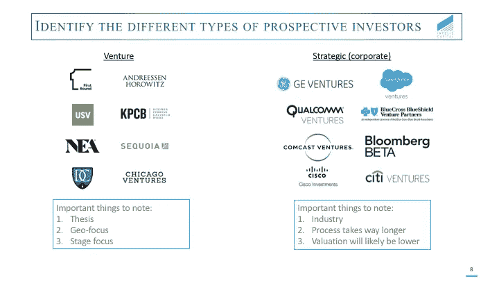
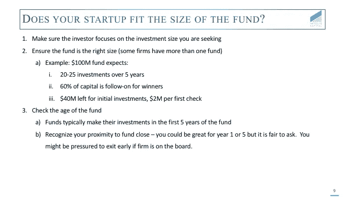
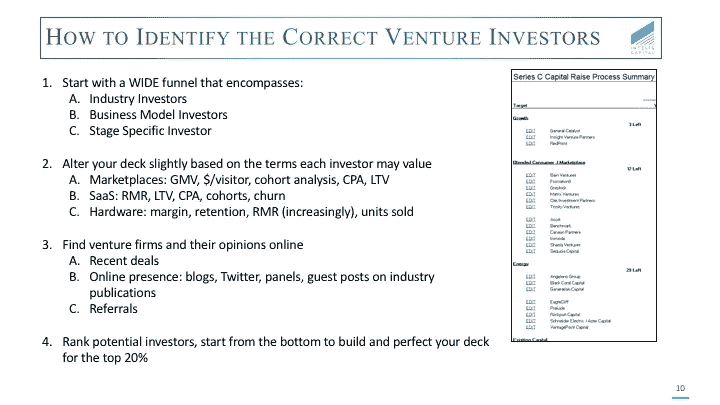
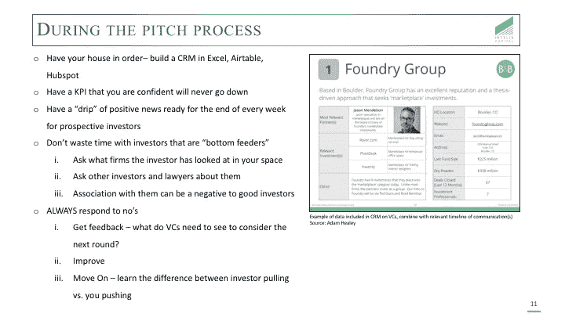
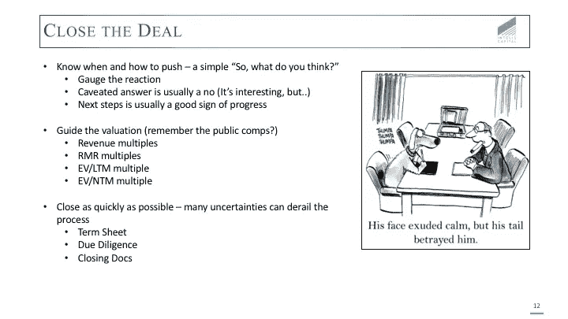

# 筹款的运作第二部分

> 原文：<https://medium.com/hackernoon/the-operations-of-fundraising-part-ii-cbcbbcc09861>

几天前，我发表了一篇关于建立筹资内部流程的重要性的文章。第二部分着重于确定正确的潜在公司，在这个过程中与他们互动，并最终完成交易。让我们跳进来。

像任何销售过程一样，当你找到合适的目标和他们各自的目标时，筹集资金就变得更容易了。然而，在这种情况下，一笔交易将有望与一个或多个希望在公司成功中发挥重要作用的合作伙伴建立长期关系。

在筹集机构资本时，一般有两类潜在投资者:风险投资者(私募股权)和战略投资者(CVC)。重要的是要了解每一类的特点，以便精心制作一个能引起共鸣的推介，并理解交易开始实现时将会产生影响的条款。

风险资本家主要是受经济利益的驱使。作为创始人，研究公司的主题、地理聚焦(如果适用)和阶段聚焦以找到最佳契合点是很重要的。虽然风险投资的主要目标是优化所有权，但优秀的投资者会寻求公平的交易条件，让创始人拥有足够的股权，从而最大限度地激励他们追求长期价值创造或寻求额外的资本。

企业风险投资有点复杂，因为它与动机有关。根据 CVC 的不同，投资的原因可能包括外包研发、先看潜在收购、降低客户获取成本或具有上升潜力的协同效应。

很容易想象预测一个 CVC 的动机有多困难，以及错位激励带来的潜在危险。将这些不确定性与通常较长的交易过程结合起来，从战略角度融资显然需要仔细考虑。

接下来的因素是我们看到许多创始人忽视考虑的:了解你如何以及在哪里适合风投基金。

1.  **如何:**结合论文(前面讨论过)**和**资助阶段。在上面的幻灯片中，我们以一只 1 亿美元的基金为例。通常情况下，一只基金会进行 20 至 25 项投资，并为后续投资预留资金。(注:这因基金而异，但这是典型模型)。让我们假设这只基金储备了 6000 万美元来维持或增加其在赢家中的头寸，剩下 4000 万美元用于初始投资。这意味着一张普通的第一张支票落在 2M 附近的某个地方。如果你要求 50 万美元，这个基金不太可能(尽管不是不可能)太大。
2.  **其中:**基金的年龄以及这将如何影响风投的退出需求。大多数投资是在 10 年期基金的第 1-5 年进行的。根据所处的阶段，一家[的初创公司](https://hackernoon.com/tagged/startup)可能在这个时间段的任何一端都很棒。然而，由于投资时机不当或在二次股权出售中董事会席位易手，可能会被迫提前退出。

创始人围绕这些问题提问是完全公平的。我认为，这显示了双方在理解风险投资过程和希望确保双方在整个合作关系中完全一致方面的成熟。

我们经常看到冷冰冰的电子邮件，显然是“喷雾和祈祷”类型的，意思是创始人给尽可能多的潜在投资者发电子邮件，内容没有区别。我对这些初创公司的建议是，退一步，真正考虑建立一个潜在投资者的目标渠道。

从一个包含你所在行业、技术或地理区域的所有投资者的大漏斗开始，然后根据剩下的标准加上平均投资规模开始缩小。例如，如果你是达拉斯的一家医疗保健公司，你可以建立一个过去 12-18 个月内在美国进行交易的所有医疗保健投资者的漏斗，然后通过对你的技术进行投资的人(例如软件/硬件)，最后由德州。

一旦你选择了前 20%看起来可能合适的公司，找到投资的合伙人。一般来说，所有人都会在网上出现，无论是 Twitter、博客、播客还是新闻稿中的引用，在最初的外联中找到一些有用的东西，解释为什么它适合资本之外的合作伙伴关系。

尽管每一轮和每一家创业公司都不一样，但筹资通常需要与数百名联系人进行数千次互动。在整个过程中传递积极的消息时，以有组织的方式与这些联系人保持联系是至关重要的。

出于这个原因，除了 CRM，我们强烈建议找到一个有意义的 KPI，它不太可能下降，并在每个周末分享更新。每周更新有几个目的:它从点创建了一条趋势线，它显示了责任，它显示了执行能力，它让你的创业公司在投资者的心目中处于首位。

随着与潜在投资者的互动增加，过滤噪音和避免“亲吻许多青蛙”变得很重要。毕竟，你还在经营一家企业，时间很宝贵。我们鼓励企业家对投资者进行尽职调查，包括询问银行和律师等服务提供商的意见。与错误的投资者交往对你觊觎的投资者来说可能是一个负面信号。

最后，永远真诚地回答不。这是展示谦逊和学习的绝佳机会。当一个创始人无视一个“不”的时候，感觉就像是在确认，不管是对是错，我做出了正确的决定。发出回应后，继续前进。时间就是金钱。

人们常说时间是所有交易的敌人。一旦风投同意投资，就要尽快完成交易。通常，很难管理流程，尤其是当它涉及到服务提供商时，但是有些步骤是可以控制的。

随着收盘日期的临近，前一篇文章中所做的基础工作真正发挥了作用。对 comps 的全面研究有助于指导估价流程，包含适当材料的有序数据室通过减少查找材料的需求和限制不必要的沟通，提高了尽职调查的速度。

就像上一篇文章一样，这篇文章也很长。然而，我希望这些建议可能有用，并可能在筹款过程中引入一些不熟悉的细微差别。

鸣谢:能源未来基金合伙人 John Tough，感谢他启发了本文中所使用的图片。

*原载于 2017 年 11 月 1 日*[*【kevindstevens.com】*](http://kevindstevens.com/2017/11/the-operations-of-fundraising-part-ii/)*。*