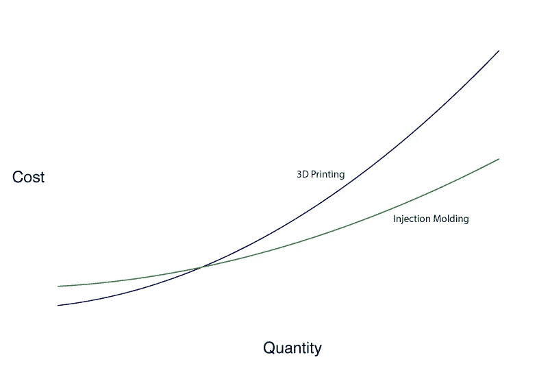

# 另一种半人马

> 原文：<https://medium.com/hackernoon/the-other-kind-of-centaur-c80b352c46dd>

我们都知道第*类人马。另一种是人类- [计算机](https://hackernoon.com/tagged/computer)的混血儿，来自自由式国际象棋。引用经济学家*的话*解释了第二个意思[的来源](https://hackernoon.com/tagged/origin):*

然而，在国际象棋中，世界上最好的棋手不是机器，而是大师加里·卡斯帕罗夫所说的“半人马”:人类和算法的混合团队。

我预测在不久的将来，人机混合体将在许多领域成为一股强大的力量。(从某种程度上来说，这算不上什么预测，如果你把我用这台电脑写论文算作人机混合体的话。)

## 潘多拉的电脑

如今，社会弥漫着一种焦虑的气氛，许多人对自动化的威胁感到疑惑。让我感到有点奇怪的是，没有人讨论自动化领域过去的案例研究。我们一直在发明会让人们失业的东西。我们很清楚通常会发生什么。也许 AI 是不同的，但如果是的话，有一个关于*如何*不同的参考还是不错的。无论如何，如果 AI 可以与我们之前看到的技术相媲美，那么历史就相当令人欣慰了。通常会发生的是:工人的生产力和效率大大提高，价格下降，需求增加，然后规模经济的效应倍增，价格下降更多。有时，价格下跌的结果是需求激增，足以增加相关行业的就业。第二个经常发生的影响是人类可以摆脱无聊和令人窒息的任务。这也不错。不利的一面是，一些员工在短期内受到了伤害，而他们正是那些专注于自动化技能的专业人员。对于整个社会来说，这是向前迈出的一步，而且收益往往足够大，我们可以补偿那些在转型中受到伤害的人，并且仍然处于主要优势。

当遇到困难的环境时，人类不是容易被打败的。我们的适应能力很强，我们善于利用工具让自己过得更好。我相信人工智能可以被人类管理，但我不会试图说服你。有许多人担心人工智能很容易从人类手中逃脱，我将让你来决定。我关注的是短期。我认为我们很快就会看到人类找到越来越多的方法来使用能力越来越强的机器来清除开销的待办事项列表，这样他们就可以专注于令人满意的东西:艺术、战略、哲学、研究。

## 混合系统

混合系统在许多情况下都很优秀，但是某些情况下特别喜欢它们。在这些情况下，两个组件系统具有交叉的性能曲线，并且在它们之间切换的成本相对于性能差异较低。考虑这张图表:

这是我编的，但我认为它很好地抓住了这个想法。在低数量的情况下，3D 打印是很棒的。做一个原型既容易又便宜。随着数量的增长，3D 打印成本很高，主要是在时间方面。注射成型，另一方面，是昂贵的设置，但对于大批量的好得多。

在这种情况下，想法是得到由任一点的最低值定义的曲线(在上面，弯曲的曲线是蓝色然后是绿色)。

对于人机混合体来说，性能曲线可能并不总是如此有条理，但显然有一些情况与上述情况相差不远，只是有了新的标签。例如，将“数量”替换为“抽象程度”,人类和计算机的性能图将与上图非常相似:对于具体的、明确规定的、重复性的任务，机器非常棒。随着任务变得越来越抽象，比如说，向观众展示新的研究，人类表现得更好。

这令人鼓舞。人类和计算机的混合体应该是可行的，但是我们需要更好地理解曲线是什么样子，甚至相关的轴是什么。

## 有创造力的半人马

我以前写过这方面的文章，但我发现计算机和人类的一个混合体特别有趣，那就是头脑风暴工具。人类非常善于将概念彼此联系起来，将想法转化为具体的规范，并向他人解释想法。计算机擅长产生随机刺激，通过蛮力探索大的量化空间，在内存中携带大量数据。

应该有一个奇妙的混合系统，一个创造性的半人马，如果你愿意，等待被发现。我希望能找到它。我已经做了一些实验，但还有很长的路要走。

## 其他地方的半人马

虽然我对增加创造力的人机混合技术感兴趣，但我不认为这是目前最有用的应用。我认为是医疗保健。

已故的 Robyn Dawes 在俄勒冈大学担任研究员时，写了一篇了不起的(在我看来)论文，名为“[决策中不当线性模型的稳健之美](http://citeseerx.ist.psu.edu/viewdoc/download?doi=10.1.1.188.5825&rep=rep1&type=pdf)”主要的想法是，由计算机实现的统计模型在预测方面比医生好得多，但医生在决定哪些变量应该进入模型，以及*它们应该如何*进入模型方面要好得多。具体来说，医生应该在与患者交谈后决定进行哪些测试，计算机应该根据测试结果确定患者是否真的患有疾病。目前，这种情况不会发生。如果可以的话，它可能会改善健康结果和效率。

这个讨论中的一个小问题是，模型只能处理它已经被训练过的数据，所以任何难以测量或者只是没有被测量的东西都不会进入模型的考虑范围。一个好医生会知道什么时候推翻一个不知情的模型。另一方面，一个不那么伟大的医生可能会偏离这个模型太多。只要有时间解决，这些问题似乎是可以克服的。无论如何，这是一个有争议的问题，因为统计模型甚至不包括在大多数诊断中。

## 结论

我说了一点，但重点是马人来了。你应该试着通过理解计算机的性能曲线来接受它们，并擅长它们不擅长的部分。不要试图在计算机擅长的地方打败它们，只要躲开就行了。无论如何，你最终到达的地方将会更加令人愉快和满足，因为这将是一个更加独特的人类的地方。

*注:当然，有些人会说，真的没有安全的地方可去，没有什么是人类更擅长的。也许在未来的某个时候，这将是真的，但考虑到目前的技术水平，这是荒谬的。在很多事情上，人类比计算机好得多。一般来说，如果它涉及大量的人际互动、交流、说服、抽象或技能多样性，人类目前更擅长于此，在可预见的未来也将如此。举几个例子，想想销售、教学、研究、艺术、医疗保健和企业家。*