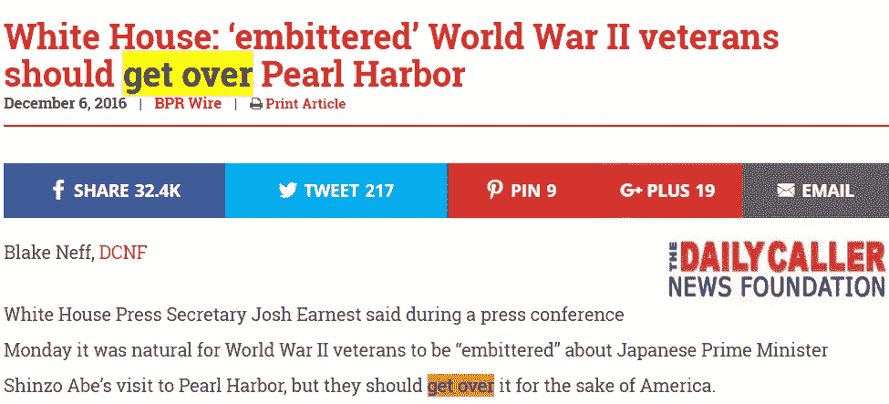
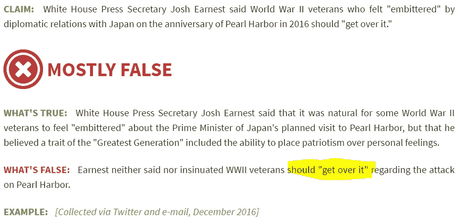
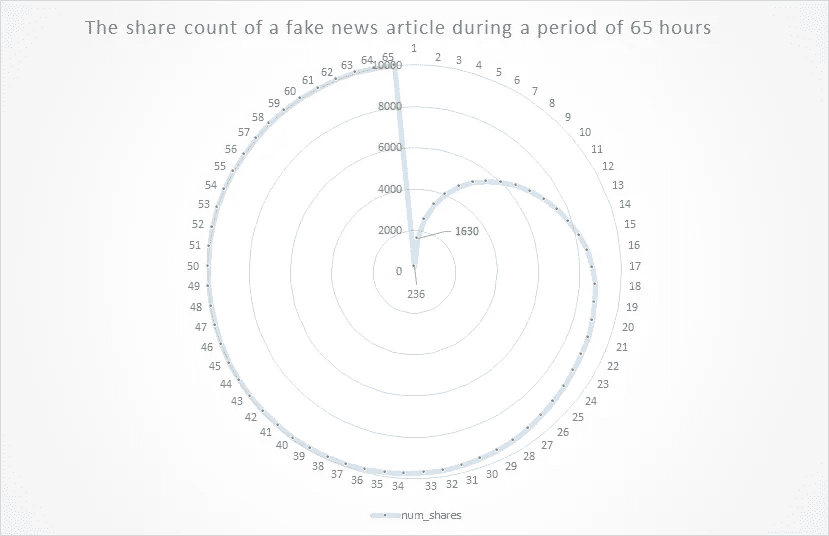
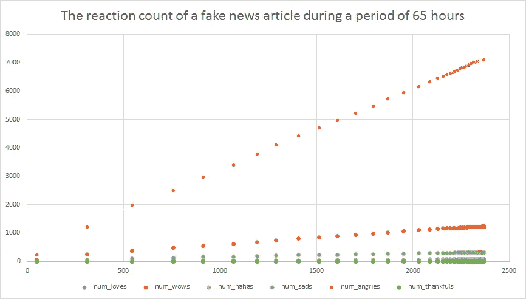

# 爆发——自动检测虚假病毒新闻。

> 原文：<https://medium.com/hackernoon/the-outbreak-detecting-fake-viral-news-automatically-3acded3a97cb>

两周前，我在 medium 上发表了[这篇文章](/@baditaflorin/detecting-fake-viral-stories-before-they-become-viral-using-fb-api-f67a18cd4f0a#.vnhrz99nu),内容是关于我们如何使用“爆发”( Outbreak)来检测虚假的病毒新闻，这是一种旨在自动识别病毒新闻的工具，可以防止它们传播。

 [## 使用 FB API 在虚假的病毒故事传播之前检测它们

### 首先提一个问题。你如何发现一篇虚假的病毒文章？

medium.com](/@baditaflorin/detecting-fake-viral-stories-before-they-become-viral-using-fb-api-f67a18cd4f0a) 

连续工作了两周，我现在开始跟踪来自 30 个脸书页面的 4000 多条[脸书](https://hackernoon.com/tagged/facebook)的帖子，这些帖子通常发布虚假或误导性的新闻，看看我能否在虚假的病毒式新闻传播之前识别它们。

我们不需要记者去阅读这个网站发布的每一篇文章和文章，而是只检测那些正在传播的文章，然后将它们发送给一个人来评估这是一篇假的还是准确的文章。

我选择了 12 月 6 日发表的一篇文章作为研究案例。

对 [Snopes](http://www.snopes.com/white-house-press-secretary-say-wwii-vets-upset-japan-visit-get/) 的快速访问揭示了真实的故事。

这篇文章，截至发帖时，总共获得了 **32K 的股份**，其中 **10K 的股份**来源于 fb 页面[保守新闻 Toda](https://www.facebook.com/ConservativeNewsToday/?ref=page_internal) y，一个有 250 万赞的页面。

在系统检测到该链接的第一个小时，它有 236 个份额。

到第二个小时，涨到了 1630 股。这是系统将文章标记为病毒文章的时间。

又过了 5 个小时，这篇文章的浏览量超过了 5000 次。

snopes 文章于 2016 年 12 月 7 日**发布，一天后**发布，共获得 484 股。

与此同时，这篇假文章仅在 fb 页面上就有 8000 次分享。

而这只是其中的一部分。我们还有点赞数，评论数，情绪数。利用这一点，我们可以训练算法进行预测分析。

这些虚假文章的一个共同点是它们会产生强烈的情绪反应。而这可以通过使用 Google Cloud NLP API 或者 Watson API 来检测。结合 facebook 的反应数据，我们可以更好地理解，我们有比一年前更好的工具。

The vertical axes is the number of reaction for each specific emotion, and on the horizontal axes is the number of likes

我想继续从事这个项目，这就是为什么我建立了这个众筹活动，目的是筹集 5000 美元，以便能够获得更好的服务器基础设施，并支付我致力于这个项目的部分时间。

# 帮助支持这项工作:

 [## 单击此处支持反病毒针对病毒假新闻文章。

### 而不是让记者去阅读网站发布的每一个帖子和文章…

www.youcaring.com](https://www.youcaring.com/antivirus-against-fake-news) 

很抱歉文章中的语言错误，英语不是我的第一语言。

## 关于我

在过去的 3 年里，我是**有组织犯罪和腐败报告项目(**[**【OCC RP**](https://www.occrp.org/en)**)**的合作者，我做数据分析和模式识别来揭示非结构化数据集中的腐败模式。

2016 年 9 月，我搬到了旧金山，在这里开始新的生活。

你可以在媒体上找到我**在线** [**弗罗林【Badita】、**](https://medium.com/u/3b723c70c152?source=post_page-----3acded3a97cb--------------------------------)**[**AngelList**](https://angel.co/florin-badita)**、** [**推特**](https://twitter.com/baditaflorin) **、L** [**inkedin、**](http://linkedin.com/in/baditaflorin)**O**[**penstreetmap**](https://www.openstreetmap.org/user/baditaflorin/diary)**

****有时候我会在博客上写**[**http://florinbadita.com/**](http://florinbadita.com/)**

************

> **[黑客中午](http://bit.ly/Hackernoon)是黑客如何开始他们的下午。我们是 [@AMI](http://bit.ly/atAMIatAMI) 家庭的一员。我们现在[接受投稿](http://bit.ly/hackernoonsubmission)，并乐意[讨论广告&赞助](mailto:partners@amipublications.com)机会。**
> 
> **如果你喜欢这个故事，我们推荐你阅读我们的[最新科技故事](http://bit.ly/hackernoonlatestt)和[趋势科技故事](https://hackernoon.com/trending)。直到下一次，不要把世界的现实想当然！**

****