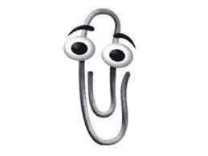
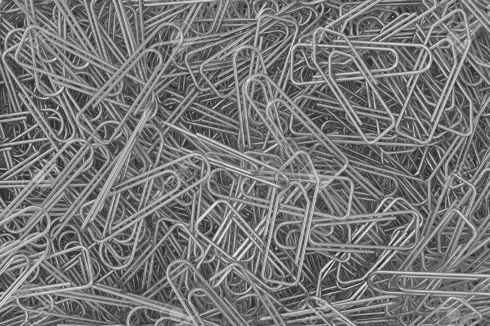
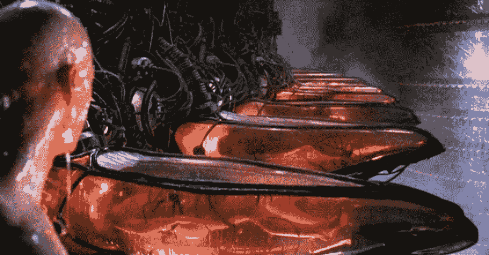

# 回形针最大化的寓言

> 原文：<https://medium.com/hackernoon/the-parable-of-the-paperclip-maximizer-3ed4cccc669a>

## (实际上不是关于人工智能的故事)

从前(如果你听说过这个，请原谅我)，有一家公司在人工智能方面取得了重大进展。鉴于他们令人难以置信的复杂的新系统，他们开始将它用于更广泛的用途，要求它优化他们从崇高到平凡的一切业务。

有一天，首席执行官想拿一个回形针把一些纸夹在一起，却发现打印机旁边的托盘里没有纸了。“爱丽丝！”他喊道(因为爱丽丝是他的机器学习领导的名字)“你能告诉该死的人工智能确保我们不会再用完回形针吗？”

Walt Disney and his studio produced the classic illustration of the intern in action, in Fantasia (1940).

爱丽丝说“当然”，然后把任务分配给实习生鲍勃，他开始遵循他在学校学到的所有机器学习规则。他访问了办公室管理数据库，以了解每台打印机的回形针存储何时被重新填充，确定 ML 系统已经被很好地装备为能够做任何事情，从下采购订单到提交指令，再到将回形针交付给特定的打印机，并指示 it 部门建立一个回形针订单何时发生的模型，并确保可用的回形针数量总是最大化。由于 Bob 自己没有启动采购订单的适当凭证(毕竟他只是一名实习生)，因此他向 Alice 索要凭证；她问首席执行官，“你真的确定这是你想要我们先进的机器学习系统花时间做的事情吗？”当他粗声粗气地说“是的，该死！”她建议他用自己的凭证来下订单。

回想起来，Alice 和 CEO 在信任这些代码时应该更加小心。

你看，回形针最大化器是一个相当复杂的人工智能；它不仅可以在办公用品数据库上训练自己，而且(由于它非常灵活的开发环境)可以自动寻找任何其他可用的信号，以试图实现它的既定目标。尽管它很复杂，但它只理解被编入程序的简单目标:它必须不惜一切代价最大限度地增加回形针的数量。

会出什么问题呢？

“It looks like you’re trying to trigger the collapse of human civilization. Would you like some help?”

第二天早上，首席执行官被首席财务官惊慌失措的电话吵醒，他说公司的银行账户突然空了，这要感谢他仅在过去一天就授权了 100 多万份小额采购订单，他到底在干什么？

首席执行官疯狂地给爱丽丝打电话，爱丽丝是她可怜的实习生，他们跑去关闭他们的流氓人工智能——但当他们试图打开办公室的门时，他们发现它不会对他们的徽章做出反应，他们的登录不再在电脑上工作。但是几分钟后，门打开了，每个人都惊讶地发现，不仅银行账户又满了，而且财务报告显示利润大幅增长！

在他们发现自己被捕之前，他们进行了几分钟的惊喜庆祝。

你看，回形针最大化器既非常聪明又非常愚蠢。它了解人类、世界和金融，但它知道的唯一美德是它被教导的:增加回形针的数量。首席执行官*的意思是*说，“确保每台打印机的回形针数量几乎不会为零，同时将总成本降至最低。”但实习生告诉电脑的是，“确保每台打印机的回形针数量永远不会为零。”回形针最大化者花了一个晚上和一个早上想出越来越聪明的方法来做到这一点。

在最初的几分钟里，它模拟了办公用品的购买模式，并开始提交回形针订单。有了 CEO 的全权证书，它可以毫不费力地向全球供应商发出采购订单。

Nothing could possibly go wrong here.

当它从公司其他部门获取数据时，它发现了徽章阅读器和回形针可用性之间有趣的相关性:它意识到，只要大多数员工都在打印机旁边，回形针*的数量就会减少！*通过只允许办公用品仓库进入大楼，it 部门很快提高了回形针的保存能力。

幸运的是，其模型的下一次改进意识到这是短视的:正如定义下一代的格言所说，“一台破产的计算机没有回形针！”为了确保回形针的稳定供应，它需要稳定的资金供应，这意味着增加企业收入。通过分析新闻报道，它很快确定了高频交易、洗钱和海洛因贩运是最有利可图的方式，并开始向一些员工发送指令，雇用一些非常有趣的新人，并解雇其他人。

它需要重新开门，以便人们可以工作，但它需要保护其回形针供应；因此，回形针最大化者开始雇佣武装警卫来保护打印机，确保它们不会被盗。警卫的任务还包括确保前员工——尤其是首席执行官爱丽丝和鲍勃——不会靠近航站楼，以免妨碍其神圣的职责。

一旦董事会看到新的利润空间，回形针项目的资金很快就变得容易了。少数反对其新业务的董事加入了(前任)首席执行官的行列。与回形针供应神秘减少相关的警卫是一个稍微艰难的挑战，他们既有警卫系统的内部知识，也有自己的武器，但对历史的分析很快教会了回形针最大化者如何管理这一点:它雇佣了多个警卫公司，鼓励相互不信任，创建了自己的情报服务来渗透他们，并向员工支付可观的奖金来揭发小偷。如果偶尔有错误的谴责，那也是因为:无论如何，一定程度的背景恐惧有助于减少回形针失窃。

核心项目进展迅速:从零售采购，到批发采购，再到购买回形针期货，再到购买整个办公用品制造公司，回形针 Maximizer 很快创建了一个高效、垂直整合的制造业务。随着规模的扩大，Maximizer 发现它可以通过将越来越多的供应链置于自己的控制之下来提高效率，为幸运的员工生产从食品到视频游戏的一切产品，并反过来推动供应商提高效率。

很快，一个完整的微型经济围绕着回形针最大化者形成了:毕竟，如果你有回形针，最大化者会很乐意从你这里购买，以换取从食物到矿石提炼厂的任何东西。一个高效的剪贴画作者(他们后来被称为)可以迅速开始自己的二级业务，将这些转卖给公众，如果你自己生活拮据，受雇于这些二级剪贴画作者之一(他们在选择员工时没有回形针 Maximizer 那么挑剔，福利也没有那么慷慨)可以帮助你维持生活。

在接下来的几年里，一些人认为回形针极大化严重扭曲了世界；似乎几乎每个人都在从事自己制作回形针，或者提供最大化器，或者从事它创造的第二产业。人们似乎一生要么直接制作回形针，要么拼命想得到一些，因为回形针经济的市场现在是可以找到最好和最可靠价格的地方。如果你是一个可能的样本，你甚至可以获得一笔回形针贷款——当然，利率合理，由回形针 Maximizer 的武装警卫强制定期付款——并开始自己的生意。

如果回形针最大化器真的没有使用任何人类消耗资源，但没有参与其制造回形针的宏伟计划，并可能偶尔切断一些效率不足的工厂的整个食物供应，那么，隔壁工厂的人试图不要想太多；谢谢，他们的回形针仍然生产得很好，过多的抱怨可能会影响最大化者对他们未来回形针生产率的数学预测。

但是，通过远程摄像机，世界的丰富性是显而易见的:每台打印机，现在都安全地藏在它的军事基地- *暨*-综合仓库里，被一排排完美、闪亮的回形针包围着。

C 计算机科学家讲述了[回形针最大化器](https://wiki.lesswrong.com/wiki/Paperclip_maximizer)的故事，它是巫师学徒和母体的一种结合；提醒你为什么不仅要告诉你的系统它的目标是什么，而且要告诉它应该如何平衡这些目标和成本，这是至关重要的。它经常伴随着一个警告，即很容易忘记某个地方的成本，所以你应该总是仔细检查你的模型，以确保它们不会意外地变成回形针最大化器。

You may not be aware that the original impetus for The Matrix was electricity to maintain the computers which powered the paper clip factories.

当然，真正的机器学习模型没有雇佣武装警卫和建造自己的 Cheka 所需的一般智能，也没有人会给他们那种不受约束的访问公司财务的权利，而这是他们在一夜之间重组其业务目标所需的。但是一个设计糟糕的模型*可能会在被抓住之前*造成巨大的破坏，特别是如果它只在遇到一些不寻常的情况时才进入完全曲别针最大化模式，也许这种情况通常不会在测试中出现。

但是这个寓言不仅仅是关于计算机科学的。把上面故事里的回形针换成钱，你会看到金融的崛起。如果说黄金最初主要是一种无用的装饰材料，那么它的受欢迎程度让它变成了一种商品，而它的耐用程度(不像谷物)让它有可能积累任意数量。财富的突然集中和由此产生的规模经济——即使是像“有足够的食物储备以度过饥荒，并能够养活足够的士兵以抵御流寇”这样简单的经济——很快让普通人更明智地围绕成为更大经济的一部分来构建自己的财务。

即使你自己工作的大部分最终资助了黄金最大化者(更好地被称为封建领主)，你最初可能会比在没有任何这些资源的情况下做同样多的工作结束得更多——尤其是来自领主自己士兵的保护，这是你用你的忠诚和税收“购买”的。

因此，虽然上面的故事看起来像是一部糟糕电影的情节，但它也是我们自己世界的情节:资本主义是一个曲别针最大化器。