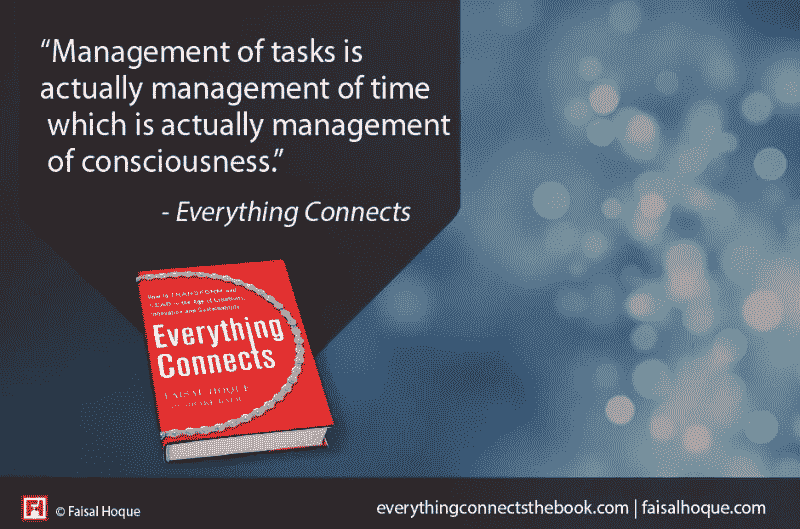
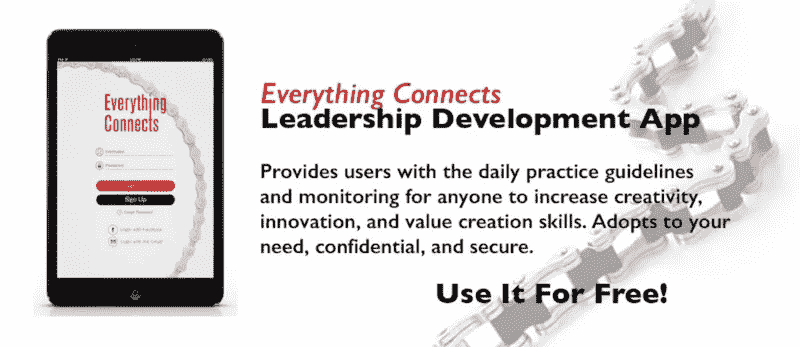

# 做得更多的悖论

> 原文：<https://medium.com/hackernoon/the-paradox-of-doing-more-d6263208c8d9>

[Image: Unsplash user [Sonja Langford](https://unsplash.com/@sonjalangford)]

## 如何真正充分利用你的时间？

大约一百年前，一位法国诺贝尔奖得主哲学家是英语世界的宠儿:亨利-路易·柏格森。他的思想触及、影响并反映了当时巴黎文化的各个角落，从意识流小说到印象派绘画。他是一个言简意赅的人，曾开玩笑说，哲学家的职责是把含蓄的东西变成明确的东西——强调我们渴望自己表达出来。

正如智者经常做的那样，柏格森重新评估了最基本的东西——比如时间本身。因为除了是一个伟大的格言警句家之外——他的一句话是，哲学家的职责是使隐含的东西显而易见，这是我们最喜欢的一句话——他对时间的本质有着深刻而独特的理解。他批评“时钟时间”是专制和不精确的。他说，这也许对科学研究有用，但对生活没用。相反，更精确的时间概念是最好不要翻译的，因为他认为时间是 dureé-réelle，可以翻译为“持续时间”，尽管你可能会笨拙地翻译它。

> “时间不是挂在墙上或手表上的东西，而是你正在进行的、流动的体验，你的意识。”

如果我们用柏格森的镜头来理解这些事情，我们就可以得出这样的结论:任务的管理实际上是时间的管理——这实际上是意识的管理。

也就是说，当你试图让人们按照相同的时间表(或不同的时间表)工作时，你实际上是在谈论管理他们的意识，他们的生活体验。这真是太好了，不是吗？

# 说不

但是反抗时钟时间的暴政不仅仅是印象派时代的哲学家的事情。它也适用于现代的极端实干家，如鲍勃·波曾，他曾同时担任富达投资公司的总裁，在哈佛商学院教授全部课程，并为《哈佛商业评论》撰写文章。

在其中一篇文章中，他认为，根据员工投入的时间来评估他们的价值的偏见——研究表明经理们就是这样做的——是极其错误的。对波曾来说，专业人士对公司的价值不在于他们投入的时间——这产生了一种优先“见面时间”的文化——而在于“他们通过自己的知识创造的价值”波曾说，由于衡量质量的标准是时间而不是结果，经理们分散了员工对他所说的最关键问题的注意力，“我目前是否以最佳方式利用了我的时间？”因此没有有效地利用他们的时间。

让我们将他的论点扩展到哲学层面:通过优先考虑时间而不是结果，我们分散了自己的注意力，不去问我们是否以最好的方式使用了我们的大脑，导致了一种只是偶然留意的文化，如果有的话。

> “围绕我们投入的时间来调整我们的工作生活，是一种避免以最佳方式使用我们的意识和精力的方式。”

以最终产品(和过程)为导向有助于我们更加严格地将我们的体验与我们的结果结合起来。

那么，以亲社会的、以承诺为导向的、哺乳动物的方式工作的一个基本步骤就是认识到，我们一起工作的人也有长期的生活经历——你没有的经历——这将产生你无法拥有的洞察力。

正如 Pozen 所建议的，很多保护你的时间归结为能够说不和表达优先事项——这意味着你需要有一种文化，这种文化适合开放的对话，并说，不，实际上，我不能这样做。

[专题图片:Unsplash 用户 [Sonja Langford](https://unsplash.com/@sonjalangford)

*改编自* [*【万物互联:如何在创意、创新、可持续发展的时代转型和引领】*](http://www.amazon.com/gp/product/0071830758/ref%3Ds9_psimh_gw_p14_d0_i1?pf_rd_m=ATVPDKIKX0DER&pf_rd_s=center-2&pf_rd_r=0Z589RWPPJ39PAR2VV0A&pf_rd_t=101&pf_rd_p=1688200382&pf_rd_i=507846) *(麦格劳·希尔，2014)。*

***版权所有 2014 年，作者费萨尔·霍克。保留所有权利。***

我是一名[企业家和作者](http://faisalhoque.com/speaking/)。[沙多卡](http://shadoka.com/)等公司创始人。Shadoka 促进企业家精神、增长和社会影响。著有《 [*万物互联——如何在创意、创新和可持续发展*](http://www.amazon.com/Everything-Connects-Creativity-Innovation-Sustainability/dp/0071830758/ref=sr_1_1?ie=UTF8&qid=1376488798&sr=8-1&keywords=everything+connects%2Bfaisal+hoque) 的时代进行变革和领导》(麦格劳·希尔，2014 年)和《 [*生存并茁壮成长:有韧性的企业家、创新者和领导者的 27 种实践*](http://survivetothrive.pub/) 》(励志出版社，2015 年)。在推特上关注我 [@faisal_hoque](http://twitter.com/faisal_hoque) 。

***免费使用*** [***万物互联领导 app***](http://app.everythingconnectsthebook.com/login.php)***。***

> [黑客中午](http://bit.ly/Hackernoon)是黑客如何开始他们的下午。我们是 [@AMI](http://bit.ly/atAMIatAMI) 家庭的一员。我们现在[接受投稿](http://bit.ly/hackernoonsubmission)，并乐意[讨论广告&赞助](mailto:partners@amipublications.com)机会。
> 
> 如果你喜欢这个故事，我们推荐你阅读我们的[最新科技故事](http://bit.ly/hackernoonlatestt)和[趋势科技故事](https://hackernoon.com/trending)。直到下一次，不要把世界的现实想当然！

