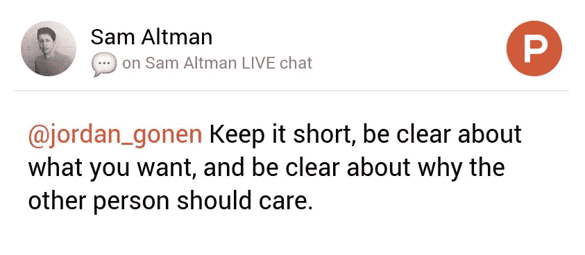

# 完美的冰冷邮件

> 原文：<https://medium.com/hackernoon/the-perfect-cold-email-eab1ddcc10dd>

## 这给我带来了成千上万的客户，福布斯和财富杂志上的文章，以及更多

电子邮件生活在职业世界的核心。无论你是忙着建立关系网还是努力让你的产品上市，你都有可能花大量的时间在收件箱里。

相信我，我知道这种感觉。电子邮件变得丑陋。真的很丑。

你知道我在想什么吗？那些经常出现在你收件箱里的长长的文本块。没完没了地闲聊。糟糕的标点符号。从来没有说到点子上！

在我职业生涯的早期，我就知道“擅长电子邮件”实际上会带来回报。

而且曾经有过。

**仅仅为了建立一个强有力的案例，冰冷的电子邮件帮助了我:**

*   在福布斯、财富杂志、商业内幕等杂志上发表我的文章。
*   帮助我获得实习机会，并在由 YCombinator 支持的大型科技公司工作
*   财富 500 强高管的固定电话
*   向成千上万的客户销售产品

**为什么它对我有效？**

*我意识到:*

每个人都讨厌电子邮件

b)大多数人不擅长电子邮件

现在，不需要天才就能明白如何擅长电子邮件。但是当一个天才，像[产品猎取直播聊天](https://medium.com/u/22acd7905c72#comment-208903)中交出一个框架的时候:我劝你看一下。

## 这是:

## 这是三个简单的步骤:

1.  保持简短
2.  明确你想要什么
3.  清楚他们为什么应该关心

## 1.简明扼要

用更少的资源写更多的东西简单得令人迷惑。大多数人匆匆忙忙地写电子邮件，并且倾向于使用不必要的话。带着目的说话，并且认定对方的时间，并不容易。

> "如果我有更多的时间，我会把这封信写得更短。"

用最少的话尽可能多地说。人们关心他们的时间。所以尊重这一点。(顺便感谢你阅读这篇博文)。

写邮件时请记住这一点:

> 让对方尽可能容易地给你答案。

## 2.说你想要的

你想要一份工作吗？说出来。你想在文章中引用你的话吗？说出来。你想让顾客使用你的产品吗？说出来。

**言归正传！**

大多数人忽略了这个建议。他们写了一句又一句，却没有说任何实质性的东西。

不要把你的问题隐藏在一段文字中。大胆一点。突出它。

如果不知道你想从他们那里得到什么，没有人能帮助你。

## 3.为什么他们应该关心

这个很难。这是大多数人被难住的地方。

但现实是，这部分是要求你把你的大脑子放到一边，开始用心。试着和你邮件的收件人产生共鸣。

## 示例 1:

任务——给大型出版物的编辑发电子邮件

问问自己这个人在找什么？

答案是:对他们感兴趣的话题采取极其独特的观点。他们不希望不得不做大量的工作，所以它不应该有任何错别字。此外，如果他们有任何批评或问题，他们不希望在电子邮件之间等待很长时间。

那幅画怎么样？

## **例 2:**

任务——给招聘人员发邮件，要求实习

问问自己这个人在找什么？

答案是:招聘人员在寻找杰出、独特的人才。交流得这么快。赶紧跟进。让他们很容易答应。不要给他们创造更多的工作，他们有这么多其他的事情要做。

这些例子不胜枚举，但我想你已经明白了。如你所知，这与火箭科学相去甚远。中学生真的可以这样做。

疯狂的是很少有人这么做。很少有人认真对待电子邮件。很少有人遵循这个框架。

如果你遵循它，并与它保持一致，好事情就会到来。人们会回复你的邮件。为什么？因为人一般都很好。他们想成为好人。他们只是不想因为你而不得不做更多的工作。

**这其中的关键是换位思考。了解你的收件人，你就会知道如何给他们发邮件。**

一如既往的感谢阅读！这对我真的很重要。

> 通过 gmail dot com 向我发送电子邮件 jordangonen1
> 
> 通过我的[每周简讯](http://tinyletter.com/jordangonen)保持联系

哦，山姆，如果你在读这封信，谢谢你的帮助。感激不尽。

> [黑客中午](http://bit.ly/Hackernoon)是黑客如何开始他们的下午。我们是 [@AMI](http://bit.ly/atAMIatAMI) 家庭的一员。我们现在[接受投稿](http://bit.ly/hackernoonsubmission)并乐意[讨论广告&赞助](mailto:partners@amipublications.com)机会。
> 
> 如果你喜欢这个故事，我们推荐你阅读我们的[最新科技故事](http://bit.ly/hackernoonlatestt)和[趋势科技故事](https://hackernoon.com/trending)。直到下一次，不要把世界的现实想当然！

